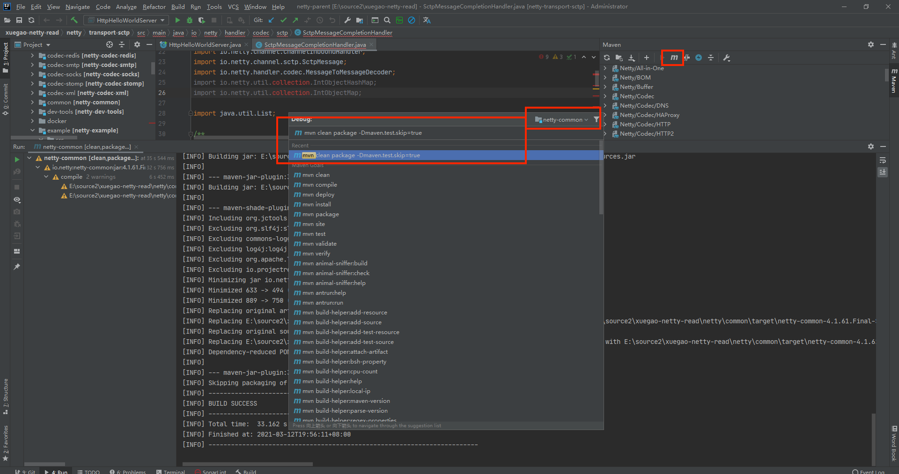
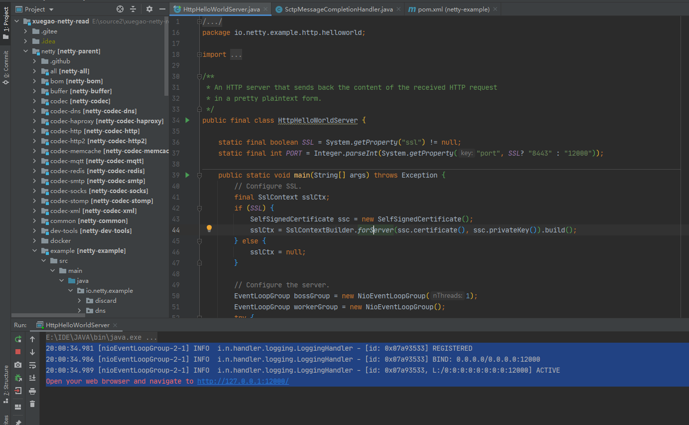
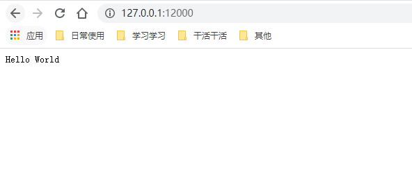
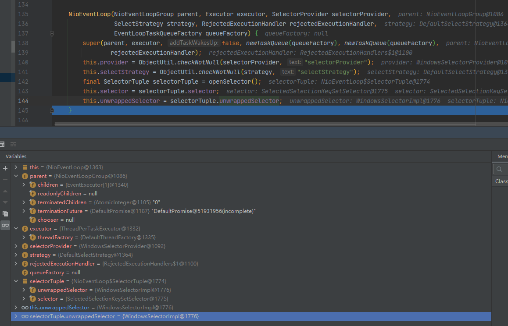
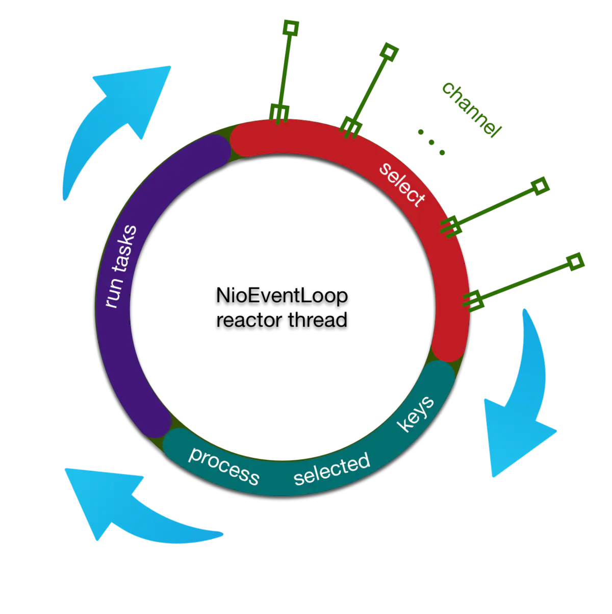

# netty源码编译

2021年3月12日19:54:02

netty 4.1.61


gitee：https://gitee.com/mirrors/netty?_from=gitee_search

github：

## 拉取代码


## 直接运行helloworld

io.netty.example.http.helloworld.HttpHelloWorldServer

会报错 io.netty.util.collection.IntObjectMap 找不到或者类似的异常


原因是这个类的目录是编译后存在在target里面？

## 编译 netty-common 目录



```java
mvn clean package -Dmaven.test.skip=true
```

```java
[INFO] --- maven-jar-plugin:3.0.2:test-jar (default) @ netty-common ---
[INFO] Skipping packaging of the test-jar
[INFO] ------------------------------------------------------------------------
[INFO] BUILD SUCCESS
[INFO] ------------------------------------------------------------------------
[INFO] Total time:  33.162 s
[INFO] Finished at: 2021-03-12T19:56:11+08:00
[INFO] ------------------------------------------------------------------------
```

## 继续报错

```
错误: 找不到或无法加载主类 io.netty.example.http.helloworld.HttpHelloWorldServer
```

## 重启

重启一下idea

## 再运行



```
20:00:34.981 [nioEventLoopGroup-2-1] INFO  i.n.handler.logging.LoggingHandler - [id: 0x07a93533] REGISTERED
20:00:34.986 [nioEventLoopGroup-2-1] INFO  i.n.handler.logging.LoggingHandler - [id: 0x07a93533] BIND: 0.0.0.0/0.0.0.0:12000
20:00:34.989 [nioEventLoopGroup-2-1] INFO  i.n.handler.logging.LoggingHandler - [id: 0x07a93533, L:/0:0:0:0:0:0:0:0:12000] ACTIVE
Open your web browser and navigate to http://127.0.0.1:12000/
20:04:18.339 [nioEventLoopGroup-2-1] INFO  i.n.handler.logging.LoggingHandler - [id: 0x07a93533, L:/0:0:0:0:0:0:0:0:12000] READ: [id: 0xe1b4afc2, L:/127.0.0.1:12000 - R:/127.0.0.1:1771]
20:04:18.340 [nioEventLoopGroup-2-1] INFO  i.n.handler.logging.LoggingHandler - [id: 0x07a93533, L:/0:0:0:0:0:0:0:0:12000] READ COMPLETE
20:04:18.340 [nioEventLoopGroup-2-1] INFO  i.n.handler.logging.LoggingHandler - [id: 0x07a93533, L:/0:0:0:0:0:0:0:0:12000] READ: [id: 0xba1f2a6f, L:/127.0.0.1:12000 - R:/127.0.0.1:1772]
20:04:18.340 [nioEventLoopGroup-2-1] INFO  i.n.handler.logging.LoggingHandler - [id: 0x07a93533, L:/0:0:0:0:0:0:0:0:12000] READ COMPLETE
```



# HelloWorldServer

```java
public final class HttpHelloWorldServer {

    static final boolean SSL = System.getProperty("ssl") != null;
    static final int PORT = Integer.parseInt(System.getProperty("port", SSL? "8443" : "12000"));

    public static void main(String[] args) throws Exception {
        // Configure the server.
        EventLoopGroup bossGroup = new NioEventLoopGroup(1);
        // 指定24个线程，然后可以自己指定
        EventLoopGroup workerGroup = new NioEventLoopGroup();
        try {
            ServerBootstrap b = new ServerBootstrap();
            // 往 map 里面设置值
            b.option(ChannelOption.SO_BACKLOG, 1024);
            b.group(bossGroup, workerGroup)
                // workerGroup
                
                // ReflectiveChannelFactory(NioServerSocketChannel.class)
                .channel(NioServerSocketChannel.class)
                .handler(new LoggingHandler(LogLevel.INFO))
                .childHandler(new HttpHelloWorldServerInitializer(sslCtx));

            Channel ch = b.bind(PORT).sync().channel();

            System.err.println("Open your web browser and navigate to " +
                               (SSL? "https" : "http") + "://127.0.0.1:" + PORT + '/');

            ch.closeFuture().sync();
        } finally {
            bossGroup.shutdownGracefully();
            workerGroup.shutdownGracefully();
        }
    }
}
```


# NioEventLoopGroup

```java
/**
 * {@link MultithreadEventLoopGroup} implementations which is used for NIO {@link Selector} based {@link Channel}s.
 	MultithreadEventLoopGroup实现，用于基于NIO Selector的Channel 
 */
public class NioEventLoopGroup extends MultithreadEventLoopGroup {

    /**
     * Create a new instance using the default number of threads, the default {@link ThreadFactory} and
     * the {@link SelectorProvider} which is returned by {@link SelectorProvider#provider()}.
     
     创建使用默认的线程数，默认一个新实例ThreadFactory和SelectorProvider这是由返回SelectorProvider.provider()
     
     */
    public NioEventLoopGroup() {
        this(0);
    }

    /**
     * Create a new instance using the specified number of threads, {@link ThreadFactory} and the
     * {@link SelectorProvider} which is returned by {@link SelectorProvider#provider()}.
     *
     * 创建使用线程，指定数量的新实例 ThreadFactory 和 SelectorProvider 其通过返回 SelectorProvider.provider()
     */
    public NioEventLoopGroup(int nThreads) {
        this(nThreads, (Executor) null);
    }

    /**
     * Create a new instance using the default number of threads, the given {@link ThreadFactory} and the
     * {@link SelectorProvider} which is returned by {@link SelectorProvider#provider()}.
     */
    public NioEventLoopGroup(ThreadFactory threadFactory) {
        this(0, threadFactory, SelectorProvider.provider());
    }

    /**
     * Create a new instance using the specified number of threads, the given {@link ThreadFactory} and the
     * {@link SelectorProvider} which is returned by {@link SelectorProvider#provider()}.
     */
    public NioEventLoopGroup(int nThreads, ThreadFactory threadFactory) {
        this(nThreads, threadFactory, SelectorProvider.provider());
    }

    public NioEventLoopGroup(int nThreads, Executor executor) {
        this(nThreads, executor, SelectorProvider.provider());
    }

    /**
     * Create a new instance using the specified number of threads, the given {@link ThreadFactory} and the given
     * {@link SelectorProvider}.
     */
    public NioEventLoopGroup(
            int nThreads, ThreadFactory threadFactory, final SelectorProvider selectorProvider) {
        // WindowsSelectorProvider
        this(nThreads, threadFactory, selectorProvider, DefaultSelectStrategyFactory.INSTANCE);
    }

    public NioEventLoopGroup(int nThreads, ThreadFactory threadFactory,
        final SelectorProvider selectorProvider, final SelectStrategyFactory selectStrategyFactory) {
        // DefaultSelectStrategyFactory
        // RejectedExecutionHandler
        super(nThreads, threadFactory, selectorProvider, selectStrategyFactory, RejectedExecutionHandlers.reject());
    }

    public NioEventLoopGroup(
            int nThreads, Executor executor, final SelectorProvider selectorProvider) {
        this(nThreads, executor, selectorProvider, DefaultSelectStrategyFactory.INSTANCE);
    }

    public NioEventLoopGroup(int nThreads, Executor executor, final SelectorProvider selectorProvider,
                             final SelectStrategyFactory selectStrategyFactory) {
        super(nThreads, executor, selectorProvider, selectStrategyFactory, RejectedExecutionHandlers.reject());
    }

    public NioEventLoopGroup(int nThreads, Executor executor, EventExecutorChooserFactory chooserFactory,
                             final SelectorProvider selectorProvider,
                             final SelectStrategyFactory selectStrategyFactory) {
        super(nThreads, executor, chooserFactory, selectorProvider, selectStrategyFactory,
                RejectedExecutionHandlers.reject());
    }

    public NioEventLoopGroup(int nThreads, Executor executor, EventExecutorChooserFactory chooserFactory,
                             final SelectorProvider selectorProvider,
                             final SelectStrategyFactory selectStrategyFactory,
                             final RejectedExecutionHandler rejectedExecutionHandler) {
        super(nThreads, executor, chooserFactory, selectorProvider, selectStrategyFactory, rejectedExecutionHandler);
    }

    public NioEventLoopGroup(int nThreads, Executor executor, EventExecutorChooserFactory chooserFactory,
                             final SelectorProvider selectorProvider,
                             final SelectStrategyFactory selectStrategyFactory,
                             final RejectedExecutionHandler rejectedExecutionHandler,
                             final EventLoopTaskQueueFactory taskQueueFactory) {
        super(nThreads, executor, chooserFactory, selectorProvider, selectStrategyFactory,
                rejectedExecutionHandler, taskQueueFactory);
    }

    /**
     * Sets the percentage of the desired amount of time spent for I/O in the child event loops.  The default value is
     * {@code 50}, which means the event loop will try to spend the same amount of time for I/O as for non-I/O tasks.
     */
    public void setIoRatio(int ioRatio) {
        for (EventExecutor e: this) {
            ((NioEventLoop) e).setIoRatio(ioRatio);
        }
    }

    /**
     * Replaces the current {@link Selector}s of the child event loops with newly created {@link Selector}s to work
     * around the  infamous epoll 100% CPU bug.
     */
    public void rebuildSelectors() {
        for (EventExecutor e: this) {
            ((NioEventLoop) e).rebuildSelector();
        }
    }

    @Override
    protected EventLoop newChild(Executor executor, Object... args) throws Exception {
        EventLoopTaskQueueFactory queueFactory = args.length == 4 ? (EventLoopTaskQueueFactory) args[3] : null;
        return new NioEventLoop(this, executor, (SelectorProvider) args[0],
            ((SelectStrategyFactory) args[1]).newSelectStrategy(), (RejectedExecutionHandler) args[2], queueFactory);
    }
}

```

# MultithreadEventLoopGroup

```java
public abstract class MultithreadEventLoopGroup extends MultithreadEventExecutorGroup implements EventLoopGroup {

    private static final int DEFAULT_EVENT_LOOP_THREADS;

    static {
        // Cpu的线程数量，乘以2， i7 8700是12线程，所以这里是24
        DEFAULT_EVENT_LOOP_THREADS = Math.max(1, SystemPropertyUtil.getInt(
            "io.netty.eventLoopThreads", NettyRuntime.availableProcessors() * 2));

        if (logger.isDebugEnabled()) {
            logger.debug("-Dio.netty.eventLoopThreads: {}", DEFAULT_EVENT_LOOP_THREADS);
        }
    }
    
    protected MultithreadEventLoopGroup(int nThreads, Executor executor, Object... args) {
        super(nThreads == 0 ? DEFAULT_EVENT_LOOP_THREADS : nThreads, executor, args);
    }
}
```

# MultithreadEventExecutorGroup

```java
public abstract class MultithreadEventExecutorGroup extends AbstractEventExecutorGroup {

    private final EventExecutor[] children;
    private final Set<EventExecutor> readonlyChildren;
    private final AtomicInteger terminatedChildren = new AtomicInteger();
    private final Promise<?> terminationFuture = new DefaultPromise(GlobalEventExecutor.INSTANCE);
    private final EventExecutorChooserFactory.EventExecutorChooser chooser;

    protected MultithreadEventExecutorGroup(int nThreads, Executor executor, Object... args) {
        this(nThreads, executor, DefaultEventExecutorChooserFactory.INSTANCE, args);
    }

    protected MultithreadEventExecutorGroup(int nThreads, Executor executor,
                                            EventExecutorChooserFactory chooserFactory, Object... args) {
        if (nThreads <= 0) {
            throw new IllegalArgumentException(String.format("nThreads: %d (expected: > 0)", nThreads));
        }

        // 新建一个线程
        if (executor == null) {
            executor = new ThreadPerTaskExecutor(newDefaultThreadFactory());
        }
        // new 了一个  nThreads长度的数组
        children = new EventExecutor[nThreads];

        for (int i = 0; i < nThreads; i ++) {
            boolean success = false;
            try {
                // NioEventLoop
                children[i] = newChild(executor, args);
                success = true;
            } catch (Exception e) {
                // TODO: Think about if this is a good exception type
                throw new IllegalStateException("failed to create a child event loop", e);
            } finally {
                if (!success) {
                    for (int j = 0; j < i; j ++) {
                        children[j].shutdownGracefully();
                    }

                    for (int j = 0; j < i; j ++) {
                        EventExecutor e = children[j];
                        try {
                            while (!e.isTerminated()) {
                                e.awaitTermination(Integer.MAX_VALUE, TimeUnit.SECONDS);
                            }
                        } catch (InterruptedException interrupted) {
                            // Let the caller handle the interruption.
                            Thread.currentThread().interrupt();
                            break;
                        }
                    }
                }
            }
        }
		// DefaultEventExecutorChooserFactory PowerOfTwoEventExecutorChooser
        chooser = chooserFactory.newChooser(children);

        final FutureListener<Object> terminationListener = new FutureListener<Object>() {
            @Override
            public void operationComplete(Future<Object> future) throws Exception {
                if (terminatedChildren.incrementAndGet() == children.length) {
                    terminationFuture.setSuccess(null);
                }
            }
        };

        for (EventExecutor e: children) {
            e.terminationFuture().addListener(terminationListener);
        }

        Set<EventExecutor> childrenSet = new LinkedHashSet<EventExecutor>(children.length);
        Collections.addAll(childrenSet, children);
        // 返回一个不可以修改的视图
        readonlyChildren = Collections.unmodifiableSet(childrenSet);
    }

    @Override
    protected EventLoop newChild(Executor executor, Object... args) throws Exception {
        EventLoopTaskQueueFactory queueFactory = args.length == 4 ? (EventLoopTaskQueueFactory) args[3] : null;
        return new NioEventLoop(this, executor, (SelectorProvider) args[0],
                                ((SelectStrategyFactory) args[1]).newSelectStrategy(),
                                (RejectedExecutionHandler) args[2], queueFactory);
    }
}
```

# NioEventLoop

```java
public final class NioEventLoop extends SingleThreadEventLoop {
    NioEventLoop(NioEventLoopGroup parent, Executor executor, SelectorProvider selectorProvider,
                 SelectStrategy strategy, RejectedExecutionHandler rejectedExecutionHandler,
                 EventLoopTaskQueueFactory queueFactory) {
        super(parent, executor, false, newTaskQueue(queueFactory), newTaskQueue(queueFactory),
              rejectedExecutionHandler);
        this.provider = ObjectUtil.checkNotNull(selectorProvider, "selectorProvider");
        this.selectStrategy = ObjectUtil.checkNotNull(strategy, "selectStrategy");
        final SelectorTuple selectorTuple = openSelector();
        this.selector = selectorTuple.selector;
        this.unwrappedSelector = selectorTuple.unwrappedSelector;
    }
}
```

# NioEventLoop

```java
public final class NioEventLoop extends SingleThreadEventLoop {

    NioEventLoop(NioEventLoopGroup parent, Executor executor, SelectorProvider selectorProvider,
                 SelectStrategy strategy, RejectedExecutionHandler rejectedExecutionHandler,
                 EventLoopTaskQueueFactory queueFactory) {
        super(parent, executor, false, newTaskQueue(queueFactory), newTaskQueue(queueFactory),
              rejectedExecutionHandler);
        this.provider = ObjectUtil.checkNotNull(selectorProvider, "selectorProvider");
        this.selectStrategy = ObjectUtil.checkNotNull(strategy, "selectStrategy");
        final SelectorTuple selectorTuple = openSelector();
        this.selector = selectorTuple.selector;
        this.unwrappedSelector = selectorTuple.unwrappedSelector;
    }
}
```



# reactor 线程的启动

NioEventLoop的run方法是reactor线程的主体，在第一次添加任务的时候被启动

NioEventLoop 父类 SingleThreadEventExecutor 的execute方法

外部线程在往任务队列里面添加任务的时候执行 `startThread()` ，netty会判断reactor线程有没有被启动，如果没有被启动，那就启动线程再往任务队列里面添加任务

SingleThreadEventExecutor 在执行`doStartThread`的时候，会调用内部执行器`executor`的execute方法，将调用NioEventLoop的run方法的过程封装成一个runnable塞到一个线程中去执行

该线程就是`executor`创建，对应netty的reactor线程实体。`executor` 默认是`ThreadPerTaskExecutor`

默认情况下，`ThreadPerTaskExecutor` 在每次执行`execute` 方法的时候都会通过`DefaultThreadFactory`创建一个`FastThreadLocalThread`线程，而这个线程就是netty中的reactor线程实体

关于为啥是 `ThreadPerTaskExecutor` 和 `DefaultThreadFactory`的组合来new一个`FastThreadLocalThread`，这里就不再详细描述，通过下面几段代码来简单说明

netty的reactor线程在添加一个任务的时候被创建，该线程实体为 `FastThreadLocalThread`(这玩意以后会开篇文章重点讲讲)，最后线程执行主体为`NioEventLoop`的`run`方法。

# reactor 线程的执行

```java
@Override
    protected void run() {
        int selectCnt = 0;
        for (;;) {
            try {
                int strategy;
                try {
                    strategy = selectStrategy.calculateStrategy(selectNowSupplier, hasTasks());
                    switch (strategy) {
                    case SelectStrategy.CONTINUE:
                        continue;

                    case SelectStrategy.BUSY_WAIT:
                        // fall-through to SELECT since the busy-wait is not supported with NIO

                    case SelectStrategy.SELECT:
                        long curDeadlineNanos = nextScheduledTaskDeadlineNanos();
                        if (curDeadlineNanos == -1L) {
                            curDeadlineNanos = NONE; // nothing on the calendar
                        }
                        nextWakeupNanos.set(curDeadlineNanos);
                        try {
                            if (!hasTasks()) {
                                strategy = select(curDeadlineNanos);
                            }
                        } finally {
                            // This update is just to help block unnecessary selector wakeups
                            // so use of lazySet is ok (no race condition)
                            nextWakeupNanos.lazySet(AWAKE);
                        }
                        // fall through
                    default:
                    }
                } catch (IOException e) {
                    // If we receive an IOException here its because the Selector is messed up. Let's rebuild
                    // the selector and retry. https://github.com/netty/netty/issues/8566
                    rebuildSelector0();
                    selectCnt = 0;
                    handleLoopException(e);
                    continue;
                }

                selectCnt++;
                cancelledKeys = 0;
                needsToSelectAgain = false;
                final int ioRatio = this.ioRatio;
                boolean ranTasks;
                if (ioRatio == 100) {
                    try {
                        if (strategy > 0) {
                            processSelectedKeys();
                        }
                    } finally {
                        // Ensure we always run tasks.
                        ranTasks = runAllTasks();
                    }
                } else if (strategy > 0) {
                    final long ioStartTime = System.nanoTime();
                    try {
                        processSelectedKeys();
                    } finally {
                        // Ensure we always run tasks.
                        final long ioTime = System.nanoTime() - ioStartTime;
                        ranTasks = runAllTasks(ioTime * (100 - ioRatio) / ioRatio);
                    }
                } else {
                    ranTasks = runAllTasks(0); // This will run the minimum number of tasks
                }

                if (ranTasks || strategy > 0) {
                    if (selectCnt > MIN_PREMATURE_SELECTOR_RETURNS && logger.isDebugEnabled()) {
                        logger.debug("Selector.select() returned prematurely {} times in a row for Selector {}.",
                                selectCnt - 1, selector);
                    }
                    selectCnt = 0;
                } else if (unexpectedSelectorWakeup(selectCnt)) { // Unexpected wakeup (unusual case)
                    selectCnt = 0;
                }
            } catch (CancelledKeyException e) {
                // Harmless exception - log anyway
                if (logger.isDebugEnabled()) {
                    logger.debug(CancelledKeyException.class.getSimpleName() + " raised by a Selector {} - JDK bug?",
                            selector, e);
                }
            } catch (Error e) {
                throw (Error) e;
            } catch (Throwable t) {
                handleLoopException(t);
            } finally {
                // Always handle shutdown even if the loop processing threw an exception.
                try {
                    if (isShuttingDown()) {
                        closeAll();
                        if (confirmShutdown()) {
                            return;
                        }
                    }
                } catch (Error e) {
                    throw (Error) e;
                } catch (Throwable t) {
                    handleLoopException(t);
                }
            }
        }
    }
```

reactor线程做的事情其实很简单，用下面一幅图就可以说明



reactor线程大概做的事情分为对三个步骤不断循环

1，首先轮询注册到reactor线程对用的selector上的所有的channel的IO事件

2，处理产生网络IO事件的channel

3，处理任务队列


# DefaultEventExecutorChooserFactory

```java
public final class DefaultEventExecutorChooserFactory implements EventExecutorChooserFactory {

    public static final DefaultEventExecutorChooserFactory INSTANCE = new DefaultEventExecutorChooserFactory();

    private DefaultEventExecutorChooserFactory() { }

    // DefaultEventExecutorChooserFactory PowerOfTwoEventExecutorChooser
    @Override
    public EventExecutorChooser newChooser(EventExecutor[] executors) {
        if (isPowerOfTwo(executors.length)) {
            return new PowerOfTwoEventExecutorChooser(executors);
        } else {
            return new GenericEventExecutorChooser(executors);
        }
    }
}
```


# SelectorProvider

```java
public abstract class SelectorProvider {

    private static final Object lock = new Object();
    private static SelectorProvider provider = null; 
    
    
    返回此Java虚拟机调用的系统范围的默认选择器提供程序。
第一次调用此方法将查找默认提供程序对象，如下所示：
如果定义了系统属性java.nio.channels.spi.SelectorProvider ，则将其视为具体提供程序类的标准名称。 该类已加载并实例化； 如果此过程失败，则会引发未指定的错误。
如果提供程序类已安装在系统类加载器可见的jar文件中，并且该jar文件在资源目录META-INF / services中包含名为java.nio.channels.spi.SelectorProvider的提供程序配置文件，然后使用该文件中指定的第一个类名称。 该类已加载并实例化； 如果此过程失败，则会引发未指定的错误。
最后，如果上述任何一种方法都未指定提供者，则实例化系统默认提供者类并返回结果。
此方法的后续调用将返回第一次调用所返回的提供者。
        
public class DefaultSelectorProvider {
    private DefaultSelectorProvider() {
    }

    public static SelectorProvider create() {
        return new WindowsSelectorProvider();
    }
}
        
返回值：
系统范围的默认选择器提供程序
    
    public static SelectorProvider provider() {
        synchronized (lock) {
            if (provider != null)
                return provider;
            return AccessController.doPrivileged(
                new PrivilegedAction<SelectorProvider>() {
                    public SelectorProvider run() {
                        if (loadProviderFromProperty())
                            return provider;
                        if (loadProviderAsService())
                            return provider;
                        provider = sun.nio.ch.DefaultSelectorProvider.create();
                        return provider;
                    }
                });
        }
    }
}
```

# SingleThreadEventExecutor

```java
// e 是 NioEventLoop 

// SingleThreadEventExecutor
public abstract class SingleThreadEventExecutor extends AbstractScheduledEventExecutor implements OrderedEventExecutor {
    private final Promise<?> terminationFuture = new DefaultPromise<Void>(GlobalEventExecutor.INSTANCE);

    @Override
    public Future<?> terminationFuture() {
        return terminationFuture;
    }
}
```

# DefaultPromise

```java
public class DefaultPromise<V> extends AbstractFuture<V> implements Promise<V> {
    @Override
    public Promise<V> addListener(GenericFutureListener<? extends Future<? super V>> listener) {
        checkNotNull(listener, "listener");

        synchronized (this) {
            addListener0(listener);
        }

        if (isDone()) {
            notifyListeners();
        }

        // DefaultPromise 
        return this;
    }

    @Override
    public boolean isDone() {
        return isDone0(result);
    }

    private static boolean isDone0(Object result) {
        return result != null && result != UNCANCELLABLE;
    }

    private void addListener0(GenericFutureListener<? extends Future<? super V>> listener) {
        if (listeners == null) {
            // listener = ultithreadEventExecutorGroup
            listeners = listener;
        } else if (listeners instanceof DefaultFutureListeners) {
            ((DefaultFutureListeners) listeners).add(listener);
        } else {
            listeners = new DefaultFutureListeners((GenericFutureListener<?>) listeners, listener);
        }
    }

    // super.sync();
    @Override
    public Promise<V> sync() throws InterruptedException {
        await();
        rethrowIfFailed();
        return this;
    }

    @Override
    public Promise<V> await() throws InterruptedException {
        if (isDone()) {
            return this;
        }

        if (Thread.interrupted()) {
            throw new InterruptedException(toString());
        }

        checkDeadLock();

        synchronized (this) {
            while (!isDone()) {
                incWaiters();
                try {
                    wait();
                } finally {
                    decWaiters();
                }
            }
        }
        return this;
    }
}
```

# ServerBootstrap

```java
public class ServerBootstrap extends AbstractBootstrap<ServerBootstrap, ServerChannel> {
    private final Map<ChannelOption<?>, Object> childOptions = new LinkedHashMap<ChannelOption<?>, Object>();
    private final Map<AttributeKey<?>, Object> childAttrs = new ConcurrentHashMap<AttributeKey<?>, Object>();
    private final ServerBootstrapConfig config = new ServerBootstrapConfig(this);
    private volatile EventLoopGroup childGroup;
    private volatile ChannelHandler childHandler;

    public ServerBootstrap() { }

    public ServerBootstrap group(EventLoopGroup parentGroup, EventLoopGroup childGroup) {
        // 调用 AbstractBootstrap 设置
        super.group(parentGroup);
        if (this.childGroup != null) {
            throw new IllegalStateException("childGroup set already");
        }
        this.childGroup = ObjectUtil.checkNotNull(childGroup, "childGroup");
        // 直接返回 childGroup
        return this;
    }

    // 设置用于处理Channel请求的ChannelHandler 。
    public ServerBootstrap childHandler(ChannelHandler childHandler) {
        this.childHandler = ObjectUtil.checkNotNull(childHandler, "childHandler");
        return this;
    }
	
    
    // init(channel);
    @Override
    void init(Channel channel) {
        setChannelOptions(channel, newOptionsArray(), logger);
        setAttributes(channel, newAttributesArray());

        ChannelPipeline p = channel.pipeline();

        final EventLoopGroup currentChildGroup = childGroup;
        final ChannelHandler currentChildHandler = childHandler;
        final Entry<ChannelOption<?>, Object>[] currentChildOptions = newOptionsArray(childOptions);
        final Entry<AttributeKey<?>, Object>[] currentChildAttrs = newAttributesArray(childAttrs);

        p.addLast(new ChannelInitializer<Channel>() {
            @Override
            public void initChannel(final Channel ch) {
                final ChannelPipeline pipeline = ch.pipeline();
                ChannelHandler handler = config.handler();
                if (handler != null) {
                    pipeline.addLast(handler);
                }

                ch.eventLoop().execute(new Runnable() {
                    @Override
                    public void run() {
                        pipeline.addLast(new ServerBootstrapAcceptor(
                            ch, currentChildGroup, currentChildHandler, currentChildOptions, currentChildAttrs));
                    }
                });
            }
        });
    }
}
```

# AbstractBootstrap

```java
public abstract class AbstractBootstrap<B extends AbstractBootstrap<B, C>, C extends Channel> implements Cloneable {
    private static final Map.Entry<ChannelOption<?>, Object>[] EMPTY_OPTION_ARRAY = new Map.Entry[0];
    private static final Map.Entry<AttributeKey<?>, Object>[] EMPTY_ATTRIBUTE_ARRAY = new Map.Entry[0];
    volatile EventLoopGroup group;
    private volatile ChannelFactory<? extends C> channelFactory;
    private volatile SocketAddress localAddress;

    private final Map<ChannelOption<?>, Object> options = new LinkedHashMap<ChannelOption<?>, Object>();
    private final Map<AttributeKey<?>, Object> attrs = new ConcurrentHashMap<AttributeKey<?>, Object>();
    private volatile ChannelHandler handler;

    AbstractBootstrap() {
        // Disallow extending from a different package.
    }

    public <T> B option(ChannelOption<T> option, T value) {
        ObjectUtil.checkNotNull(option, "option");
        synchronized (options) {
            // 如果值 为 空，那么会从linkedmap直接删除这个 key
            if (value == null) {
                options.remove(option);
            } else {
                options.put(option, value);
            }
        }
        return self();
    }

    // 设置 parentGroup
    public B group(EventLoopGroup group) {
        ObjectUtil.checkNotNull(group, "group");
        if (this.group != null) {
            throw new IllegalStateException("group set already");
        }
        this.group = group;
        return self();
    }

    // 用于从中创建Channel实例的Class 。
    // 如果您的Channel实现没有no-args构造函数，
    // 则可以使用this或channelFactory(io.netty.channel.ChannelFactory) 。
    public B channel(Class<? extends C> channelClass) {
        return channelFactory(new ReflectiveChannelFactory<C>(
            ObjectUtil.checkNotNull(channelClass, "channelClass")
        ));
    }

    // LoggingHandler 
    // 用于处理请求的ChannelHandler 。
    public B handler(ChannelHandler handler) {
        this.handler = ObjectUtil.checkNotNull(handler, "handler");
        return self();
    }

    public ChannelFuture bind(int inetPort) {
        return bind(new InetSocketAddress(inetPort));
    }

    public ChannelFuture bind(SocketAddress localAddress) {
        validate();
        return doBind(ObjectUtil.checkNotNull(localAddress, "localAddress"));
    }

    public B validate() {
        if (group == null) {
            throw new IllegalStateException("group not set");
        }
        if (channelFactory == null) {
            throw new IllegalStateException("channel or channelFactory not set");
        }
        return self();
    }

    private ChannelFuture doBind(final SocketAddress localAddress) {
        final ChannelFuture regFuture = initAndRegister();
        final Channel channel = regFuture.channel();
        if (regFuture.cause() != null) {
            return regFuture;
        }

        if (regFuture.isDone()) {
            // At this point we know that the registration was complete and successful.
            ChannelPromise promise = channel.newPromise();
            doBind0(regFuture, channel, localAddress, promise);
            return promise;
        } else {
            // Registration future is almost always fulfilled already, but just in case it's not.
            final PendingRegistrationPromise promise = new PendingRegistrationPromise(channel);
            regFuture.addListener(new ChannelFutureListener() {
                @Override
                public void operationComplete(ChannelFuture future) throws Exception {
                    Throwable cause = future.cause();
                    if (cause != null) {
                        // Registration on the EventLoop failed so fail the ChannelPromise directly to not cause an
                        // IllegalStateException once we try to access the EventLoop of the Channel.
                        promise.setFailure(cause);
                    } else {
                        // Registration was successful, so set the correct executor to use.
                        // See https://github.com/netty/netty/issues/2586
                        promise.registered();

                        doBind0(regFuture, channel, localAddress, promise);
                    }
                }
            });
            return promise;
        }
    }

    final ChannelFuture initAndRegister() {
        Channel channel = null;
        try {
            // 通过 channelFactory 反射 获取一个对象
            // NioServerSocketChannel
            channel = channelFactory.newChannel();
            init(channel);
        } catch (Throwable t) {
            if (channel != null) {
                // channel can be null if newChannel crashed (eg SocketException("too many open files"))
                channel.unsafe().closeForcibly();
                // as the Channel is not registered yet we need to force the usage of the GlobalEventExecutor
                return new DefaultChannelPromise(channel, GlobalEventExecutor.INSTANCE).setFailure(t);
            }
            // as the Channel is not registered yet we need to force the usage of the GlobalEventExecutor
            return new DefaultChannelPromise(new FailedChannel(), GlobalEventExecutor.INSTANCE).setFailure(t);
        }

        ChannelFuture regFuture = config().group().register(channel);
        if (regFuture.cause() != null) {
            if (channel.isRegistered()) {
                channel.close();
            } else {
                channel.unsafe().closeForcibly();
            }
        }

        // If we are here and the promise is not failed, it's one of the following cases:
        // 1) If we attempted registration from the event loop, the registration has been completed at this point.
        //    i.e. It's safe to attempt bind() or connect() now because the channel has been registered.
        // 2) If we attempted registration from the other thread, the registration request has been successfully
        //    added to the event loop's task queue for later execution.
        //    i.e. It's safe to attempt bind() or connect() now:
        //         because bind() or connect() will be executed *after* the scheduled registration task is executed
        //         because register(), bind(), and connect() are all bound to the same thread.

        return regFuture;
    }

    final Map.Entry<ChannelOption<?>, Object>[] newOptionsArray() {
        return newOptionsArray(options);
    }

    static Map.Entry<ChannelOption<?>, Object>[] newOptionsArray(Map<ChannelOption<?>, Object> options) {
        synchronized (options) {
            return new LinkedHashMap<ChannelOption<?>, Object>(options).entrySet().toArray(EMPTY_OPTION_ARRAY);
        }
    }

}
```

# ReflectiveChannelFactory

```java
// .channel(NioServerSocketChannel.class)
// 通过类.class，获取一个 对象
public class ReflectiveChannelFactory<T extends Channel> implements ChannelFactory<T> {

    private final Constructor<? extends T> constructor;

    public ReflectiveChannelFactory(Class<? extends T> clazz) {
        ObjectUtil.checkNotNull(clazz, "clazz");
        try {
            this.constructor = clazz.getConstructor();
        } catch (NoSuchMethodException e) {
            throw new IllegalArgumentException("Class " + StringUtil.simpleClassName(clazz) +
                                               " does not have a public non-arg constructor", e);
        }
    }
}
```

# AbstractChannel

```java
// ch.closeFuture()

public abstract class AbstractChannel extends DefaultAttributeMap implements Channel {

    @Override
    public ChannelFuture closeFuture() {
        return closeFuture;
    }
}


```

# DefaultChannelPromise

```java
// .sync();

public class DefaultChannelPromise extends DefaultPromise<Void> implements ChannelPromise, FlushCheckpoint {

    @Override
    public ChannelPromise sync() throws InterruptedException {
        super.sync();
        return this;
    }

    @Override
    public ChannelPromise await() throws InterruptedException {
        super.await();
        return this;
    }

}
```

# DefaultChannelPipeline

```java
public class DefaultChannelPipeline implements ChannelPipeline {
    @Override
    public final ChannelPipeline addLast(ChannelHandler... handlers) {
        return addLast(null, handlers);
    }

    @Override
    public final ChannelPipeline addLast(EventExecutorGroup executor, ChannelHandler... handlers) {
        ObjectUtil.checkNotNull(handlers, "handlers");

        for (ChannelHandler h: handlers) {
            if (h == null) {
                break;
            }
            addLast(executor, null, h);
        }
        return this;
    }

    @Override
    public final ChannelPipeline addLast(EventExecutorGroup group, String name, ChannelHandler handler) {
        final AbstractChannelHandlerContext newCtx;
        synchronized (this) {
            checkMultiplicity(handler);

            newCtx = newContext(group, filterName(name, handler), handler);

            addLast0(newCtx);

            // If the registered is false it means that the channel was not registered on an eventLoop yet.
            // In this case we add the context to the pipeline and add a task that will call
            // ChannelHandler.handlerAdded(...) once the channel is registered.
            if (!registered) {
                newCtx.setAddPending();
                callHandlerCallbackLater(newCtx, true);
                return this;
            }

            EventExecutor executor = newCtx.executor();
            if (!executor.inEventLoop()) {
                callHandlerAddedInEventLoop(newCtx, executor);
                return this;
            }
        }
        callHandlerAdded0(newCtx);
        return this;
    }

    private static void checkMultiplicity(ChannelHandler handler) {
        if (handler instanceof ChannelHandlerAdapter) {
            ChannelHandlerAdapter h = (ChannelHandlerAdapter) handler;
            if (!h.isSharable() && h.added) {
                throw new ChannelPipelineException(
                    h.getClass().getName() +
                    " is not a @Sharable handler, so can't be added or removed multiple times.");
            }
            h.added = true;
        }
    }

    private String filterName(String name, ChannelHandler handler) {
        if (name == null) {
            return generateName(handler);
        }
        checkDuplicateName(name);
        return name;
    }

    private String generateName(ChannelHandler handler) {
        Map<Class<?>, String> cache = nameCaches.get();
        // ServerBootstrap
        Class<?> handlerType = handler.getClass();
        String name = cache.get(handlerType);
        if (name == null) {
            // 等于空的时候 ServerBootstrap$1#0
            name = generateName0(handlerType);
            cache.put(handlerType, name);
        }

        // It's not very likely for a user to put more than one handler of the same type, but make sure to avoid
        // any name conflicts.  Note that we don't cache the names generated here.
        if (context0(name) != null) {
            String baseName = name.substring(0, name.length() - 1); // Strip the trailing '0'.
            for (int i = 1;; i ++) {
                String newName = baseName + i;
                if (context0(newName) == null) {
                    name = newName;
                    break;
                }
            }
        }
        return name;
    }

    private static String generateName0(Class<?> handlerType) {
        // ServerBootstrap$1#0
        return StringUtil.simpleClassName(handlerType) + "#0";
    }
}
```

# ChannelHandlerAdapter

```java
public abstract class ChannelHandlerAdapter implements ChannelHandler {
    
    public boolean isSharable() {
        /**
         * Cache the result of {@link Sharable} annotation detection to workaround a condition. We use a
         * {@link ThreadLocal} and {@link WeakHashMap} to eliminate the volatile write/reads. Using different
         * {@link WeakHashMap} instances per {@link Thread} is good enough for us and the number of
         * {@link Thread}s are quite limited anyway.
         *
         * See <a href="https://github.com/netty/netty/issues/2289">#2289</a>.
         */
        Class<?> clazz = getClass();
        Map<Class<?>, Boolean> cache = InternalThreadLocalMap.get().handlerSharableCache();
        Boolean sharable = cache.get(clazz);
        if (sharable == null) {
            sharable = clazz.isAnnotationPresent(Sharable.class);
            cache.put(clazz, sharable);
        }
        return sharable;
    }
}
```


# 问题

```java
for (EventExecutor e: children) {
    // SingleThreadEventExecutor
    e.terminationFuture().addListener(terminationListener);
}
```


文章

https://blog.csdn.net/prestigeding/article/details/53977445


