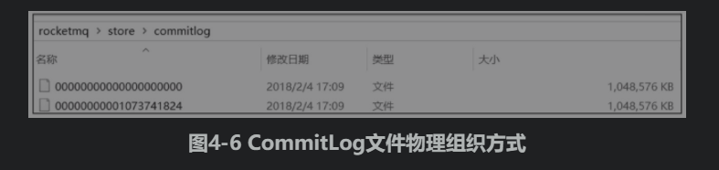

# 拉源码

github：

gitee：https://gitee.com/apache/rocketmq

# 源码编译与启动

## 全局install

```
mvn -Prelease-all -DskipTests clean install -U
```

## 启动namesrv

```
进入org.apache.rocketmq.namesrv.NamesrvStartup，执行main方法

会抛出错误, 原因是没有设置配置ROCKETMQ_HOME文件路径

Please set the ROCKETMQ_HOME variable in your environment to match the lo
cation of the RocketMQ installation  
```

解决办法

修改NamesrvStartup类createNamesrvController方法

```java
if (null == namesrvConfig.getRocketmqHome()) {
    System.out.printf("Please set the %s variable in your environment to match the location of the RocketMQ installation%n", MixAll.ROCKETMQ_HOME_ENV);
    System.exit(-2);
}

namesrvConfig.setRocketmqHome("E:\\GiteeDemo\\rocketmq\\distribution");
if (null == namesrvConfig.getRocketmqHome()) {
    System.out.printf("Please set the %s variable in your environment to match the location of the RocketMQ installation%n", MixAll.ROCKETMQ_HOME_ENV);
    System.exit(-2);
}
```


可以修改源码，增加rocketHome的配置，distribution是一个子项目的名称

也可以通过修改启动参数设置rocketHome， 在idea的run configurators中配置 VM参数为

-Drocketmq.home.dir=D:\code\java_yuanma\rocketmq\distribution

同时还需要设置user.home，指定日志文件路径

E:\GiteeDemo\xuegao-rocketmq-read\rocketmq\user.home

-Duser.home=D:\code\java_yuanma\rocketmq\user.home

还需要配置namesrv的ip和port


-n 127.0.0.1：9876


然后运行NamesrvStartup#main启动namesrv


## 启动broker

进入org.apache.rocketmq.broker.BrokerStartup，可以执行main方法，同样需要先配置rocketHome

在org.apache.rocketmq.broker.BrokerStartup#createBrokerController中修改源码，增加rocketHome的配置

```java
brokerConfig.setRocketmqHome("E:\\GiteeDemo\\rocketmq\\distribution");
if (null == brokerConfig.getRocketmqHome()) {
    System.out.printf("Please set the %s variable in your environment to match the location of the RocketMQ installation", MixAll.ROCKETMQ_HOME_ENV);
    System.exit(-2);
}
```

也可以通过修改启动参数设置rocketHome， 在idea的run configurators中配置 VM参数为

-Drocketmq.home.dir=D:\code\java_yuanma\rocketmq\distribution

同时还需要设置user.home，指定日志文件路径

-Duser.home=E:\GiteeDemo\rocketmq\user.home

还需要配置程序参数

‐n 127.0.0.0:9876 -c E:\GiteeDemo\rocketmq\distribution\conf\broker.conf


然后运行BrokerStartup#main启动broker


如果出现以下情况，ip不对，是因为多网卡的问题


这时需要修改D:\code\java_yuanma\rocketmq\distribution\conf\broker.conf 此配置文件

增加brokerIP1 = 127.0.0.1


### 测试

启动Producer发消息，成功

如果出现No Topic Route Info 错误：

broker.conf 中增加配置

```
autoCreateTopicEnable = true
namesrvAddr = 127.0.0.1:9876
```


# 源码结构

1）broker:broker模块（broker启动进程）。

2）client：消息客户端，包含消息生产者、消息消费者相关类。

3）common：公共包。

4）dev：开发者信息（非源代码）。

5）distribution：部署实例文件夹（非源代码）。

6）example:RocketMQ示例代码。

7）filter：消息过滤相关基础类。

8）filtersrv：消息过滤服务器实现相关类（Filter启动进程）。

9）logappender：日志实现相关类。

10）namesrv:NameServer实现相关类（NameServer启动进程）。

11）openmessaging：消息开放标准，正在制定中。

12）remoting：远程通信模块，基于Netty。

13）srvutil：服务器工具类。

14）store：消息存储实现相关类。

15）style:checkstyle相关实现。

16）test：测试相关类。17）tools：工具类，监控命令相关实现类。

# 设计理念和目标

基于主题的发布与订阅模式，其核心功能包括消息发送、消息存储（Broker）、消息消费，

整体设计追求简单与性能第一，主要体现在如下三个方面。

1，NameServer设计极其简单，抛弃zookeeper充当注册中心，自研NameServer来实现元数据的管理（Topic路由信息等）

从实际需求出发，因为Topic路由信息无须在集群之间保持强一致，追求最终一致性，并且能容忍分钟级的不一致。正是基于此种情况，RocketMQ的NameServer集群之间互不通信，极大地降低了NameServer实现的复杂程度，对网络的要求也降低了不少，但是性能相比较Zookeeper有了极大的提升。

2，高效的IO存储机制，RocketMQ追求消息发送的高吞吐量，RocketMQ的消息存储文件设计成文件组的概念，组内单个文件大小固定，方便引入内存映射机制，所有主题的消息存储基于顺序写，极大地提供了消息写性能，同时为了兼顾消息消费与消息查找，引入了消息消费队列文件与索引文件。

3，容忍存在设计缺陷，适当将某些工作下放给RocketMQ使用者。如何保证消息一定能被消息消费者消费，并且保证只消费一次。

RocketMQ的设计者给出的解决办法是不解决这个难题，而是退而求其次，只保证消息被消费者消费，但设计上允许消息被重复消费，这样极大地简化了消息中间件的内核，使得实现消息发送高可用变得非常简单与高效，消息重复问题由消费者在消息消费时实现幂等。


# 第2章 NameServer

brocker在启动时向所有的nameserver注册自己

producer在发送消息的时候，先去nameserver获取所有的broker地址，然后根据负载均衡算法选择一个broker发送

nameserver和所有的broker保持长连接，同时保持心跳的检测，30秒一次，检测到broker宕机，将其从路由表移除

但是路由变化不会马上通知消息生产者

## NameServer启动流程

### NameServerConfig

（NameServer业务参数）

```
参数来源

1）-c configFile通过-c命令指定配置文件的路径。
2）使用“--属性名 属性值”，例如 --listenPort 9876。
```

NameServerConfig

```
相关参数

rocketmqhome：rocketmq主目录，可以通过-Drocketmq.home.dir=path或通过设置环境变量ROCKETMQ_HOME来配置
kvConfigPath：NameServer存储KV配置属性的持久化路径
configStorePath：orderMessageEnable：是否支持顺序消息，默认是不支持。nameServer默认配置文件路径，不生效。
orderMessageEnable：是否支持顺序消息，默认是不支持。
```

### NettyServerConfig

（NameServer网络参数）

```
listenPort：NameServer监听端口，该值默认会被初始化为9876
serverWorkerThreads：Netty业务线程池线程个数
serverCallbackExecutorThreads：Netty public任务线程池线程个数，Netty网络设计，根据业务类型会创建不同的线程池，
	比如处理消息发送、消息消费、心跳检测等。如果该业务类型（RequestCode）未注册线程池，则由public线程池执行。
serverSelectorThreads：IO线程池线程个数，主要是NameServer、Broker端解析请求、返回相应的线程个数，
	这类线程主要是处理网络请求的，解析请求包，然后转发到各个业务线程池完成具体的业务操作，然后将结果再返回调用方。
serverOnewaySemaphoreValue：send oneway消息请求并发度（Broker端参数）
serverAsyncSemaphoreValue：异步消息发送最大并发度（Broker端参数
serverChannelMaxIdleTimeSeconds：网络连接最大空闲时间，默认120s。如果连接空闲时间超过该参数设置的值，连接将被关闭。由netty实现
serverSocketSndBufSize：网络socket发送缓存区大小，默认64k。
serverSocketRcvBufSize：网络socket接收缓存区大小，默认64k。
serverPooledByteBufAllocatorEnable：ByteBuffer是否开启缓存，建议开启
useEpollNativeSelector：是否启用Epoll IO模型，Linux环境建议开启
```


在启动NameServer时，可以先使用．/mqnameserver -c configFile -p打印当前加载的配置属性。


### 创建NameServerController

根据启动属性创建NamesrvController实例，并初始化该实例，NameServerController实例为NameServer核心控制器。

NamesrvStartup#start

```
调用NamesrvController#Initialize
注册JVM钩子函数并启动服务器，以便监听Broker、消息生产者的网络请求。

这里主要是向读者展示一种常用的编程技巧
如果代码中使用了线程池，一种优雅停机的方式就是注册一个JVM钩子函数，在JVM进程关闭之前，先将线程池关闭，及时释放资源。
```

NamesrvController#Initialize

```
 public boolean initialize() {
        // 加载KV的配置
        this.kvConfigManager.load();
        // 创建NettyServer网络处理对象
        this.remotingServer = new NettyRemotingServer(this.nettyServerConfig, this.brokerHousekeepingService);

        // 创建一个线程容量为 serverWorkerThreads 的固定长度的线程池，
        // 该线程池供 DefaultRequestProcessor 类使用，实现具体的默认的请求命令处理。
        this.remotingExecutor = Executors.newFixedThreadPool(
        	nettyServerConfig.getServerWorkerThreads(), new ThreadFactoryImpl("RemotingExecutorThread_"));

        this.registerProcessor();

        // 然后开启两个定时任务，在RocketMQ中此类定时任务统称为心跳检测。
        // 定时任务1:NameServer每隔10s扫描一次Broker，移除处于不激活状态的Broker。
        // 定时任务2:nameServer每隔10分钟打印一次KV配置。
        this.scheduledExecutorService.scheduleAtFixedRate(new Runnable() {

            @Override
            public void run() {
                NamesrvController.this.routeInfoManager.scanNotActiveBroker();
            }
        }, 5, 10, TimeUnit.SECONDS);

        this.scheduledExecutorService.scheduleAtFixedRate(new Runnable() {

            @Override
            public void run() {
                NamesrvController.this.kvConfigManager.printAllPeriodically();
            }
        }, 1, 10, TimeUnit.MINUTES);
	 return true;
}
```

## NameServer路由注册、故障剔除

NameServer主要作用是为消息生产者和消息消费者提供关于主题Topic的路由信息，那么NameServer需要存储路由的基础信息，还要能够管理Broker节点，包括路由注册、路由删除等功能。

NameServer路由实现类：org.apache.rocketmq.namesrv.routeinfo.RouteInfoManager

```java
private static final InternalLogger log = InternalLoggerFactory.getLogger(LoggerName.NAMESRV_LOGGER_NAME);
// NameServer 与 Broker 空闲时长，默认2分钟，在2分钟内 Nameserver 没有收到 Broker 的心跳包，则关闭该连接。
private final static long BROKER_CHANNEL_EXPIRED_TIME = 1000 * 60 * 2;
// 读写锁，用来保护非线程安全容器 HashMap。
private final ReadWriteLock lock = new ReentrantReadWriteLock();

// 每个Broker上存在该主题的队列个数。QueueData队列描述信息，对应如下属性：
// Topic消息队列路由信息，消息发送时根据路由表进行负载均衡。主题与队列关系，记录一个主题的队列分布在哪些Broker上，
private final HashMap<String/* topic */, List<QueueData>> topicQueueTable;
// Broker基础信息，包含brokerName、所属集群名称、主备Broker地址。
private final HashMap<String/* brokerName */, BrokerData> brokerAddrTable;
// Broker集群信息，存储集群中所有Broker名称。
private final HashMap<String/* clusterName */, Set<String/* brokerName */>> clusterAddrTable;
// 当前存活的 Broker,该信息不是实时的，
// Broker状态信息。NameServer 每10S扫描一次所有的 broker,根据心跳包的时间得知 broker的状态，NameServer每次收到心跳包时会替换该信息。
private final HashMap<String/* brokerAddr */, BrokerLiveInfo> brokerLiveTable;
// Broker上的FilterServer列表，用于类模式消息过滤，详细介绍请参考第6章的内容
private final HashMap<String/* brokerAddr */, List<String>/* Filter Server */> filterServerTable;
```

RocketMQ基于订阅发布机制，一个Topic拥有多个消息队列，一个Broker为每一主题默认创建4个读队列4个写队列。

多个Broker组成一个集群，BrokerName由相同的多台Broker组成Master-Slave架构，brokerId为0代表Master，大于0表示Slave。

BrokerLiveInfo中的lastUpdateTimestamp存储上次收到Broker心跳包的时间。


RocketMQ 2主2从数据结构展示图


TopicQueueTable、brokerAddrTable运行时内存结构


BrokerLiveTable、clusterAddrTable运行时内存结构


## 路由注册

RocketMQ路由注册是通过Broker与NameServer的心跳功能实现的。

Broker启动时向集群中所有的NameServer发送心跳语句，每隔30s向集群中所有NameServer发送心跳包，NameServer收到Broker心跳包时会更新brokerLiveTable缓存中BrokerLiveInfo的lastUpdate Timestamp，然后NameServer每隔10s扫描brokerLiveTable，如果连续120s没有收到心跳包，NameServer将移除该Broker的路由信息同时关闭Socket连接。


Broker发送心跳包

```java
// BrokerController#start

this.scheduledExecutorService.scheduleAtFixedRate(new Runnable() {

    @Override
    public void run() {
        try {
            BrokerController.this.registerBrokerAll(true, false, brokerConfig.isForceRegister());
        } catch (Throwable e) {
            log.error("registerBrokerAll Exception", e);
        }
    }
}, 1000 * 10, Math.max(10000, Math.min(brokerConfig.getRegisterNameServerPeriod(), 60000)), TimeUnit.MILLISECONDS);

```

遍历NameServer列表，Broker消息服务器依次向NameServer发送心跳包。

```java
// BrokerOuterAPI#registerBrokerAll
public List<RegisterBrokerResult> registerBrokerAll(
    final String clusterName,
    final String brokerAddr,
    final String brokerName,
    final long brokerId,
    final String haServerAddr,
    final TopicConfigSerializeWrapper topicConfigWrapper,
    final List<String> filterServerList,
    final boolean oneway,
    final int timeoutMills,
    final boolean compressed) {

    final List<RegisterBrokerResult> registerBrokerResultList = new CopyOnWriteArrayList<>();
    List<String> nameServerAddressList = this.remotingClient.getNameServerAddressList();
    if (nameServerAddressList != null && nameServerAddressList.size() > 0) {

        final RegisterBrokerRequestHeader requestHeader = new RegisterBrokerRequestHeader();
        requestHeader.setBrokerAddr(brokerAddr);
        requestHeader.setBrokerId(brokerId);
        requestHeader.setBrokerName(brokerName);
        requestHeader.setClusterName(clusterName);
        requestHeader.setHaServerAddr(haServerAddr);
        requestHeader.setCompressed(compressed);

        RegisterBrokerBody requestBody = new RegisterBrokerBody();
        requestBody.setTopicConfigSerializeWrapper(topicConfigWrapper);
        requestBody.setFilterServerList(filterServerList);
        final byte[] body = requestBody.encode(compressed);
        final int bodyCrc32 = UtilAll.crc32(body);
        requestHeader.setBodyCrc32(bodyCrc32);
        final CountDownLatch countDownLatch = new CountDownLatch(nameServerAddressList.size());
        for (final String namesrvAddr : nameServerAddressList) {
            brokerOuterExecutor.execute(new Runnable() {
                @Override
                public void run() {
                    try {
                        RegisterBrokerResult result = registerBroker(namesrvAddr,oneway, timeoutMills,requestHeader,body);
                        if (result != null) {
                            registerBrokerResultList.add(result);
                        }

                        log.info("register broker[{}]to name server {} OK", brokerId, namesrvAddr);
                    } catch (Exception e) {
                        log.warn("registerBroker Exception, {}", namesrvAddr, e);
                    } finally {
                        countDownLatch.countDown();
                    }
                }
            });
        }

        try {
            countDownLatch.await(timeoutMills, TimeUnit.MILLISECONDS);
        } catch (InterruptedException e) {
        }
    }

    return registerBrokerResultList;
}
```

网络发送代码

```java
// BrokerOuterAPI#registerBroker
private RegisterBrokerResult registerBroker(
        final String namesrvAddr,
        final boolean oneway,
        final int timeoutMills,
        final RegisterBrokerRequestHeader requestHeader,
        final byte[] body
    ) throws RemotingCommandException, MQBrokerException, RemotingConnectException, RemotingSendRequestException, RemotingTimeoutException,
        InterruptedException {
        RemotingCommand request = RemotingCommand.createRequestCommand(RequestCode.REGISTER_BROKER, requestHeader);
        request.setBody(body);

        if (oneway) {
            try {
                this.remotingClient.invokeOneway(namesrvAddr, request, timeoutMills);
            } catch (RemotingTooMuchRequestException e) {
                // Ignore
            }
            return null;
        }

        RemotingCommand response = this.remotingClient.invokeSync(namesrvAddr, request, timeoutMills);
        assert response != null;
        switch (response.getCode()) {
            case ResponseCode.SUCCESS: {
                RegisterBrokerResponseHeader responseHeader =
                    (RegisterBrokerResponseHeader) response.decodeCommandCustomHeader(RegisterBrokerResponseHeader.class);
                RegisterBrokerResult result = new RegisterBrokerResult();
                result.setMasterAddr(responseHeader.getMasterAddr());
                result.setHaServerAddr(responseHeader.getHaServerAddr());
                if (response.getBody() != null) {
                    result.setKvTable(KVTable.decode(response.getBody(), KVTable.class));
                }
                return result;
            }
            default:
                break;
        }

        throw new MQBrokerException(response.getCode(), response.getRemark(), requestHeader == null ? null : requestHeader.getBrokerAddr());
    }
```

发送心跳包具体逻辑，首先封装请求包头（Header）。

□ brokerAddr:broker地址。

□ brokerId:brokerId, 0:Master；大于0:Slave。

□ brokerName:broker名称。

□ clusterName：集群名称。

□ haServerAddr:master地址，初次请求时该值为空，slave向Nameserver注册后返回。

□ requestBody：


filterServerList。消息过滤服务器列表

topicConfigWrapper。主题配置，topicConfigWrapper内部封装的是Topic Config-Manager中的topicConfigTable，内部存储的是Broker启动时默认的一些Topic, MixAll.SELF_TEST_TOPIC、MixAll.DEFAULT_TOPIC（AutoCreateTopic-Enable=true）、MixAll.BENCHMARK_TOPIC、MixAll.OFFSET_MOVED_EVENT、BrokerConfig#brokerClusterName、BrokerConfig#brokerName。Broker中Topic默认存储在${Rocket_Home}/store/confg/topic.json中。


RocketMQ网络传输基于Netty，每一个请求，RocketMQ都会定义一个RequestCode，然后在服务端会对应相应的网络处理器（processor包中）,只需整库搜索RequestCode即可找到相应的处理逻辑。

## NameServer处理心跳包

org.apache.rocketmq.namesrv.processor.DefaultRequestProcessor网络处理器解析请求类型

如果请求类型为RequestCode.REGISTER_BROKER，则请求最终转发到RouteInfoMan ager#registerBroker。

```java
@Override
public RemotingCommand processRequest(ChannelHandlerContext ctx,
                                      RemotingCommand request) throws RemotingCommandException {

    if (ctx != null) {
        log.debug("receive request, {} {} {}",
                  request.getCode(),
                  RemotingHelper.parseChannelRemoteAddr(ctx.channel()),
                  request);
    }


    switch (request.getCode()) {
        case RequestCode.PUT_KV_CONFIG:
            return this.putKVConfig(ctx, request);
        case RequestCode.GET_KV_CONFIG:
            return this.getKVConfig(ctx, request);
        case RequestCode.DELETE_KV_CONFIG:
            return this.deleteKVConfig(ctx, request);
        case RequestCode.QUERY_DATA_VERSION:
            return queryBrokerTopicConfig(ctx, request);
        case RequestCode.REGISTER_BROKER:
            Version brokerVersion = MQVersion.value2Version(request.getVersion());
            if (brokerVersion.ordinal() >= MQVersion.Version.V3_0_11.ordinal()) {
                return this.registerBrokerWithFilterServer(ctx, request);
            } else {
                return this.registerBroker(ctx, request);
            }
        case RequestCode.UNREGISTER_BROKER:
            return this.unregisterBroker(ctx, request);
        case RequestCode.GET_ROUTEINFO_BY_TOPIC:
            return this.getRouteInfoByTopic(ctx, request);
        case RequestCode.GET_BROKER_CLUSTER_INFO:
            return this.getBrokerClusterInfo(ctx, request);
        case RequestCode.WIPE_WRITE_PERM_OF_BROKER:
            return this.wipeWritePermOfBroker(ctx, request);
        case RequestCode.GET_ALL_TOPIC_LIST_FROM_NAMESERVER:
            return getAllTopicListFromNameserver(ctx, request);
        case RequestCode.DELETE_TOPIC_IN_NAMESRV:
            return deleteTopicInNamesrv(ctx, request);
        case RequestCode.GET_KVLIST_BY_NAMESPACE:
            return this.getKVListByNamespace(ctx, request);
        case RequestCode.GET_TOPICS_BY_CLUSTER:
            return this.getTopicsByCluster(ctx, request);
        case RequestCode.GET_SYSTEM_TOPIC_LIST_FROM_NS:
            return this.getSystemTopicListFromNs(ctx, request);
        case RequestCode.GET_UNIT_TOPIC_LIST:
            return this.getUnitTopicList(ctx, request);
        case RequestCode.GET_HAS_UNIT_SUB_TOPIC_LIST:
            return this.getHasUnitSubTopicList(ctx, request);
        case RequestCode.GET_HAS_UNIT_SUB_UNUNIT_TOPIC_LIST:
            return this.getHasUnitSubUnUnitTopicList(ctx, request);
        case RequestCode.UPDATE_NAMESRV_CONFIG:
            return this.updateConfig(ctx, request);
        case RequestCode.GET_NAMESRV_CONFIG:
            return this.getConfig(ctx, request);
        default:
            break;
    }
    return null;
}
```

RouteInfoManager#registerBroker clusterAddrTable维护

路由注册需要加写锁，防止并发修改RouteInfoManager中的路由表。首先判断Broker所属集群是否存在，如果不存在，则创建，然后将broker名加入到集群Broker集合中。

```java
this.lock.writeLock().lockInterruptibly();

Set<String> brokerNames = this.clusterAddrTable.get(clusterName);
if (null == brokerNames) {
    brokerNames = new HashSet<String>();
    this.clusterAddrTable.put(clusterName, brokerNames);
}
brokerNames.add(brokerName);
```


RouteInfoManager#registerBroker brokerAddrTable维护

维护BrokerData信息，首先从brokerAddrTable根据BrokerName尝试获取Broker信息，如果不存在，则新建BrokerData并放入到brokerAddrTable,registerFirst设置为true；如果存在，直接替换原先的，registerFirst设置为false，表示非第一次注册。

```java
boolean registerFirst = false;

BrokerData brokerData = this.brokerAddrTable.get(brokerName);
if (null == brokerData) {
    registerFirst = true;
    brokerData = new BrokerData(clusterName, brokerName, new HashMap<Long, String>());
    this.brokerAddrTable.put(brokerName, brokerData);
}
Map<Long, String> brokerAddrsMap = brokerData.getBrokerAddrs();
//Switch slave to master: first remove <1, IP:PORT> in namesrv, then add <0, IP:PORT>
//The same IP:PORT must only have one record in brokerAddrTable
Iterator<Entry<Long, String>> it = brokerAddrsMap.entrySet().iterator();
while (it.hasNext()) {
    Entry<Long, String> item = it.next();
    if (null != brokerAddr && brokerAddr.equals(item.getValue()) && brokerId != item.getKey()) {
        it.remove();
    }
}

String oldAddr = brokerData.getBrokerAddrs().put(brokerId, brokerAddr);
registerFirst = registerFirst || (null == oldAddr);
```


RouteInfoManager#registerBroker topicQueueTable维护

如果Broker为Master，并且Broker Topic配置信息发生变化或者是初次注册，则需要创建或更新Topic路由元数据，填充topicQueueTable，其实就是为默认主题自动注册路由信息，其中包含MixAll.DEFAULT_TOPIC的路由信息。当消息生产者发送主题时，如果该主题未创建并且BrokerConfig的autoCreateTopicEnable为true时，将返回MixAll. DEFAULT_TOPIC的路由信息

```java
if (null != topicConfigWrapper && MixAll.MASTER_ID == brokerId) {
    if (this.isBrokerTopicConfigChanged(brokerAddr, topicConfigWrapper.getDataVersion()) || registerFirst) {
        ConcurrentMap<String, TopicConfig> tcTable = topicConfigWrapper.getTopicConfigTable();
        if (tcTable != null) {
            for (Map.Entry<String, TopicConfig> entry : tcTable.entrySet()) {
                this.createAndUpdateQueueData(brokerName, entry.getValue());
            }
        }
    }
}
```


RouteInfoManager#createAndUpdateQueueData

根据TopicConfig创建QueueData数据结构，然后更新topicQueueTable。

```java
private void createAndUpdateQueueData(final String brokerName, final TopicConfig topicConfig) {
    QueueData queueData = new QueueData();
    queueData.setBrokerName(brokerName);
    queueData.setWriteQueueNums(topicConfig.getWriteQueueNums());
    queueData.setReadQueueNums(topicConfig.getReadQueueNums());
    queueData.setPerm(topicConfig.getPerm());
    queueData.setTopicSynFlag(topicConfig.getTopicSysFlag());

    List<QueueData> queueDataList = this.topicQueueTable.get(topicConfig.getTopicName());
    if (null == queueDataList) {
        queueDataList = new LinkedList<QueueData>();
        queueDataList.add(queueData);
        this.topicQueueTable.put(topicConfig.getTopicName(), queueDataList);
        log.info("new topic registered, {} {}", topicConfig.getTopicName(), queueData);
    } else {
        boolean addNewOne = true;

        Iterator<QueueData> it = queueDataList.iterator();
        while (it.hasNext()) {
            QueueData qd = it.next();
            if (qd.getBrokerName().equals(brokerName)) {
                if (qd.equals(queueData)) {
                    addNewOne = false;
                } else {
                    log.info("topic changed, {} OLD: {} NEW: {}", topicConfig.getTopicName(), qd,
                             queueData);
                    it.remove();
                }
            }
        }

        if (addNewOne) {
            queueDataList.add(queueData);
        }
    }
}
```


RouteInfoManager#registerBroker

更新BrokerLiveInfo，存活Broker信息表，BrokeLiveInfo是执行路由删除的重要依据。

```java
BrokerLiveInfo prevBrokerLiveInfo = this.brokerLiveTable.put(brokerAddr,
                                                             new BrokerLiveInfo(
                                                                 System.currentTimeMillis(),
                                                                 topicConfigWrapper.getDataVersion(),
                                                                 channel,
                                                                 haServerAddr));
if (null == prevBrokerLiveInfo) {
    log.info("new broker registered, {} HAServer: {}", brokerAddr, haServerAddr);
}
```


RouteInfoManager#registerBroker

注册Broker的过滤器Server地址列表，一个Broker上会关联多个FilterServer消息过滤服务器，此部分内容将在第6章详细介绍；如果此Broker为从节点，则需要查找该Broker的Master的节点信息，并更新对应的masterAddr属性。

```java
if (filterServerList != null) {
    if (filterServerList.isEmpty()) {
        this.filterServerTable.remove(brokerAddr);
    } else {
        this.filterServerTable.put(brokerAddr, filterServerList);
    }
}

if (MixAll.MASTER_ID != brokerId) {
    String masterAddr = brokerData.getBrokerAddrs().get(MixAll.MASTER_ID);
    if (masterAddr != null) {
        BrokerLiveInfo brokerLiveInfo = this.brokerLiveTable.get(masterAddr);
        if (brokerLiveInfo != null) {
            result.setHaServerAddr(brokerLiveInfo.getHaServerAddr());
            result.setMasterAddr(masterAddr);
        }
    }
}
```

设计亮点：NameServe与Broker保持长连接，Broker状态存储在brokerLiveTable中，NameServer每收到一个心跳包，将更新brokerLiveTable中关于Broker的状态信息以及路由表（topicQueueTable、brokerAddrTable、brokerLiveTable、filterServerTable）。更新上述路由表（HashTable）使用了锁粒度较少的读写锁，允许多个消息发送者（Producer）并发读，保证消息发送时的高并发。但同一时刻NameServer只处理一个Broker心跳包，多个心跳包请求串行执行。这也是读写锁经典使用场景，更多关于读写锁的信息，可以参考笔者的博文：http://blog.csdn.net/prestigeding/article/details/53286756。


## 路由删除

根据上面章节的介绍，Broker每隔30s向NameServer发送一个心跳包，心跳包中包含BrokerId、Broker地址、Broker名称、Broker所属集群名称、Broker关联的FilterServer列表。但是如果Broker宕机，NameServer无法收到心跳包，此时NameServer如何来剔除这些失效的Broker呢？Name Server会每隔10s扫描brokerLiveTable状态表，如果BrokerLive的lastUpdateTimestamp的时间戳距当前时间超过120s，则认为Broker失效，移除该Broker，关闭与Broker连接，并同时更新topicQueueTable、brokerAddrTable、brokerLiveTable、filterServerTable。


RocktMQ有两个触发点来触发路由删除。

1）NameServer定时扫描brokerLiveTable检测上次心跳包与当前系统时间的时间差，如果时间戳大于120s，则需要移除该Broker信息。

2）Broker在正常被关闭的情况下，会执行unregisterBroker指令。

由于不管是何种方式触发的路由删除，路由删除的方法都是一样的，就是从topic-QueueTable、brokerAddrTable、brokerLiveTable、filterServerTable删除与该Broker相关的信息，但RocketMQ这两种方式维护路由信息时会抽取公共代码，本文将以第一种方式展开分析。


RouteInfoManager#scanNotActiveBroker

我们应该不会忘记scanNotActiveBroker在NameServer#NamesrvController中每10s执行一次。

遍历brokerLiveInfo路由表（HashMap），检测BrokerLiveInfo的lastUpdateTimestamp上次收到心跳包的时间如果超过当前时间120s,

NameServer则认为该Broker已不可用，故需要将它移除，关闭Channel，然后删除与该Broker相关的路由信息，路由表维护过程，需要申请写锁。

```java
public void scanNotActiveBroker() {
    Iterator<Entry<String, BrokerLiveInfo>> it = this.brokerLiveTable.entrySet().iterator();
    while (it.hasNext()) {
        Entry<String, BrokerLiveInfo> next = it.next();
        long last = next.getValue().getLastUpdateTimestamp();
        if ((last + BROKER_CHANNEL_EXPIRED_TIME) < System.currentTimeMillis()) {
            RemotingUtil.closeChannel(next.getValue().getChannel());
            it.remove();
            log.warn("The broker channel expired, {} {}ms", next.getKey(), BROKER_CHANNEL_EXPIRED_TIME);
            this.onChannelDestroy(next.getKey(), next.getValue().getChannel());
        }
    }
}
```


RouteInfoManager#onChannelDestroy

```java
    public void onChannelDestroy(String remoteAddr, Channel channel) {
        String brokerAddrFound = null;
        if (channel != null) {
            try {
                try {
                    this.lock.readLock().lockInterruptibly();
                    Iterator<Entry<String, BrokerLiveInfo>> itBrokerLiveTable =
                        this.brokerLiveTable.entrySet().iterator();
                    while (itBrokerLiveTable.hasNext()) {
                        Entry<String, BrokerLiveInfo> entry = itBrokerLiveTable.next();
                        if (entry.getValue().getChannel() == channel) {
                            brokerAddrFound = entry.getKey();
                            break;
                        }
                    }
                } finally {
                    this.lock.readLock().unlock();
                }
            } catch (Exception e) {
                log.error("onChannelDestroy Exception", e);
            }
        }

        if (null == brokerAddrFound) {
            brokerAddrFound = remoteAddr;
        } else {
            log.info("the broker's channel destroyed, {}, clean it's data structure at once", brokerAddrFound);
        }

        if (brokerAddrFound != null && brokerAddrFound.length() > 0) {

            try {
                try {
                    // Step1：申请写锁，根据brokerAddress从brokerLiveTable、filterServerTable移除，如代码清单2-18所示。
                    this.lock.writeLock().lockInterruptibly();
                    this.brokerLiveTable.remove(brokerAddrFound);
                    this.filterServerTable.remove(brokerAddrFound);
                    // Step1：
                    
                    // Step2：维护brokerAddrTable。
                    // 遍历从HashMap<String/* brokerName */,BrokerData>brokerAddrTable，
                    // 从BrokerData的HashMap<Long/* brokerId*/, String/* broker address */>brokerAddrs中，找到具体的Broker，
                    // 从BrokerData中移除，如果移除后在BrokerData中不再包含其他Broker，
                    // 则在brokerAddrTable中移除该brokerName对应的条目。
                    String brokerNameFound = null;
                    boolean removeBrokerName = false;
                    Iterator<Entry<String, BrokerData>> itBrokerAddrTable =
                        this.brokerAddrTable.entrySet().iterator();
                    while (itBrokerAddrTable.hasNext() && (null == brokerNameFound)) {
                        BrokerData brokerData = itBrokerAddrTable.next().getValue();

                        Iterator<Entry<Long, String>> it = brokerData.getBrokerAddrs().entrySet().iterator();
                        while (it.hasNext()) {
                            Entry<Long, String> entry = it.next();
                            Long brokerId = entry.getKey();
                            String brokerAddr = entry.getValue();
                            if (brokerAddr.equals(brokerAddrFound)) {
                                brokerNameFound = brokerData.getBrokerName();
                                it.remove();
                                log.info("remove brokerAddr[{}, {}] from brokerAddrTable, because channel destroyed",
                                    brokerId, brokerAddr);
                                break;
                            }
                        }

                        if (brokerData.getBrokerAddrs().isEmpty()) {
                            removeBrokerName = true;
                            itBrokerAddrTable.remove();
                            log.info("remove brokerName[{}] from brokerAddrTable, because channel destroyed",
                                brokerData.getBrokerName());
                        }
                    }

                    // Step3：根据BrokerName，从clusterAddrTable中找到Broker并从集群中移除。
                    // 如果移除后，集群中不包含任何Broker，则将该集群从clusterAddrTable中移除。
                    if (brokerNameFound != null && removeBrokerName) {
                        Iterator<Entry<String, Set<String>>> it = this.clusterAddrTable.entrySet().iterator();
                        while (it.hasNext()) {
                            Entry<String, Set<String>> entry = it.next();
                            String clusterName = entry.getKey();
                            Set<String> brokerNames = entry.getValue();
                            boolean removed = brokerNames.remove(brokerNameFound);
                            if (removed) {
                                log.info("remove brokerName[{}], clusterName[{}] from clusterAddrTable, because channel destroyed",
                                    brokerNameFound, clusterName);

                                if (brokerNames.isEmpty()) {
                                    log.info("remove the clusterName[{}] from clusterAddrTable, because channel destroyed and no broker in this cluster",
                                        clusterName);
                                    it.remove();
                                }

                                break;
                            }
                        }
                    }
                    // Step3：

                    // Step4：根据brokerName，遍历所有主题的队列，如果队列中包含了当前Broker的队列，
                    // 则移除，如果topic只包含待移除Broker的队列的话，从路由表中删除该topic，如代码清单2-21所示。
                    if (removeBrokerName) {
                        Iterator<Entry<String, List<QueueData>>> itTopicQueueTable =
                            this.topicQueueTable.entrySet().iterator();
                        while (itTopicQueueTable.hasNext()) {
                            Entry<String, List<QueueData>> entry = itTopicQueueTable.next();
                            String topic = entry.getKey();
                            List<QueueData> queueDataList = entry.getValue();

                            Iterator<QueueData> itQueueData = queueDataList.iterator();
                            while (itQueueData.hasNext()) {
                                QueueData queueData = itQueueData.next();
                                if (queueData.getBrokerName().equals(brokerNameFound)) {
                                    itQueueData.remove();
                                    log.info("remove topic[{} {}], from topicQueueTable, because channel destroyed",
                                        topic, queueData);
                                }
                            }

                            if (queueDataList.isEmpty()) {
                                itTopicQueueTable.remove();
                                log.info("remove topic[{}] all queue, from topicQueueTable, because channel destroyed",
                                    topic);
                            }
                        }
                    }
                    // Step4：
                } finally {
                    // Step5：释放锁，完成路由删除。
                    this.lock.writeLock().unlock();
                    // Step5：
                }
            } catch (Exception e) {
                log.error("onChannelDestroy Exception", e);
            }
        }
    }
```


## 路由发现

RocketMQ路由发现是非实时的，当Topic路由出现变化后，NameServer不主动推送给客户端，而是由客户端定时拉取主题最新的路由。

根据主题名称拉取路由信息的命令编码为：GET_ROUTEINTO_BY_TOPIC。RocketMQ路由结果如图2-6所示。

□ orderTopicConf：顺序消息配置内容，来自于kvConfig。

□ List<QueueData> queueData:topic队列元数据。

□ List<BrokerData> brokerDatas:topic分布的broker元数据。

□ HashMap<String/* brokerAdress*/, List<String>/*filterServer*/>:broker上过滤服务器地址列表。

□ NameServer路由发现实现类：DefaultRequestProcessor#getRouteInfoByTopic，如代码清单2-22所示。


DefaultRequestProcessor#getRouteInfoByTopic

Step1：调用RouterInfoManager的方法，从路由表topicQueueTable、brokerAddrTable、filterServerTable中分别填充TopicRouteData中的List<QueueData>、List<BrokerData>和filterServer地址表。

Step2：如果找到主题对应的路由信息并且该主题为顺序消息，则从NameServerKVconfig中获取关于顺序消息相关的配置填充路由信息。

如果找不到路由信息CODE则使用TOPIC_NOT_EXISTS，表示没有找到对应的路由。

```java
public RemotingCommand getRouteInfoByTopic(ChannelHandlerContext ctx,
                                           RemotingCommand request) throws RemotingCommandException {
    final RemotingCommand response = RemotingCommand.createResponseCommand(null);
    final GetRouteInfoRequestHeader requestHeader =
        (GetRouteInfoRequestHeader) request.decodeCommandCustomHeader(GetRouteInfoRequestHeader.class);

    TopicRouteData topicRouteData = this.namesrvController.getRouteInfoManager().pickupTopicRouteData(requestHeader.getTopic());

    if (topicRouteData != null) {
        if (this.namesrvController.getNamesrvConfig().isOrderMessageEnable()) {
            String orderTopicConf =
                this.namesrvController.getKvConfigManager().getKVConfig(NamesrvUtil.NAMESPACE_ORDER_TOPIC_CONFIG,
                                                                        requestHeader.getTopic());
            topicRouteData.setOrderTopicConf(orderTopicConf);
        }

        byte[] content = topicRouteData.encode();
        response.setBody(content);
        response.setCode(ResponseCode.SUCCESS);
        response.setRemark(null);
        return response;
    }

    response.setCode(ResponseCode.TOPIC_NOT_EXIST);
    response.setRemark("No topic route info in name server for the topic: " + requestHeader.getTopic()
                       + FAQUrl.suggestTodo(FAQUrl.APPLY_TOPIC_URL));
    return response;
}
```

## 本章小结

本章主要介绍了NameServer路由功能，包含路由元数据、路由注册与发现机制。

为了加强对本章的理解，路由发现机制可以用图2-6来形象解释。


NameServer路由发现与删除机制就介绍到这里了，我们会发现这种设计会存在这样一种情况：

NameServer需要等Broker失效至少120s才能将该Broker从路由表中移除掉，那如果在Broker故障期间，消息生产者Producer根据主题获取到的路由信息包含已经宕机的Broker，会导致消息发送失败，那这种情况怎么办，

岂不是消息发送不是高可用的？让我们带着这个疑问进入RocketMQ消息发送的学习。


# 第3章 消息发送

RocketMQ发送普通消息有三种实现方式：可靠同步发送、可靠异步发送、单向（Oneway）发送

## 漫谈消息发送

RocketMQ支持3种消息发送方式：同步（sync）、异步（async）、单向（oneway）。

同步：发送者向MQ执行发送消息API时，同步等待，直到消息服务器返回发送结果。

异步：发送者向MQ执行发送消息API时，指定消息发送成功后的回掉函数，然后调用消息发送API后，立即返回，消息发送者线程不阻塞，直到运行结束，消息发送成功或失败的回调任务在一个新的线程中执行。

单向：消息发送者向MQ执行发送消息API时，直接返回，不等待消息服务器的结果，也不注册回调函数，简单地说，就是只管发，不在乎消息是否成功存储在消息服务器上。


RocketMQ消息发送需要考虑以下几个问题。

□ 消息队列如何进行负载？

□ 消息发送如何实现高可用？

□ 批量消息发送如何实现一致性？


## 认识消息

RocketMQ消息封装类是org.apache.rocketmq.common.message.Message

## Message

基础属性主要包括消息所属主题topic、消息Flag（RocketMQ不做处理）、扩展属性、消息体。

```java
public class Message implements Serializable {
    private static final long serialVersionUID = 8445773977080406428L;

    private String topic;
    private int flag;
    // tag存储，消息TAG，用于消息过滤。
    // keys，Message索引键，多个用空格隔开，RocketMQ可以根据这些key快速检索到消息。
    // waitStoreMsgOK，消息发送时是否等消息存储完成后再返回。
    // delayTimeLevel：消息延迟级别，用于定时消息或消息重试。
    private Map<String, String> properties;
    private byte[] body;
    private String transactionId;

    public Message() {
    }

    public Message(String topic, String tags, String keys, int flag, byte[] body, boolean waitStoreMsgOK) {
        this.topic = topic;
        this.flag = flag;
        this.body = body;

        if (tags != null && tags.length() > 0)
            this.setTags(tags);

        if (keys != null && keys.length() > 0)
            this.setKeys(keys);

        this.setWaitStoreMsgOK(waitStoreMsgOK);
    }
}
```


## MessageFlag

```java
public class MessageSysFlag {
    public final static int COMPRESSED_FLAG = 0x1;
    public final static int MULTI_TAGS_FLAG = 0x1 << 1;
    public final static int TRANSACTION_NOT_TYPE = 0;
    public final static int TRANSACTION_PREPARED_TYPE = 0x1 << 2;
    public final static int TRANSACTION_COMMIT_TYPE = 0x2 << 2;
    public final static int TRANSACTION_ROLLBACK_TYPE = 0x3 << 2;
    public final static int BORNHOST_V6_FLAG = 0x1 << 4;
    public final static int STOREHOSTADDRESS_V6_FLAG = 0x1 << 5;

    public static int getTransactionValue(final int flag) {
        return flag & TRANSACTION_ROLLBACK_TYPE;
    }

    public static int resetTransactionValue(final int flag, final int type) {
        return (flag & (~TRANSACTION_ROLLBACK_TYPE)) | type;
    }

    public static int clearCompressedFlag(final int flag) {
        return flag & (~COMPRESSED_FLAG);
    }
}
```


## 生产者启动流程

## DefaultMQProducer消息发送者

DefaultMQProducer是默认的消息生产者实现类，它实现MQAdmin的接口

下面介绍DefaultMQProducer的主要方法。

```java
void createTopic（String key, String newTopic, int queueNum, inttopicSysFlag）;
// 创建主题。
// key：目前未实际作用，可以与newTopic相同。
// newTopic：主题名称。
// queueNum：队列数量。
// topicSysFlag：主题系统标签，默认为0。
long searchOffset（final MessageQueue mq, final long timestamp）;
// newTopic：主题名称。
// queueNum：队列数量。
// topicSysFlag：主题系统标签，默认为0。
long maxOffset（final MessageQueue mq）;
// 查找该消息队列中最大的物理偏移量。
long minOffset（final MessageQueue mq）;
// 查找该消息队列中最小物理偏移量。
MessageExt viewMessage（final String offsetMsgId）;
// 根据消息偏移量查找消息。
QueryResult queryMessage（final String topic, final String key, final intmaxNum, final long begin, final long end）;
// 根据条件查询消息。
// topic：消息主题。
// key：消息索引字段。
// maxNum：本次最多取出消息条数。
// begin：开始时间。
// end：结束时间。
MessageExt viewMessage（String topic, String msgId）;
// 根据主题与消息ID查找消息。
List<MessageQueue> fetchPublishMessageQueues（final String topic）;
// 查找该主题下所有的消息队列。
SendResult send（final Message msg）;
// 同步发送消息，具体发送到主题中的哪个消息队列由负载算法决定。
SendResult send（final Message msg, final long timeout）;
// 同步发送消息，如果发送超过timeout则抛出超时异常。
void send（final Message msg, final SendCallback sendCallback）;
// 异步发送消息，sendCallback参数是消息发送成功后的回调方法。
void send（final Message msg, final SendCallback sendCallback, finallong timeout）;
// 异步发送消息，如果发送超过timeout指定的值，则抛出超时异常。
void sendOneway（final Message msg）;
// 单向消息发送，就是不在乎发送结果，消息发送出去后该方法立即返回。
SendResult send（final Message msg, final MessageQueue mq）;
// 同步方式发送消息，发送到指定消息队列。
void send（final Message msg, final MessageQueue mq, finalSendCallback sendCallback）;
// 异步方式发送消息，发送到指定消息队列。
void sendOneway（final Message msg, final MessageQueue mq）;
// 单向方式发送消息，发送到指定的消息队列。
SendResult send（final Message msg, final MessageQueueSelectorselector, final Object arg）;
// 消息发送，指定消息选择算法，覆盖消息生产者默认的消息队列负载。
SendResult send（final Collection<Message> msgs, finalMessageQueue mq, final long timeout）;
// 同步批量消息发送。
```

```java
// 生产者所属组，消息服务器在回查事务状态时会随机选择该组中任何一个生产者发起事务回查请求
private String producerGroup;
// 默认topicKey。
private String createTopicKey = TopicValidator.AUTO_CREATE_TOPIC_KEY_TOPIC;
// 默认主题在每一个Broker队列数量。
private volatile int defaultTopicQueueNums = 4;
// 发送消息默认超时时间，默认3s。
private int sendMsgTimeout = 3000;
// 消息体超过该值则启用压缩，默认4K。
private int compressMsgBodyOverHowmuch = 1024 * 4;
// 同步方式发送消息重试次数，默认为2，总共执行3次。
private int retryTimesWhenSendFailed = 2;
// 异步方式发送消息重试次数，默认为2。
private int retryTimesWhenSendAsyncFailed = 2;
// 消息重试时选择另外一个Broker时，是否不等待存储结果就返回，默认为false。
private boolean retryAnotherBrokerWhenNotStoreOK = false;
// 允许发送的最大消息长度，默认为4M，该值最大值为2^32-1。
private int maxMessageSize = 1024 * 1024 * 4; // 4M
```

## 消息生产者启动流程

DefaultMQProducer的start

```java
@Override
public void start() throws MQClientException {
    this.defaultMQProducerImpl.initTransactionEnv();
    super.start();
}
```


DefaultMQProducerImpl的start

```java
public void start() throws MQClientException {
    this.start(true);
}

public void start(final boolean startFactory) throws MQClientException {
    switch (this.serviceState) {
        case CREATE_JUST:
            this.serviceState = ServiceState.START_FAILED;
			// Step1：检查productGroup是否符合要求；并改变生产者的instanceName为进程ID。
            this.checkConfig();
            // Step1

            if (!this.defaultMQProducer.getProducerGroup().equals(MixAll.CLIENT_INNER_PRODUCER_GROUP)) {
                this.defaultMQProducer.changeInstanceNameToPID();
            }

            // Step2：创建MQClientInstance实例。
            // 整个JVM实例中只存在一个MQClientManager实例，维护一个MQClientInstance缓存表ConcurrentMap<String/* clientId */, 
            // MQClientInstance>factoryTable =newConcurrentHashMap<String, MQClientInstance>（），
            // 也就是同一个clientId只会创建一个MQClientInstance。代码清单3-6是创建clientId的方法。
            this.mQClientFactory = MQClientManager.getInstance().getOrCreateMQClientInstance(this.defaultMQProducer, rpcHook);
			// Step2：
            
            // Step3：向MQClientInstance注册，将当前生产者加入到MQClientInstance管理中，方便后续调用网络请求、进行心跳检测等。
            boolean registerOK = mQClientFactory.registerProducer(this.defaultMQProducer.getProducerGroup(), this);
            if (!registerOK) {
                this.serviceState = ServiceState.CREATE_JUST;
                throw new MQClientException("The producer group[" + this.defaultMQProducer.getProducerGroup()
                                            + "] has been created before, specify another name please." + FAQUrl.suggestTodo(FAQUrl.GROUP_NAME_DUPLICATE_URL),
                                            null);
            }
			// Step3：
            
            this.topicPublishInfoTable.put(this.defaultMQProducer.getCreateTopicKey(), new TopicPublishInfo());

            // 启动MQClientInstance，如果MQClientInstance已经启动，则本次启动不会真正执行。
            // MQClientInstance启动过程将在第5章讲解消息消费时有详细的介绍。
            if (startFactory) {
                mQClientFactory.start();
            }

            log.info("the producer [{}] start OK. sendMessageWithVIPChannel={}", this.defaultMQProducer.getProducerGroup(),
                     this.defaultMQProducer.isSendMessageWithVIPChannel());
            this.serviceState = ServiceState.RUNNING;
            break;
        case RUNNING:
        case START_FAILED:
        case SHUTDOWN_ALREADY:
            throw new MQClientException("The producer service state not OK, maybe started once, "
                                        + this.serviceState
                                        + FAQUrl.suggestTodo(FAQUrl.CLIENT_SERVICE_NOT_OK),
                                        null);
        default:
            break;
    }

    this.mQClientFactory.sendHeartbeatToAllBrokerWithLock();

    this.timer.scheduleAtFixedRate(new TimerTask() {
        @Override
        public void run() {
            try {
                RequestFutureTable.scanExpiredRequest();
            } catch (Throwable e) {
                log.error("scan RequestFutureTable exception", e);
            }
        }
    }, 1000 * 3, 1000);
}
```


MQClientManager#getOrCreateMQClientInstance

```java
public MQClientInstance getOrCreateMQClientInstance(final ClientConfig clientConfig, RPCHook rpcHook) {
    String clientId = clientConfig.buildMQClientId();
    MQClientInstance instance = this.factoryTable.get(clientId);
    if (null == instance) {
        instance =
            new MQClientInstance(clientConfig.cloneClientConfig(),
                                 this.factoryIndexGenerator.getAndIncrement(), clientId, rpcHook);
        MQClientInstance prev = this.factoryTable.putIfAbsent(clientId, instance);
        if (prev != null) {
            instance = prev;
            log.warn("Returned Previous MQClientInstance for clientId:[{}]", clientId);
        } else {
            log.info("Created new MQClientInstance for clientId:[{}]", clientId);
        }
    }

    return instance;
}
```


ClientConfig#buildMQClientId

clientId为客户端IP+instance+（unitname可选），如果在同一台物理服务器部署两个应用程序，应用程序岂不是clientId相同，会造成混乱？

为了避免这个问题，如果instance为默认值DEFAULT的话，RocketMQ会自动将instance设置为进程ID，

这样避免了不同进程的相互影响，但同一个JVM中的不同消费者和不同生产者在启动时获取到的MQClientInstane实例都是同一个。

根据后面的介绍，MQClientInstance封装了RocketMQ网络处理API，是消息生产者（Producer）、消息消费者（Consumer）与NameServer、Broker打交道的网络通道。

```java
public String buildMQClientId() {
    StringBuilder sb = new StringBuilder();
    sb.append(this.getClientIP());

    sb.append("@");
    sb.append(this.getInstanceName());
    if (!UtilAll.isBlank(this.unitName)) {
        sb.append("@");
        sb.append(this.unitName);
    }

    return sb.toString();
}
```


## 消息发送基本流程

消息发送流程主要的步骤：验证消息、查找路由、消息发送（包含异常处理机制）。


同步消息发送入口

默认消息发送以同步方式发送，默认超时时间为3s。

DefaultMQProducer#send

```java
@Override
public SendResult send(Message msg) throws MQClientException, RemotingException, MQBrokerException, InterruptedException {
    Validators.checkMessage(msg, this);
    msg.setTopic(withNamespace(msg.getTopic()));
    return this.defaultMQProducerImpl.send(msg);
}
```

DefaultMQProducerImpl#send

```java
public SendResult send(
    Message msg) throws MQClientException, RemotingException, MQBrokerException, InterruptedException {
    return send(msg, this.defaultMQProducer.getSendMsgTimeout());
}
```

DefaultMQProducerImpl#send

```java
public SendResult send(Message msg, long timeout) 
    throws MQClientException, RemotingException, MQBrokerException, InterruptedException {
    
    return this.sendDefaultImpl(msg, CommunicationMode.SYNC, null, timeout);
}
```

DefaultMQProducerImpl#sendSelectImpl

```java
private SendResult sendSelectImpl(
        Message msg,
        MessageQueueSelector selector,
        Object arg,
        final CommunicationMode communicationMode,
        final SendCallback sendCallback, final long timeout
    ) throws MQClientException, RemotingException, MQBrokerException, InterruptedException {
        long beginStartTime = System.currentTimeMillis();
        this.makeSureStateOK();
    	// 消息长度验证
        Validators.checkMessage(msg, this.defaultMQProducer);

        TopicPublishInfo topicPublishInfo = this.tryToFindTopicPublishInfo(msg.getTopic());
        if (topicPublishInfo != null && topicPublishInfo.ok()) {
            MessageQueue mq = null;
            try {
                List<MessageQueue> messageQueueList =
                    mQClientFactory.getMQAdminImpl().parsePublishMessageQueues(topicPublishInfo.getMessageQueueList());
                Message userMessage = MessageAccessor.cloneMessage(msg);
                String userTopic = NamespaceUtil.withoutNamespace(userMessage.getTopic(), mQClientFactory.getClientConfig().getNamespace());
                userMessage.setTopic(userTopic);

                mq = mQClientFactory.getClientConfig().queueWithNamespace(selector.select(messageQueueList, userMessage, arg));
            } catch (Throwable e) {
                throw new MQClientException("select message queue threw exception.", e);
            }

            long costTime = System.currentTimeMillis() - beginStartTime;
            if (timeout < costTime) {
                throw new RemotingTooMuchRequestException("sendSelectImpl call timeout");
            }
            if (mq != null) {
                return this.sendKernelImpl(msg, mq, communicationMode, sendCallback, null, timeout - costTime);
            } else {
                throw new MQClientException("select message queue return null.", null);
            }
        }

        validateNameServerSetting();
        throw new MQClientException("No route info for this topic, " + msg.getTopic(), null);
    }

```

### 消息长度验证

消息发送之前，首先确保生产者处于运行状态，然后验证消息是否符合相应的规范，具体的规范要求是主题名称、消息体不能为空、消息长度不能等于0且默认不能超过允许发送消息的最大长度4M（maxMessageSize=1024 * 1024 * 4）。

### 查找主题路由信息

消息发送之前，首先需要获取主题的路由信息，只有获取了这些信息我们才知道消息要发送到具体的Broker节点。

tryToFindTopicPublishInfo是查找主题的路由信息的方法。

如果生产者中缓存了topic的路由信息，如果该路由信息中包含了消息队列，则直接返回该路由信息，如果没有缓存或没有包含消息队列，则向NameServer查询该topic的路由信息。

如果最终未找到路由信息，则抛出异常：无法找到主题相关路由信息异常。先看一下TopicPublishInfo，如图3-5所示。

```java
private TopicPublishInfo tryToFindTopicPublishInfo(final String topic) {
    TopicPublishInfo topicPublishInfo = this.topicPublishInfoTable.get(topic);
    if (null == topicPublishInfo || !topicPublishInfo.ok()) {
        this.topicPublishInfoTable.putIfAbsent(topic, new TopicPublishInfo());
        this.mQClientFactory.updateTopicRouteInfoFromNameServer(topic);
        topicPublishInfo = this.topicPublishInfoTable.get(topic);
    }

    if (topicPublishInfo.isHaveTopicRouterInfo() || topicPublishInfo.ok()) {
        return topicPublishInfo;
    } else {
        this.mQClientFactory.updateTopicRouteInfoFromNameServer(topic, true, this.defaultMQProducer);
        topicPublishInfo = this.topicPublishInfoTable.get(topic);
        return topicPublishInfo;
    }
}
```

第一次发送消息时，本地没有缓存topic的路由信息，查询NameServer尝试获取，

如果路由信息未找到，再次尝试用默认主题DefaultMQProducerImpl#createTopicKey去查询，

如果BrokerConfig#autoCreateTopicEnable为true时，NameServer将返回路由信息，如果autoCreateTopicEnable为false将抛出无法找到topic路由异常。

代码MQClientInstance#up dateTopicRouteInfoFromNameServer这个方法的功能是消息生产者更新和维护路由缓存，具体代码如下。


TopicPublishInfo

```java
public class TopicPublishInfo {
    private boolean orderTopic = false;
    private boolean haveTopicRouterInfo = false;
    private List<MessageQueue> messageQueueList = new ArrayList<MessageQueue>();
    private volatile ThreadLocalIndex sendWhichQueue = new ThreadLocalIndex();
    private TopicRouteData topicRouteData;
}
```

orderTopic：是否是顺序消息。

List<MessageQueue> messageQueueList：该主题队列的消息队列。

sendWhichQueue：每选择一次消息队列，该值会自增1，如果Integer.MAX_VALUE，则重置为0，用于选择消息队列。

List<QueueData> queueData:topic队列元数据。

List<BrokerData> brokerDatas:topic分布的broker元数据。

HashMap<String/* brokerAdress*/, List<String> /*filterServer*/>:broker上过滤服务器地址列表。


MQClientInstance#updateTopicRouteInfoFromNameServer

```java
public boolean updateTopicRouteInfoFromNameServer(final String topic, boolean isDefault,
                                                  DefaultMQProducer defaultMQProducer) {
    try {
        if (this.lockNamesrv.tryLock(LOCK_TIMEOUT_MILLIS, TimeUnit.MILLISECONDS)) {
            try {
                TopicRouteData topicRouteData;
                
                // Step1：如果isDefault为true，则使用默认主题去查询，
                // 如果查询到路由信息，则替换路由信息中读写队列个数为消息生产者默认的队列个数（defaultTopicQueueNums）；
                // 如果isDefault为false，则使用参数topic去查询；如果未查询到路由信息，则返回false，表示路由信息未变化。
                if (isDefault && defaultMQProducer != null) {
                    topicRouteData = this.mQClientAPIImpl.getDefaultTopicRouteInfoFromNameServer(defaultMQProducer.getCreateTopicKey(),
                                                                                                 1000 * 3);
                    if (topicRouteData != null) {
                        for (QueueData data : topicRouteData.getQueueDatas()) {
                            int queueNums = Math.min(defaultMQProducer.getDefaultTopicQueueNums(), data.getReadQueueNums());
                            data.setReadQueueNums(queueNums);
                            data.setWriteQueueNums(queueNums);
                        }
                    }
                } else {
                    topicRouteData = this.mQClientAPIImpl.getTopicRouteInfoFromNameServer(topic, 1000 * 3);
                }
                
                // Step2：如果路由信息找到，与本地缓存中的路由信息进行对比，判断路由信息是否发生了改变，如果未发生变化，则直接返回false。
                if (topicRouteData != null) {
                    TopicRouteData old = this.topicRouteTable.get(topic);
                    boolean changed = topicRouteDataIsChange(old, topicRouteData);
                    if (!changed) {
                        // Step3：更新MQClientInstance Broker地址缓存表。
                        changed = this.isNeedUpdateTopicRouteInfo(topic);
                    } else {
                        log.info("the topic[{}] route info changed, old[{}] ,new[{}]", topic, old, topicRouteData);
                    }

                    if (changed) {
                        TopicRouteData cloneTopicRouteData = topicRouteData.cloneTopicRouteData();

                        for (BrokerData bd : topicRouteData.getBrokerDatas()) {
                            this.brokerAddrTable.put(bd.getBrokerName(), bd.getBrokerAddrs());
                        }

                        // Update Pub info
                        {
                            // Step4：根据topicRouteData中的List<QueueData>转换成topicPublishInfo的List<MessageQueue>列表。
                            // 其具体实现在topicRouteData2TopicPublishInfo，然后会更新该MQClientInstance所管辖的所有消息发送关于topic的路由信息
                            TopicPublishInfo publishInfo = topicRouteData2TopicPublishInfo(topic, topicRouteData);
                            publishInfo.setHaveTopicRouterInfo(true);
                            Iterator<Entry<String, MQProducerInner>> it = this.producerTable.entrySet().iterator();
                            while (it.hasNext()) {
                                Entry<String, MQProducerInner> entry = it.next();
                                MQProducerInner impl = entry.getValue();
                                if (impl != null) {
                                    impl.updateTopicPublishInfo(topic, publishInfo);
                                }
                            }
                        }

                        // Update sub info
                        {
                            Set<MessageQueue> subscribeInfo = topicRouteData2TopicSubscribeInfo(topic, topicRouteData);
                            Iterator<Entry<String, MQConsumerInner>> it = this.consumerTable.entrySet().iterator();
                            while (it.hasNext()) {
                                Entry<String, MQConsumerInner> entry = it.next();
                                MQConsumerInner impl = entry.getValue();
                                if (impl != null) {
                                    impl.updateTopicSubscribeInfo(topic, subscribeInfo);
                                }
                            }
                        }
                        log.info("topicRouteTable.put. Topic = {}, TopicRouteData[{}]", topic, cloneTopicRouteData);
                        this.topicRouteTable.put(topic, cloneTopicRouteData);
                        return true;
                    }
                } else {
                    log.warn("updateTopicRouteInfoFromNameServer, getTopicRouteInfoFromNameServer return null, Topic: {}. [{}]", topic, this.clientId);
                }
            } catch (MQClientException e) {
                if (!topic.startsWith(MixAll.RETRY_GROUP_TOPIC_PREFIX)) {
                    log.warn("updateTopicRouteInfoFromNameServer Exception", e);
                }
            } catch (RemotingException e) {
                log.error("updateTopicRouteInfoFromNameServer Exception", e);
                throw new IllegalStateException(e);
            } finally {
                this.lockNamesrv.unlock();
            }
        } else {
            log.warn("updateTopicRouteInfoFromNameServer tryLock timeout {}ms. [{}]", LOCK_TIMEOUT_MILLIS, this.clientId);
        }
    } catch (InterruptedException e) {
        log.warn("updateTopicRouteInfoFromNameServer Exception", e);
    }

    return false;
}
```


MQClientInstance#updateTopicRouteInfoFromNameServer

Step4：根据topicRouteData中的List<QueueData>转换成topicPublishInfo的List<MessageQueue>列表。

其具体实现在topicRouteData2TopicPublishInfo，然后会更新该MQClientInstance所管辖的所有消息发送关于topic的路由信息。

```java
public static TopicPublishInfo topicRouteData2TopicPublishInfo(final String topic, final TopicRouteData route) {
    TopicPublishInfo info = new TopicPublishInfo();
    info.setTopicRouteData(route);
    if (route.getOrderTopicConf() != null && route.getOrderTopicConf().length() > 0) {
        String[] brokers = route.getOrderTopicConf().split(";");
        for (String broker : brokers) {
            String[] item = broker.split(":");
            int nums = Integer.parseInt(item[1]);
            for (int i = 0; i < nums; i++) {
                MessageQueue mq = new MessageQueue(topic, item[0], i);
                info.getMessageQueueList().add(mq);
            }
        }

        info.setOrderTopic(true);
    } else {
        List<QueueData> qds = route.getQueueDatas();
        Collections.sort(qds);
        for (QueueData qd : qds) {
            if (PermName.isWriteable(qd.getPerm())) {
                BrokerData brokerData = null;
                for (BrokerData bd : route.getBrokerDatas()) {
                    if (bd.getBrokerName().equals(qd.getBrokerName())) {
                        brokerData = bd;
                        break;
                    }
                }

                if (null == brokerData) {
                    continue;
                }

                if (!brokerData.getBrokerAddrs().containsKey(MixAll.MASTER_ID)) {
                    continue;
                }

                for (int i = 0; i < qd.getWriteQueueNums(); i++) {
                    MessageQueue mq = new MessageQueue(topic, qd.getBrokerName(), i);
                    info.getMessageQueueList().add(mq);
                }
            }
        }

        info.setOrderTopic(false);
    }

    return info;
}
```

循环遍历路由信息的QueueData信息，如果队列没有写权限，则继续遍历下一个QueueData；

根据brokerName找到brokerData信息，找不到或没有找到Master节点，则遍历下一个QueueData；

根据写队列个数，根据topic+序号创建MessageQueue，填充topicPublishInfo的List<QuueMessage>。完成消息发送的路由查找。


### 选择消息队列

根据路由信息选择消息队列，返回的消息队列按照broker、序号排序。举例说明，如果topicA在broker-a, broker-b上分别创建了4个队列，那么返回的消息队列：

```json
[
    {
        "broker-Name": "broker-a",
        "queueId": 0
    },
    {
        "brokerName": "broker-a",
        "queueId": 1
    },
    {
        "brokerName": "broker-a",
        "queueId": 2
    },
    {
        "brokerName": "broker-a",
        "queueId": 3
    },
    {
        "brokerName": "broker-b",
        "queueId": 0
    },
    {
        "brokerName": "broker-b",
        "queueId": 1
    },
    {
        "brokerName": "broker-b",
        "queueId": 2
    },
    {
        "brokerName": "broker-b",
        "queueId": 3
    }
]
```

那RocketMQ如何选择消息队列呢？

首先消息发送端采用重试机制

由retryTimesWhenSendFailed指定同步方式重试次数，异步重试机制在收到消息发送结构后执行回调之前进行重试。

由retryTimesWhen Send-AsyncFailed指定，接下来就是循环执行，选择消息队列、发送消息，发送成功则返回，收到异常则重试。

选择消息队列有两种方式。

1）sendLatencyFaultEnable=false，默认不启用Broker故障延迟机制。

2）sendLatencyFaultEnable=true，启用Broker故障延迟机制。


默认机制

sendLatencyFaultEnable=false，调用TopicPublishInfo#selectOneMessageQueue

```java
public MessageQueue selectOneMessageQueue(final String lastBrokerName) {
    if (lastBrokerName == null) {
        return selectOneMessageQueue();
    } else {
        for (int i = 0; i < this.messageQueueList.size(); i++) {
            int index = this.sendWhichQueue.getAndIncrement();
            int pos = Math.abs(index) % this.messageQueueList.size();
            if (pos < 0)
                pos = 0;
            MessageQueue mq = this.messageQueueList.get(pos);
            if (!mq.getBrokerName().equals(lastBrokerName)) {
                return mq;
            }
        }
        return selectOneMessageQueue();
    }
}

public MessageQueue selectOneMessageQueue() {
    int index = this.sendWhichQueue.getAndIncrement();
    int pos = Math.abs(index) % this.messageQueueList.size();
    if (pos < 0)
        pos = 0;
    return this.messageQueueList.get(pos);
}
```

首先在一次消息发送过程中，可能会多次执行选择消息队列这个方法，lastBrokerName就是上一次选择的执行发送消息失败的Broker。

第一次执行消息队列选择时，lastBrokerName为null，此时直接用sendWhichQueue自增再获取值，与当前路由表中消息队列个数取模，

返回该位置的MessageQueue（selectOneMessageQueue（）方法），如果消息发送再失败的话，下次进行消息队列选择时规避上次MesageQueue所在的Broker，否则还是很有可能再次失败。

该算法在一次消息发送过程中能成功规避故障的Broker，但如果Broker宕机，

由于路由算法中的消息队列是按Broker排序的，如果上一次根据路由算法选择的是宕机的Broker的第一个队列，那么随后的下次选择的是宕机Broker的第二个队列，消息发送很有可能会失败，再次引发重试，带来不必要的性能损耗，那么有什么方法在一次消息发送失败后，暂时将该Broker排除在消息队列选择范围外呢？或许有朋友会问，Broker不可用后，路由信息中为什么还会包含该Broker的路由信息呢？

其实这不难解释：首先，NameServer检测Broker是否可用是有延迟的，最短为一次心跳检测间隔（10s）；其次，NameServer不会检测到Broker宕机后马上推送消息给消息生产者，而是消息生产者每隔30s更新一次路由信息，所以消息生产者最快感知Broker最新的路由信息也需要30s。

如果能引入一种机制，在Broker宕机期间，如果一次消息发送失败后，可以将该Broker暂时排除在消息队列的选择范围中。

### Broker故障延迟机制

MQFaultStrategy#selectOneMessageQueue

首先对上述代码进行解读。

1）根据对消息队列进行轮询获取一个消息队列。

2）验证该消息队列是否可用，latencyFaultTolerance.isAvailable（mq.getBrokerName（））是关键。

3）如果返回的MessageQueue可用，移除latencyFaultTolerance关于该topic条目，表明该Broker故障已经恢复。

```java
public MessageQueue selectOneMessageQueue(final TopicPublishInfo tpInfo, final String lastBrokerName) {
    if (this.sendLatencyFaultEnable) {
        try {
            int index = tpInfo.getSendWhichQueue().getAndIncrement();
            for (int i = 0; i < tpInfo.getMessageQueueList().size(); i++) {
                int pos = Math.abs(index++) % tpInfo.getMessageQueueList().size();
                if (pos < 0)
                    pos = 0;
                MessageQueue mq = tpInfo.getMessageQueueList().get(pos);
                if (latencyFaultTolerance.isAvailable(mq.getBrokerName()))
                    return mq;
            }

            final String notBestBroker = latencyFaultTolerance.pickOneAtLeast();
            int writeQueueNums = tpInfo.getQueueIdByBroker(notBestBroker);
            if (writeQueueNums > 0) {
                final MessageQueue mq = tpInfo.selectOneMessageQueue();
                if (notBestBroker != null) {
                    mq.setBrokerName(notBestBroker);
                    mq.setQueueId(tpInfo.getSendWhichQueue().getAndIncrement() % writeQueueNums);
                }
                return mq;
            } else {
                latencyFaultTolerance.remove(notBestBroker);
            }
        } catch (Exception e) {
            log.error("Error occurred when selecting message queue", e);
        }

        return tpInfo.selectOneMessageQueue();
    }

    return tpInfo.selectOneMessageQueue(lastBrokerName);
}
```


LatencyFaultTolerance：延迟机制接口规范。

1）void updateFaultItem（final T name, final long currentLatency, final longnotAvailable-Duration）更新失败条目。

name:brokerName。

currentLatency：消息发送故障延迟时间。

notAvailableDuration：不可用持续时长，在这个时间内，Broker将被规避。

2）boolean isAvailable（final T name）判断Broker是否可用。

name:broker名称。

3）void remove（final T name）移除Fault条目，意味着Broker重新参与路由计算。

4）T pickOneAtLeast（）尝试从规避的Broker中选择一个可用的Broker，如果没有找到，将返回null。


FaultItem：失败条目（规避规则条目）。

1）final String name条目唯一键，这里为brokerName。

2）private volatile long currentLatency本次消息发送延迟。

3）private volatile long startTimestamp故障规避开始时间。


MQFaultStrategy：消息失败策略，延迟实现的门面类。

1）long[] latencyMax = {50L, 100L, 550L, 1000L, 2000L, 3000L, 15000L}，

2）long[] notAvailableDuration = {0L, 0L, 30000L, 60000L, 120000L,180000L, 600000L}

latencyMax，根据currentLatency本次消息发送延迟，从latencyMax尾部向前找到第一个比currentLatency小的索引index，如果没有找到，返回0。

然后根据这个索引从notAvailableDuration数组中取出对应的时间，在这个时长内，Broker将设置为不可用。


下面从源码的角度分析updateFaultItem、isAvailable方法的实现原理，如下所示。

DefaultMQProducerImpl#sendDefaultImpl

```java
beginTimestampPrev = System.currentTimeMillis();
if (times > 0) {
    //Reset topic with namespace during resend.
    msg.setTopic(this.defaultMQProducer.withNamespace(msg.getTopic()));
}
long costTime = beginTimestampPrev - beginTimestampFirst;
if (timeout < costTime) {
    callTimeout = true;
    break;
}

sendResult = this.sendKernelImpl(msg, mq, communicationMode, sendCallback, topicPublishInfo, timeout - costTime);
endTimestamp = System.currentTimeMillis();
this.updateFaultItem(mq.getBrokerName(), endTimestamp - beginTimestampPrev, false);
```

上述代码如果发送过程中抛出了异常，调用DefaultMQProducerImpl#updateFaultItem，该方法则直接调用MQFaultStrategy#updateFaultItem方法，关注一下各个参数的含义。

第一个参数：broker名称。

第二个参数：本次消息发送延迟时间currentLatency。

第三个参数：isolation，是否隔离，该参数的含义如果为true，则使用默认时长30s来计算Broker故障规避时长，如果为false，则使用本次消息发送延迟时间来计算Broker故障规避时长。


MQFaultStrategy#updateFaultItem

```java
public void updateFaultItem(final String brokerName, final long currentLatency, boolean isolation) {
    if (this.sendLatencyFaultEnable) {
        long duration = computeNotAvailableDuration(isolation ? 30000 : currentLatency);
        this.latencyFaultTolerance.updateFaultItem(brokerName, currentLatency, duration);
    }
}

private long computeNotAvailableDuration(final long currentLatency) {
    for (int i = latencyMax.length - 1; i >= 0; i--) {
        if (currentLatency >= latencyMax[i])
            return this.notAvailableDuration[i];
    }

    return 0;
}
```

如果isolation为true，则使用30s作为computeNotAvailableDuration方法的参数；

如果isolation为false，则使用本次消息发送时延作为computeNotAvailableDuration方法的参数，

那computeNotAvailableDuration的作用是计算因本次消息发送故障需要将Broker规避的时长，也就是接下来多久的时间内该Broker将不参与消息发送队列负载。

具体算法：从latencyMax数组尾部开始寻找，找到第一个比currentLatency小的下标，然后从notAvailableDuration数组中获取需要规避的时长，该方法最终调用LatencyFaultTolerance的updateFaultItem。


LatencyFaultToleranceImpl#updateFaultItem

```java
@Override
public void updateFaultItem(final String name, final long currentLatency, final long notAvailableDuration) {
    FaultItem old = this.faultItemTable.get(name);
    if (null == old) {
        final FaultItem faultItem = new FaultItem(name);
        faultItem.setCurrentLatency(currentLatency);
        faultItem.setStartTimestamp(System.currentTimeMillis() + notAvailableDuration);

        old = this.faultItemTable.putIfAbsent(name, faultItem);
        if (old != null) {
            old.setCurrentLatency(currentLatency);
            old.setStartTimestamp(System.currentTimeMillis() + notAvailableDuration);
        }
    } else {
        old.setCurrentLatency(currentLatency);
        old.setStartTimestamp(System.currentTimeMillis() + notAvailableDuration);
    }
}
```

根据broker名称从缓存表中获取FaultItem，如果找到则更新FaultItem，否则创建FaultItem。这里有两个关键点。

1）currentLatency、startTimeStamp被volatile修饰。

2）startTimeStamp为当前系统时间加上需要规避的时长。startTimeStamp是判断broker当前是否可用的直接一句，请看FaultItem#isAvailable方法。


FaultItem#isAvailable

```java
@Override
public boolean isAvailable(final String name) {
    final FaultItem faultItem = this.faultItemTable.get(name);
    if (faultItem != null) {
        return faultItem.isAvailable();
    }
    return true;
}

public boolean isAvailable() {
    return (System.currentTimeMillis() - startTimestamp) >= 0;
}
```


## 消息发送

DefaultMQProducerImpl#sendKernelImpl

```java
// Message msg：待发送消息。
// MessageQueue mq：消息将发送到该消息队列上。
// CommunicationMode communicationMode：消息发送模式，SYNC、ASYNC、ONEWAY。
// SendCallback sendCallback：异步消息回调函数。
// TopicPublishInfo topicPublishInfo：主题路由信息
// long timeout：消息发送超时时间。
private SendResult sendKernelImpl(final Message msg,
                                  final MessageQueue mq,
                                  final CommunicationMode communicationMode,
                                  final SendCallback sendCallback,
                                  final TopicPublishInfo topicPublishInfo,
                                  final long timeout) throws MQClientException, RemotingException, MQBrokerException, InterruptedException {
    long beginStartTime = System.currentTimeMillis();

    // Step1：根据MessageQueue获取Broker的网络地址。
    // 如果MQClientInstance的brokerAddrTable未缓存该Broker的信息，则从NameServer主动更新一下topic的路由信息。
    // 如果路由更新后还是找不到Broker信息，则抛出MQClientException，提示Broker不存在。
    String brokerAddr = this.mQClientFactory.findBrokerAddressInPublish(mq.getBrokerName());
    if (null == brokerAddr) {
        tryToFindTopicPublishInfo(mq.getTopic());
        brokerAddr = this.mQClientFactory.findBrokerAddressInPublish(mq.getBrokerName());
    }
    // Step1：

    SendMessageContext context = null;
    if (brokerAddr != null) {
        brokerAddr = MixAll.brokerVIPChannel(this.defaultMQProducer.isSendMessageWithVIPChannel(), brokerAddr);

        byte[] prevBody = msg.getBody();
        try {
            // Step2：为消息分配全局唯一ID，如果消息体默认超过4K（compressMsgBodyOverHowmuch），会对消息体采用zip压缩，
            // 并设置消息的系统标记为MessageSysFlag.COMPRESSED_FLAG。
            // 如果是事务Prepared消息，则设置消息的系统标记为MessageSysFlag.TRANSACTION_PREPARED_TYPE。

            //for MessageBatch,ID has been set in the generating process
            if (!(msg instanceof MessageBatch)) {
                MessageClientIDSetter.setUniqID(msg);
            }

            boolean topicWithNamespace = false;
            if (null != this.mQClientFactory.getClientConfig().getNamespace()) {
                msg.setInstanceId(this.mQClientFactory.getClientConfig().getNamespace());
                topicWithNamespace = true;
            }

            int sysFlag = 0;
            boolean msgBodyCompressed = false;
            if (this.tryToCompressMessage(msg)) {
                sysFlag |= MessageSysFlag.COMPRESSED_FLAG;
                msgBodyCompressed = true;
            }

            final String tranMsg = msg.getProperty(MessageConst.PROPERTY_TRANSACTION_PREPARED);
            if (tranMsg != null && Boolean.parseBoolean(tranMsg)) {
                sysFlag |= MessageSysFlag.TRANSACTION_PREPARED_TYPE;
            }
            // Step2：

            // Step3：如果注册了消息发送钩子函数，则执行消息发送之前的增强逻辑。
            // 通过DefaultMQProducerImpl#registerSendMessageHook注册钩子处理类，并且可以注册多个。
            // 简单看一下钩子处理类接口。
            if (hasCheckForbiddenHook()) {
                CheckForbiddenContext checkForbiddenContext = new CheckForbiddenContext();
                checkForbiddenContext.setNameSrvAddr(this.defaultMQProducer.getNamesrvAddr());
                checkForbiddenContext.setGroup(this.defaultMQProducer.getProducerGroup());
                checkForbiddenContext.setCommunicationMode(communicationMode);
                checkForbiddenContext.setBrokerAddr(brokerAddr);
                checkForbiddenContext.setMessage(msg);
                checkForbiddenContext.setMq(mq);
                checkForbiddenContext.setUnitMode(this.isUnitMode());
                this.executeCheckForbiddenHook(checkForbiddenContext);
            }

            if (this.hasSendMessageHook()) {
                context = new SendMessageContext();
                context.setProducer(this);
                context.setProducerGroup(this.defaultMQProducer.getProducerGroup());
                context.setCommunicationMode(communicationMode);
                context.setBornHost(this.defaultMQProducer.getClientIP());
                context.setBrokerAddr(brokerAddr);
                context.setMessage(msg);
                context.setMq(mq);
                context.setNamespace(this.defaultMQProducer.getNamespace());
                String isTrans = msg.getProperty(MessageConst.PROPERTY_TRANSACTION_PREPARED);
                if (isTrans != null && isTrans.equals("true")) {
                    context.setMsgType(MessageType.Trans_Msg_Half);
                }

                if (msg.getProperty("__STARTDELIVERTIME") != null || msg.getProperty(MessageConst.PROPERTY_DELAY_TIME_LEVEL) != null) {
                    context.setMsgType(MessageType.Delay_Msg);
                }
                this.executeSendMessageHookBefore(context);
            }

            // Step4：构建消息发送请求包。
            // 主要包含如下重要信息：生产者组、主题名称、默认创建主题Key、该主题在单个Broker默认队列数、队列ID（队列序号）、
            // 消息系统标记（MessageSysFlag）、消息发送时间、消息标记（RocketMQ对消息中的flag不做任何处理，供应用程序使用）、
            // 消息扩展属性、消息重试次数、是否是批量消息等。
            SendMessageRequestHeader requestHeader = new SendMessageRequestHeader();
            requestHeader.setProducerGroup(this.defaultMQProducer.getProducerGroup());
            requestHeader.setTopic(msg.getTopic());
            requestHeader.setDefaultTopic(this.defaultMQProducer.getCreateTopicKey());
            requestHeader.setDefaultTopicQueueNums(this.defaultMQProducer.getDefaultTopicQueueNums());
            requestHeader.setQueueId(mq.getQueueId());
            requestHeader.setSysFlag(sysFlag);
            requestHeader.setBornTimestamp(System.currentTimeMillis());
            requestHeader.setFlag(msg.getFlag());
            requestHeader.setProperties(MessageDecoder.messageProperties2String(msg.getProperties()));
            requestHeader.setReconsumeTimes(0);
            requestHeader.setUnitMode(this.isUnitMode());
            requestHeader.setBatch(msg instanceof MessageBatch);
            if (requestHeader.getTopic().startsWith(MixAll.RETRY_GROUP_TOPIC_PREFIX)) {
                String reconsumeTimes = MessageAccessor.getReconsumeTime(msg);
                if (reconsumeTimes != null) {
                    requestHeader.setReconsumeTimes(Integer.valueOf(reconsumeTimes));
                    MessageAccessor.clearProperty(msg, MessageConst.PROPERTY_RECONSUME_TIME);
                }

                String maxReconsumeTimes = MessageAccessor.getMaxReconsumeTimes(msg);
                if (maxReconsumeTimes != null) {
                    requestHeader.setMaxReconsumeTimes(Integer.valueOf(maxReconsumeTimes));
                    MessageAccessor.clearProperty(msg, MessageConst.PROPERTY_MAX_RECONSUME_TIMES);
                }
            }

            SendResult sendResult = null;
            switch (communicationMode) {
                case ASYNC:
                    Message tmpMessage = msg;
                    boolean messageCloned = false;
                    if (msgBodyCompressed) {
                        //If msg body was compressed, msgbody should be reset using prevBody.
                        //Clone new message using commpressed message body and recover origin massage.
                        //Fix bug:https://github.com/apache/rocketmq-externals/issues/66
                        tmpMessage = MessageAccessor.cloneMessage(msg);
                        messageCloned = true;
                        msg.setBody(prevBody);
                    }

                    if (topicWithNamespace) {
                        if (!messageCloned) {
                            tmpMessage = MessageAccessor.cloneMessage(msg);
                            messageCloned = true;
                        }
                        msg.setTopic(NamespaceUtil.withoutNamespace(msg.getTopic(), this.defaultMQProducer.getNamespace()));
                    }

                    long costTimeAsync = System.currentTimeMillis() - beginStartTime;
                    if (timeout < costTimeAsync) {
                        throw new RemotingTooMuchRequestException("sendKernelImpl call timeout");
                    }
                    sendResult = this.mQClientFactory.getMQClientAPIImpl().sendMessage(
                        brokerAddr,
                        mq.getBrokerName(),
                        tmpMessage,
                        requestHeader,
                        timeout - costTimeAsync,
                        communicationMode,
                        sendCallback,
                        topicPublishInfo,
                        this.mQClientFactory,
                        this.defaultMQProducer.getRetryTimesWhenSendAsyncFailed(),
                        context,
                        this);
                    break;
                case ONEWAY:
                case SYNC:
                    long costTimeSync = System.currentTimeMillis() - beginStartTime;
                    if (timeout < costTimeSync) {
                        throw new RemotingTooMuchRequestException("sendKernelImpl call timeout");
                    }
                    // Step5：根据消息发送方式，同步、异步、单向方式进行网络传输。
                    sendResult = this.mQClientFactory.getMQClientAPIImpl().sendMessage(
                        brokerAddr,
                        mq.getBrokerName(),
                        msg,
                        requestHeader,
                        timeout - costTimeSync,
                        communicationMode,
                        context,
                        this);
                    break;
                default:
                    assert false;
                    break;
            }
			// Step6：如果注册了消息发送钩子函数，执行after逻辑。
            // 注意，就算消息发送过程中发生RemotingException、MQBrokerException、InterruptedException时该方法也会执行。
            if (this.hasSendMessageHook()) {
                context.setSendResult(sendResult);
                this.executeSendMessageHookAfter(context);
            }

            return sendResult;
        } catch (RemotingException e) {
            if (this.hasSendMessageHook()) {
                context.setException(e);
                this.executeSendMessageHookAfter(context);
            }
            throw e;
        } catch (MQBrokerException e) {
            if (this.hasSendMessageHook()) {
                context.setException(e);
                this.executeSendMessageHookAfter(context);
            }
            throw e;
        } catch (InterruptedException e) {
            if (this.hasSendMessageHook()) {
                context.setException(e);
                this.executeSendMessageHookAfter(context);
            }
            throw e;
        } finally {
            msg.setBody(prevBody);
            msg.setTopic(NamespaceUtil.withoutNamespace(msg.getTopic(), this.defaultMQProducer.getNamespace()));
        }
    }

    throw new MQClientException("The broker[" + mq.getBrokerName() + "] not exist", null);
}
```


SendMessageHook注册钩子处理类

```java
public interface SendMessageHook {
    String hookName();

    void sendMessageBefore(final SendMessageContext context);

    void sendMessageAfter(final SendMessageContext context);
}
```


MQClientAPIImpl#sendMessage

Step5：根据消息发送方式，同步、异步、单向方式进行网络传输。

```java
public SendResult sendMessage(
    final String addr,
    final String brokerName,
    final Message msg,
    final SendMessageRequestHeader requestHeader,
    final long timeoutMillis,
    final CommunicationMode communicationMode,
    final SendCallback sendCallback,
    final TopicPublishInfo topicPublishInfo,
    final MQClientInstance instance,
    final int retryTimesWhenSendFailed,
    final SendMessageContext context,
    final DefaultMQProducerImpl producer
) throws RemotingException, MQBrokerException, InterruptedException {
    long beginStartTime = System.currentTimeMillis();
    RemotingCommand request = null;
    String msgType = msg.getProperty(MessageConst.PROPERTY_MESSAGE_TYPE);
    boolean isReply = msgType != null && msgType.equals(MixAll.REPLY_MESSAGE_FLAG);
    if (isReply) {
        if (sendSmartMsg) {
            SendMessageRequestHeaderV2 requestHeaderV2 = SendMessageRequestHeaderV2.createSendMessageRequestHeaderV2(requestHeader);
            request = RemotingCommand.createRequestCommand(RequestCode.SEND_REPLY_MESSAGE_V2, requestHeaderV2);
        } else {
            request = RemotingCommand.createRequestCommand(RequestCode.SEND_REPLY_MESSAGE, requestHeader);
        }
    } else {
        if (sendSmartMsg || msg instanceof MessageBatch) {
            SendMessageRequestHeaderV2 requestHeaderV2 = SendMessageRequestHeaderV2.createSendMessageRequestHeaderV2(requestHeader);
            request = RemotingCommand.createRequestCommand(msg instanceof MessageBatch ? RequestCode.SEND_BATCH_MESSAGE : RequestCode.SEND_MESSAGE_V2, requestHeaderV2);
        } else {
            request = RemotingCommand.createRequestCommand(RequestCode.SEND_MESSAGE, requestHeader);
        }
    }
    request.setBody(msg.getBody());

    switch (communicationMode) {
        case ONEWAY:
            this.remotingClient.invokeOneway(addr, request, timeoutMillis);
            return null;
        case ASYNC:
            final AtomicInteger times = new AtomicInteger();
            long costTimeAsync = System.currentTimeMillis() - beginStartTime;
            if (timeoutMillis < costTimeAsync) {
                throw new RemotingTooMuchRequestException("sendMessage call timeout");
            }
            this.sendMessageAsync(addr, brokerName, msg, timeoutMillis - costTimeAsync, request, sendCallback, topicPublishInfo, instance,
                                  retryTimesWhenSendFailed, times, context, producer);
            return null;
        case SYNC:
            long costTimeSync = System.cusrrentTimeMillis() - beginStartTime;
            if (timeoutMillis < costTimeSync) {
                throw new RemotingTooMuchRequestException("sendMessage call timeout");
            }
            return this.sendMessageSync(addr, brokerName, msg, timeoutMillis - costTimeSync, request);
        default:
            assert false;
            break;
    }

    return null;
}
```


## 同步发送

MQ客户端发送消息的入口是MQClientAPIImpl#sendMessage。

请求命令是Request-Code.SEND_MESSAGE，我们可以找到该命令的处理类：org.apache.rocketmq.broker.processor. Send MessageProcessor。

入口方法在SendMessageProcessor#sendMessage。


AbstractSendMessageProcessor#msgCheck

Step1：检查消息发送是否合理，这里完成了以下几件事情。

1）检查该Broker是否有写权限。

2）检查该Topic是否可以进行消息发送。主要针对默认主题，默认主题不能发送消息，仅仅供路由查找。

3）在NameServer端存储主题的配置信息，默认路径：${ROCKET_HOME}/store/config/topic.json。

下面是主题存储信息。

order：是否是顺序消息；

perm：权限码；

readQueueNums：读队列数量；

writeQueueNums：写队列数量；

topicName：主题名称；

topicSysFlag:topicFlag，当前版本暂为保留；

topicFilterType：主题过滤方式，当前版本仅支持SINGLE_TAG。

4）检查队列，如果队列不合法，返回错误码。

Step2：如果消息重试次数超过允许的最大重试次数，消息将进入到DLD延迟队列。延迟队列主题：%DLQ%+消费组名，延迟队列在消息消费时将重点讲解。Step3：调用DefaultMessageStore#putMessage进行消息存储。关于消息存储的实现细节将在第4章重点剖析。

```java
protected RemotingCommand msgCheck(final ChannelHandlerContext ctx,
                                   final SendMessageRequestHeader requestHeader, final RemotingCommand response) {
    if (!PermName.isWriteable(this.brokerController.getBrokerConfig().getBrokerPermission())
        && this.brokerController.getTopicConfigManager().isOrderTopic(requestHeader.getTopic())) {
        response.setCode(ResponseCode.NO_PERMISSION);
        response.setRemark("the broker[" + this.brokerController.getBrokerConfig().getBrokerIP1()
                           + "] sending message is forbidden");
        return response;
    }

    if (!TopicValidator.validateTopic(requestHeader.getTopic(), response)) {
        return response;
    }
    if (TopicValidator.isNotAllowedSendTopic(requestHeader.getTopic(), response)) {
        return response;
    }

    TopicConfig topicConfig =
        this.brokerController.getTopicConfigManager().selectTopicConfig(requestHeader.getTopic());
    if (null == topicConfig) {
        int topicSysFlag = 0;
        if (requestHeader.isUnitMode()) {
            if (requestHeader.getTopic().startsWith(MixAll.RETRY_GROUP_TOPIC_PREFIX)) {
                topicSysFlag = TopicSysFlag.buildSysFlag(false, true);
            } else {
                topicSysFlag = TopicSysFlag.buildSysFlag(true, false);
            }
        }

        log.warn("the topic {} not exist, producer: {}", requestHeader.getTopic(), ctx.channel().remoteAddress());
        topicConfig = this.brokerController.getTopicConfigManager().createTopicInSendMessageMethod(
            requestHeader.getTopic(),
            requestHeader.getDefaultTopic(),
            RemotingHelper.parseChannelRemoteAddr(ctx.channel()),
            requestHeader.getDefaultTopicQueueNums(), topicSysFlag);

        if (null == topicConfig) {
            if (requestHeader.getTopic().startsWith(MixAll.RETRY_GROUP_TOPIC_PREFIX)) {
                topicConfig =
                    this.brokerController.getTopicConfigManager().createTopicInSendMessageBackMethod(
                    requestHeader.getTopic(), 1, PermName.PERM_WRITE | PermName.PERM_READ,
                    topicSysFlag);
            }
        }

        if (null == topicConfig) {
            response.setCode(ResponseCode.TOPIC_NOT_EXIST);
            response.setRemark("topic[" + requestHeader.getTopic() + "] not exist, apply first please!"
                               + FAQUrl.suggestTodo(FAQUrl.APPLY_TOPIC_URL));
            return response;
        }
    }

    int queueIdInt = requestHeader.getQueueId();
    int idValid = Math.max(topicConfig.getWriteQueueNums(), topicConfig.getReadQueueNums());
    if (queueIdInt >= idValid) {
        String errorInfo = String.format("request queueId[%d] is illegal, %s Producer: %s",
                                         queueIdInt,
                                         topicConfig.toString(),
                                         RemotingHelper.parseChannelRemoteAddr(ctx.channel()));

        log.warn(errorInfo);
        response.setCode(ResponseCode.SYSTEM_ERROR);
        response.setRemark(errorInfo);

        return response;
    }
    return response;
}
```


## 异步发送

消息异步发送是指消息生产者调用发送的API后，无须阻塞等待消息服务器返回本次消息发送结果，

只需要提供一个回调函数，供消息发送客户端在收到响应结果回调。

异步方式相比同步方式，消息发送端的发送性能会显著提高，但为了保护消息服务器的负载压力，RocketMQ对消息发送的异步消息进行了并发控制，

通过参数clientAsync Semaphore Value来控制，默认为65535。

异步消息发送虽然也可以通过DefaultMQProducer#retryTimes-WhenSendAsyncFailed属性来控制消息重试次数，但是重试的调用入口是在收到服务端响应包时进行的，如果出现网络异常、网络超时等将不会重试。


## 单向发送

单向发送是指消息生产者调用消息发送的API后，无须等待消息服务器返回本次消息发送结果，并且无须提供回调函数，

表示消息发送压根就不关心本次消息发送是否成功，其实现原理与异步消息发送相同，

只是消息发送客户端在收到响应结果后什么都不做而已，并且没有重试机制。


## 批量消息发送

批量消息发送是将同一主题的多条消息一起打包发送到消息服务端，减少网络调用次数，提高网络传输效率。

当然，并不是在同一批次中发送的消息数量越多性能就越好，其判断依据是单条消息的长度，

如果单条消息内容比较长，则打包多条消息发送会影响其他线程发送消息的响应时间，

并且单批次消息发送总长度不能超过Default MQProducer#maxMessageSize。

批量消息发送要解决的是如何将这些消息编码以便服务端能够正确解码出每条消息的消息内容。


下面我们来一一介绍下RemotingCommand的属性。

1）code：请求命令编码，请求命令类型。

2）version：版本号。

3）opaque：客户端请求序号。

4）flag：标记

倒数第一位表示请求类型，0：请求；1：返回。

倒数第二位，1：表示oneway。

5）remark：描述。

6）extFields：扩展属性。

7）customeHeader：每个请求对应的请求头信息。

8）byte[] body：消息体内容。

单条消息发送时，消息体的内容将保存在body中。批量消息发送，需要将多条消息体的内容存储在body中，如何存储方便服务端正确解析出每条消息呢？

RocketMQ采取的方式是，对单条消息内容使用固定格式进行存储，如图3-8所示。


DefaultMQProducer#send批量信息发送

```java
@Override
public SendResult send(Collection<Message> msgs) 
    throws MQClientException, RemotingException, MQBrokerException, InterruptedException {
    
    return this.defaultMQProducerImpl.send(batch(msgs));
}
```

消息发送端调用batch方法，将一批消息封装成MessageBatch对象。

Message-Batch继承自Message对象，MessageBatch内部持有List<Message>messages。

这样的话，批量消息发送与单条消息发送的处理流程完全一样。

MessageBatch只需要将该集合中的每条消息的消息体body聚合成一个byte[]数值，在消息服务端能够从该byte[]数值中正确解析出消息即可。


MessageBatch#encode

```java
public byte[] encode() {
    return MessageDecoder.encodeMessages(messages);
}
```

在创建RemotingCommand对象时将调用messageBatch#encode（）方法填充到Remoting-Command的body域中。


多条消息编码格式如图3-8所示，对应代码

MessageDecoder#encodeMessage

```java
public static byte[] encodeMessage(Message message) {
    //only need flag, body, properties
    byte[] body = message.getBody();
    int bodyLen = body.length;
    String properties = messageProperties2String(message.getProperties());
    byte[] propertiesBytes = properties.getBytes(CHARSET_UTF8);
    //note properties length must not more than Short.MAX
    short propertiesLength = (short) propertiesBytes.length;
    int sysFlag = message.getFlag();
    int storeSize = 4 // 1 TOTALSIZE
        + 4 // 2 MAGICCOD
        + 4 // 3 BODYCRC
        + 4 // 4 FLAG
        + 4 + bodyLen // 4 BODY
        + 2 + propertiesLength;
    ByteBuffer byteBuffer = ByteBuffer.allocate(storeSize);
    // 1 TOTALSIZE
    byteBuffer.putInt(storeSize);

    // 2 MAGICCODE
    byteBuffer.putInt(0);

    // 3 BODYCRC
    byteBuffer.putInt(0);

    // 4 FLAG
    int flag = message.getFlag();
    byteBuffer.putInt(flag);

    // 5 BODY
    byteBuffer.putInt(bodyLen);
    byteBuffer.put(body);

    // 6 properties
    byteBuffer.putShort(propertiesLength);
    byteBuffer.put(propertiesBytes);

    return byteBuffer.array();
}
```

在消息发送端将会按照上述结构进行解码，然后整个发送流程与单个消息发送没什么差异，就不一一介绍了。


## 本章小结

1）消息生产者启动流程

重点理解MQClientInstance、消息生产者之间的关系

2）消息队列负载机制

消息生产者在发送消息时，如果本地路由表中未缓存topic的路由信息，向Name-Server发送获取路由信息请求，更新本地路由信息表，并且消息生产者每隔30s从Name-Server更新路由表。

3）消息发送异常机制

消息发送高可用主要通过两个手段：重试与Broker规避。

Broker规避就是在一次消息发送过程中发现错误，在某一时间段内，消息生产者不会选择该Broker（消息服务器）上的消息队列，提高发送消息的成功率。

4）批量消息发送

RocketMQ支持将同一主题下的多条消息一次性发送到消息服务端。


# 第4章 消息存储

 存储概要设计

RocketMQ主要存储的文件包括Comitlog文件、ConsumeQueue文件、IndexFile文件。

RocketMQ将所有主题的消息存储在同一个文件中，确保消息发送时顺序写文件，尽最大的能力确保消息发送的高性能与高吞吐量。

但由于消息中间件一般是基于消息主题的订阅机制，这样便给按照消息主题检索消息带来了极大的不便。

为了提高消息消费的效率，RocketMQ引入了ConsumeQueue消息队列文件，每个消息主题包含多个消息消费队列，每一个消息队列有一个消息文件。

IndexFile索引文件，其主要设计理念就是为了加速消息的检索性能，根据消息的属性快速从Commitlog文件中检索消息。

RocketMQ是一款高性能的消息中间件，存储部分的设计是核心，存储的核心是IO访问性能，


数据流向


1）CommitLog：消息存储文件，所有消息主题的消息都存储在CommitLog文件中。

2）ConsumeQueue：消息消费队列，消息到达CommitLog文件后，将异步转发到消息消费队列，供消息消费者消费。

3）IndexFile：消息索引文件，主要存储消息Key与Offset的对应关系。

4）事务状态服务：存储每条消息的事务状态。

5）定时消息服务：每一个延迟级别对应一个消息消费队列，存储延迟队列的消息拉取进度。


## 初识消息存储

消息存储实现类：org.apache.rocketmq.store.DefaultMessageStore

```java
public class DefaultMessageStore implements MessageStore {
     private final MessageStoreConfig messageStoreConfig;
    // CommitLog
    private final CommitLog commitLog;

    private final ConcurrentMap<String/* topic */, ConcurrentMap<Integer/* queueId */, ConsumeQueue>> consumeQueueTable;

    private final FlushConsumeQueueService flushConsumeQueueService;

    private final CleanCommitLogService cleanCommitLogService;

    private final CleanConsumeQueueService cleanConsumeQueueService;

    private final IndexService indexService;

    private final AllocateMappedFileService allocateMappedFileService;

    private final ReputMessageService reputMessageService;

    private final HAService haService;

    private final ScheduleMessageService scheduleMessageService;

    private final StoreStatsService storeStatsService;

    private final TransientStorePool transientStorePool;

    private final RunningFlags runningFlags = new RunningFlags();
    private final SystemClock systemClock = new SystemClock();

    private final ScheduledExecutorService scheduledExecutorService =
        Executors.newSingleThreadScheduledExecutor(new ThreadFactoryImpl("StoreScheduledThread"));
    private final BrokerStatsManager brokerStatsManager;
    private final MessageArrivingListener messageArrivingListener;
    private final BrokerConfig brokerConfig;

    private volatile boolean shutdown = true;

    private StoreCheckpoint storeCheckpoint;

    private AtomicLong printTimes = new AtomicLong(0);

    private final LinkedList<CommitLogDispatcher> dispatcherList;

    private RandomAccessFile lockFile;

    private FileLock lock;

    boolean shutDownNormal = false;

    private final ScheduledExecutorService diskCheckScheduledExecutorService =
            Executors.newSingleThreadScheduledExecutor(new ThreadFactoryImpl("DiskCheckScheduledThread"));
}
```

1）MessageStoreConfig messageStoreConfig：消息存储配置属性。

2）CommitLog commitLog:CommitLog文件的存储实现类。

3）ConcurrentMap<String/* topic */, ConcurrentMap<Integer/* queueId */,Consume-Queue>> consumeQueueTable：消息队列存储缓存表，按消息主题分组。

4）FlushConsumeQueueService flushConsumeQueueService：消息队列文件ConsumeQueue刷盘线程。

5）CleanCommitLogService cleanCommitLogService：清除CommitLog文件服务。

6）CleanConsumeQueueService cleanConsumeQueueService：清除ConsumeQueue文件服务。

7）IndexService indexService：索引文件实现类。

8）AllocateMappedFileService allocateMappedFileService:MappedFile分配服务。

9）ReputMessageService reputMessageService:CommitLog消息分发，根据CommitLog文件构建ConsumeQueue、IndexFile文件。

10）HAService haService：存储HA机制。

11）TransientStorePool transientStorePool：消息堆内存缓存。

12）MessageArrivingListener messageArrivingListener：消息拉取长轮询模式消息达到监听器。

13）BrokerConfig brokerConfig:Broker配置属性。

14）StoreCheckpoint storeCheckpoint：文件刷盘检测点。

15）LinkedList<CommitLogDispatcher> dispatcherList:CommitLog文件转发请求。

## 消息发送存储流程

消息存储入口：org.apache.rocketmq.store.DefaultMessageStore#putMessage。

Step1：如果当前Broker停止工作或Broker为SLAVE角色或当前Rocket不支持写入则拒绝消息写入；如果消息主题长度超过256个字符、消息属性长度超过65536个字符将拒绝该消息写入。

```
如果日志中包含“message store is not writeable, so putMessage isforbidden”，
出现这种日志最有可能是磁盘空间不足，在写ConsumeQueue、IndexFile文件出现错误时会拒绝消息再次写入。
```

Step2：如果消息的延迟级别大于0，将消息的原主题名称与原消息队列ID存入消息属性中，用延迟消息主题SCHEDULE_TOPIC、消息队列ID更新原先消息的主题与队列，这是并发消息消费重试关键的一步，下一章会重点探讨消息重试机制与定时消息的实现原理。


CommitLog#putMessage

```java
public class CommitLog {
    
    public PutMessageResult putMessage(final MessageExtBrokerInner msg) {
        // Set the storage time
        msg.setStoreTimestamp(System.currentTimeMillis());
        // Set the message body BODY CRC (consider the most appropriate setting
        // on the client)
        msg.setBodyCRC(UtilAll.crc32(msg.getBody()));
        // Back to Results
        AppendMessageResult result = null;

        StoreStatsService storeStatsService = this.defaultMessageStore.getStoreStatsService();

        String topic = msg.getTopic();
        int queueId = msg.getQueueId();

        final int tranType = MessageSysFlag.getTransactionValue(msg.getSysFlag());
        if (tranType == MessageSysFlag.TRANSACTION_NOT_TYPE
            || tranType == MessageSysFlag.TRANSACTION_COMMIT_TYPE) {
            // Delay Delivery
            if (msg.getDelayTimeLevel() > 0) {
                if (msg.getDelayTimeLevel() > this.defaultMessageStore.getScheduleMessageService().getMaxDelayLevel()) {
                    msg.setDelayTimeLevel(this.defaultMessageStore.getScheduleMessageService().getMaxDelayLevel());
                }

                topic = TopicValidator.RMQ_SYS_SCHEDULE_TOPIC;
                queueId = ScheduleMessageService.delayLevel2QueueId(msg.getDelayTimeLevel());

                // Backup real topic, queueId
                MessageAccessor.putProperty(msg, MessageConst.PROPERTY_REAL_TOPIC, msg.getTopic());
                MessageAccessor.putProperty(msg, MessageConst.PROPERTY_REAL_QUEUE_ID, String.valueOf(msg.getQueueId()));
                msg.setPropertiesString(MessageDecoder.messageProperties2String(msg.getProperties()));

                msg.setTopic(topic);
                msg.setQueueId(queueId);
            }
        }

        InetSocketAddress bornSocketAddress = (InetSocketAddress) msg.getBornHost();
        if (bornSocketAddress.getAddress() instanceof Inet6Address) {
            msg.setBornHostV6Flag();
        }

        InetSocketAddress storeSocketAddress = (InetSocketAddress) msg.getStoreHost();
        if (storeSocketAddress.getAddress() instanceof Inet6Address) {
            msg.setStoreHostAddressV6Flag();
        }

        long elapsedTimeInLock = 0;

        // Step3：获取当前可以写入的Commitlog文件，RocketMQ物理文件的组织方式如图4-3所示。
        MappedFile unlockMappedFile = null;
        MappedFile mappedFile = this.mappedFileQueue.getLastMappedFile();
		// Step3：
        
        putMessageLock.lock(); //spin or ReentrantLock ,depending on store config
        try {
            long beginLockTimestamp = this.defaultMessageStore.getSystemClock().now();
            this.beginTimeInLock = beginLockTimestamp;

            // Here settings are stored timestamp, in order to ensure an orderly
            // global
            msg.setStoreTimestamp(beginLockTimestamp);

            // Step4：在写入CommitLog之前，先申请putMessageLock，也就是将消息存储到CommitLog文件中是串行的。
            if (null == mappedFile || mappedFile.isFull()) {
                mappedFile = this.mappedFileQueue.getLastMappedFile(0); // Mark: NewFile may be cause noise
            }
            if (null == mappedFile) {
                log.error("create mapped file1 error, topic: " + msg.getTopic() + " clientAddr: " + msg.getBornHostString());
                beginTimeInLock = 0;
                return new PutMessageResult(PutMessageStatus.CREATE_MAPEDFILE_FAILED, null);
            }
			// Step4：
            
            result = mappedFile.appendMessage(msg, this.appendMessageCallback);
            switch (result.getStatus()) {
                case PUT_OK:
                    break;
                case END_OF_FILE:
                    unlockMappedFile = mappedFile;
                    // Create a new file, re-write the message
                    mappedFile = this.mappedFileQueue.getLastMappedFile(0);
                    if (null == mappedFile) {
                        // XXX: warn and notify me
                        log.error("create mapped file2 error, topic: " + msg.getTopic() + " clientAddr: " + msg.getBornHostString());
                        beginTimeInLock = 0;
                        return new PutMessageResult(PutMessageStatus.CREATE_MAPEDFILE_FAILED, result);
                    }
                    result = mappedFile.appendMessage(msg, this.appendMessageCallback);
                    break;
                case MESSAGE_SIZE_EXCEEDED:
                case PROPERTIES_SIZE_EXCEEDED:
                    beginTimeInLock = 0;
                    return new PutMessageResult(PutMessageStatus.MESSAGE_ILLEGAL, result);
                case UNKNOWN_ERROR:
                    beginTimeInLock = 0;
                    return new PutMessageResult(PutMessageStatus.UNKNOWN_ERROR, result);
                default:
                    beginTimeInLock = 0;
                    return new PutMessageResult(PutMessageStatus.UNKNOWN_ERROR, result);
            }

            elapsedTimeInLock = this.defaultMessageStore.getSystemClock().now() - beginLockTimestamp;
            beginTimeInLock = 0;
        } finally {
            putMessageLock.unlock();
        }

        if (elapsedTimeInLock > 500) {
            log.warn("[NOTIFYME]putMessage in lock cost time(ms)={}, bodyLength={} AppendMessageResult={}", elapsedTimeInLock, msg.getBody().length, result);
        }

        if (null != unlockMappedFile && this.defaultMessageStore.getMessageStoreConfig().isWarmMapedFileEnable()) {
            this.defaultMessageStore.unlockMappedFile(unlockMappedFile);
        }

        PutMessageResult putMessageResult = new PutMessageResult(PutMessageStatus.PUT_OK, result);

        // Statistics
        storeStatsService.getSinglePutMessageTopicTimesTotal(msg.getTopic()).incrementAndGet();
        storeStatsService.getSinglePutMessageTopicSizeTotal(topic).addAndGet(result.getWroteBytes());

        // Step14:DefaultAppendMessageCallback#doAppend只是将消息追加在内存中，需要根据是同步刷盘还是异步刷盘方式，
        // 将内存中的数据持久化到磁盘，关于刷盘操作后面会详细介绍。然后执行HA主从同步复制，主从同步将在第7章详细介绍。
        handleDiskFlush(result, putMessageResult, msg);
        handleHA(result, putMessageResult, msg);

        return putMessageResult;
    }
}
```

Commitlog文件存储目录为${ROCKET_HOME}/store/commitlog目录，每一个文件默认1G，一个文件写满后再创建另外一个，以该文件中第一个偏移量为文件名，偏移量小于20位用0补齐。图4-3所示的第一个文件初始偏移量为0，第二个文件的1073741824，代表该文件中的第一条消息的物理偏移量为1073741824，这样根据物理偏移量能快速定位到消息。MappedFileQueue可以看作是${ROCKET_HOME}/store/commitlog文件夹，而MappedFile则对应该文件夹下一个个的文件。


Step4：在写入CommitLog之前，先申请putMessageLock，也就是将消息存储到CommitLog文件中是串行的。


Step5：设置消息的存储时间，如果mappedFile为空，表明${ROCKET_HOME}/store/commitlog目录下不存在任何文件，

说明本次消息是第一次消息发送，用偏移量0创建第一个commit文件，文件为00000000000000000000，

如果文件创建失败，抛出CREATE_MAPEDFILE_FAILED，很有可能是磁盘空间不足或权限不够。


MappedFile#appendMessagesInner

```java
public class MappedFile extends ReferenceResource {
    public AppendMessageResult appendMessagesInner(final MessageExt messageExt, final AppendMessageCallback cb) {
        assert messageExt != null;
        assert cb != null;

        // Step6：将消息追加到MappedFile中。
        // 首先先获取MappedFile当前写指针，如果currentPos大于或等于文件大小则表明文件已写满，抛出AppendMessageStatus.UNKNOWN_ERROR。
        // 如果currentPos小于文件大小，通过slice（）方法创建一个与MappedFile的共享内存区，并设置position为当前指针。
        int currentPos = this.wrotePosition.get();

        if (currentPos < this.fileSize) {
            ByteBuffer byteBuffer = writeBuffer != null ? writeBuffer.slice() : this.mappedByteBuffer.slice();
            byteBuffer.position(currentPos);
            AppendMessageResult result;
            if (messageExt instanceof MessageExtBrokerInner) {
                result = cb.doAppend(this.getFileFromOffset(), byteBuffer, this.fileSize - currentPos, (MessageExtBrokerInner) messageExt);
            } else if (messageExt instanceof MessageExtBatch) {
                result = cb.doAppend(this.getFileFromOffset(), byteBuffer, this.fileSize - currentPos, (MessageExtBatch) messageExt);
            } else {
                return new AppendMessageResult(AppendMessageStatus.UNKNOWN_ERROR);
            }
            this.wrotePosition.addAndGet(result.getWroteBytes());
            this.storeTimestamp = result.getStoreTimestamp();
            return result;
        }
        // Step6：
        
        log.error("MappedFile.appendMessage return null, wrotePosition: {} fileSize: {}", currentPos, this.fileSize);
        return new AppendMessageResult(AppendMessageStatus.UNKNOWN_ERROR);
    }
}
```

CommitLog$DefaultAppendMessageCallback#doAppend

```java
// CommitLog
class DefaultAppendMessageCallback implements AppendMessageCallback {

    public AppendMessageResult doAppend(final long fileFromOffset, final ByteBuffer byteBuffer, final int maxBlank,
                                        final MessageExtBrokerInner msgInner) {
        // STORETIMESTAMP + STOREHOSTADDRESS + OFFSET <br>

        // PHY OFFSET
        // Step7：创建全局唯一消息ID，消息ID有16字节，消息ID组成如图4-4所示。
        long wroteOffset = fileFromOffset + byteBuffer.position();

        int sysflag = msgInner.getSysFlag();

        int bornHostLength = (sysflag & MessageSysFlag.BORNHOST_V6_FLAG) == 0 ? 4 + 4 : 16 + 4;
        int storeHostLength = (sysflag & MessageSysFlag.STOREHOSTADDRESS_V6_FLAG) == 0 ? 4 + 4 : 16 + 4;
        ByteBuffer bornHostHolder = ByteBuffer.allocate(bornHostLength);
        ByteBuffer storeHostHolder = ByteBuffer.allocate(storeHostLength);

        this.resetByteBuffer(storeHostHolder, storeHostLength);
        String msgId;
        if ((sysflag & MessageSysFlag.STOREHOSTADDRESS_V6_FLAG) == 0) {
            msgId = MessageDecoder.createMessageId(this.msgIdMemory, msgInner.getStoreHostBytes(storeHostHolder), wroteOffset);
        } else {
            msgId = MessageDecoder.createMessageId(this.msgIdV6Memory, msgInner.getStoreHostBytes(storeHostHolder), wroteOffset);
        }
        // Step7：

        // Step8：获取该消息在消息队列的偏移量。CommitLog中保存了当前所有消息队列的当前待写入偏移量。
        // Record ConsumeQueue information
        keyBuilder.setLength(0);
        keyBuilder.append(msgInner.getTopic());
        keyBuilder.append('-');
        keyBuilder.append(msgInner.getQueueId());
        String key = keyBuilder.toString();
        Long queueOffset = CommitLog.this.topicQueueTable.get(key);
        if (null == queueOffset) {
            queueOffset = 0L;
            CommitLog.this.topicQueueTable.put(key, queueOffset);
        }
        // Step8：

        // Transaction messages that require special handling
        final int tranType = MessageSysFlag.getTransactionValue(msgInner.getSysFlag());
        switch (tranType) {
                // Prepared and Rollback message is not consumed, will not enter the
                // consumer queuec
            case MessageSysFlag.TRANSACTION_PREPARED_TYPE:
            case MessageSysFlag.TRANSACTION_ROLLBACK_TYPE:
                queueOffset = 0L;
                break;
            case MessageSysFlag.TRANSACTION_NOT_TYPE:
            case MessageSysFlag.TRANSACTION_COMMIT_TYPE:
            default:
                break;
        }

        /**
             * Serialize message
             */
        final byte[] propertiesData =
            msgInner.getPropertiesString() == null ? null : msgInner.getPropertiesString().getBytes(MessageDecoder.CHARSET_UTF8);

        final int propertiesLength = propertiesData == null ? 0 : propertiesData.length;

        if (propertiesLength > Short.MAX_VALUE) {
            log.warn("putMessage message properties length too long. length={}", propertiesData.length);
            return new AppendMessageResult(AppendMessageStatus.PROPERTIES_SIZE_EXCEEDED);
        }

        final byte[] topicData = msgInner.getTopic().getBytes(MessageDecoder.CHARSET_UTF8);
        final int topicLength = topicData.length;

        final int bodyLength = msgInner.getBody() == null ? 0 : msgInner.getBody().length;

        final int msgLen = calMsgLength(msgInner.getSysFlag(), bodyLength, topicLength, propertiesLength);

        // Exceeds the maximum message
        if (msgLen > this.maxMessageSize) {
            CommitLog.log.warn("message size exceeded, msg total size: " + msgLen + ", msg body size: " + bodyLength
                               + ", maxMessageSize: " + this.maxMessageSize);
            return new AppendMessageResult(AppendMessageStatus.MESSAGE_SIZE_EXCEEDED);
        }

        
        // Step10：如果消息长度+END_FILE_MIN_BLANK_LENGTH大于CommitLog文件的空闲空间，则返回AppendMessageStatus.END_OF_FILE, 
        // Broker会重新创建一个新的CommitLog文件来存储该消息。从这里可以看出，每个CommitLog文件最少会空闲8个字节，
        // 高4字节存储当前文件剩余空间，低4字节存储魔数：CommitLog.BLANK_MAGIC_CODE。
        // Determines whether there is sufficient free space
        if ((msgLen + END_FILE_MIN_BLANK_LENGTH) > maxBlank) {
            this.resetByteBuffer(this.msgStoreItemMemory, maxBlank);
            // 1 TOTALSIZE
            this.msgStoreItemMemory.putInt(maxBlank);
            // 2 MAGICCODE
            this.msgStoreItemMemory.putInt(CommitLog.BLANK_MAGIC_CODE);
            // 3 The remaining space may be any value
            // Here the length of the specially set maxBlank
            final long beginTimeMills = CommitLog.this.defaultMessageStore.now();
            byteBuffer.put(this.msgStoreItemMemory.array(), 0, maxBlank);
            return new AppendMessageResult(AppendMessageStatus.END_OF_FILE, wroteOffset, maxBlank, msgId, msgInner.getStoreTimestamp(),
                                           queueOffset, CommitLog.this.defaultMessageStore.now() - beginTimeMills);
        // Step10：
        }

        // Initialization of storage space
        this.resetByteBuffer(msgStoreItemMemory, msgLen);
        // 1 TOTALSIZE
        this.msgStoreItemMemory.putInt(msgLen);
        // 2 MAGICCODE
        this.msgStoreItemMemory.putInt(CommitLog.MESSAGE_MAGIC_CODE);
        // 3 BODYCRC
        this.msgStoreItemMemory.putInt(msgInner.getBodyCRC());
        // 4 QUEUEID
        this.msgStoreItemMemory.putInt(msgInner.getQueueId());
        // 5 FLAG
        this.msgStoreItemMemory.putInt(msgInner.getFlag());
        // 6 QUEUEOFFSET
        this.msgStoreItemMemory.putLong(queueOffset);
        // 7 PHYSICALOFFSET
        this.msgStoreItemMemory.putLong(fileFromOffset + byteBuffer.position());
        // 8 SYSFLAG
        this.msgStoreItemMemory.putInt(msgInner.getSysFlag());
        // 9 BORNTIMESTAMP
        this.msgStoreItemMemory.putLong(msgInner.getBornTimestamp());
        // 10 BORNHOST
        this.resetByteBuffer(bornHostHolder, bornHostLength);
        this.msgStoreItemMemory.put(msgInner.getBornHostBytes(bornHostHolder));
        // 11 STORETIMESTAMP
        this.msgStoreItemMemory.putLong(msgInner.getStoreTimestamp());
        // 12 STOREHOSTADDRESS
        this.resetByteBuffer(storeHostHolder, storeHostLength);
        this.msgStoreItemMemory.put(msgInner.getStoreHostBytes(storeHostHolder));
        // 13 RECONSUMETIMES
        this.msgStoreItemMemory.putInt(msgInner.getReconsumeTimes());
        // 14 Prepared Transaction Offset
        this.msgStoreItemMemory.putLong(msgInner.getPreparedTransactionOffset());
        // 15 BODY
        this.msgStoreItemMemory.putInt(bodyLength);
        if (bodyLength > 0)
            this.msgStoreItemMemory.put(msgInner.getBody());
        // 16 TOPIC
        this.msgStoreItemMemory.put((byte) topicLength);
        this.msgStoreItemMemory.put(topicData);
        // 17 PROPERTIES
        this.msgStoreItemMemory.putShort((short) propertiesLength);
        if (propertiesLength > 0)
            this.msgStoreItemMemory.put(propertiesData);

        // Step11：将消息内容存储到ByteBuffer中，然后创建AppendMessageResult。
        // 这里只是将消息存储在MappedFile对应的内存映射Buffer中，并没有刷写到磁盘，追加结果如图4-5所示。
        final long beginTimeMills = CommitLog.this.defaultMessageStore.now();
        // Write messages to the queue buffer
        byteBuffer.put(this.msgStoreItemMemory.array(), 0, msgLen);

        AppendMessageResult result = new AppendMessageResult(AppendMessageStatus.PUT_OK, wroteOffset, msgLen, msgId,
                                                             msgInner.getStoreTimestamp(), queueOffset, CommitLog.this.defaultMessageStore.now() - beginTimeMills);

        // Step12：更新消息队列逻辑偏移量。
        // Step13：处理完消息追加逻辑后将释放putMessageLock锁。
        switch (tranType) {
            case MessageSysFlag.TRANSACTION_PREPARED_TYPE:
            case MessageSysFlag.TRANSACTION_ROLLBACK_TYPE:
                break;
            case MessageSysFlag.TRANSACTION_NOT_TYPE:
            case MessageSysFlag.TRANSACTION_COMMIT_TYPE:
                // The next update ConsumeQueue information
                CommitLog.this.topicQueueTable.put(key, ++queueOffset);
                break;
            default:
                break;
        }
        // Step11：
        return result;
    }
}
```


但为了消息ID可读性，返回给应用程序的msgId为字符类型，可以通过UtilAll.bytes2string方法将msgId字节数组转换成字符串，通过UtilAll.string2bytes方法将msgId字符串还原成16个字节的字节数组，从而根据提取消息偏移量，可以快速通过msgId找到消息内容。

```java
protected static int calMsgLength(int sysFlag, int bodyLength, int topicLength, int propertiesLength) {
    int bornhostLength = (sysFlag & MessageSysFlag.BORNHOST_V6_FLAG) == 0 ? 8 : 20;
    int storehostAddressLength = (sysFlag & MessageSysFlag.STOREHOSTADDRESS_V6_FLAG) == 0 ? 8 : 20;
    final int msgLen = 4 //TOTALSIZE
        + 4 //MAGICCODE
        + 4 //BODYCRC
        + 4 //QUEUEID
        + 4 //FLAG
        + 8 //QUEUEOFFSET
        + 8 //PHYSICALOFFSET
        + 4 //SYSFLAG
        + 8 //BORNTIMESTAMP
        + bornhostLength //BORNHOST
        + 8 //STORETIMESTAMP
        + storehostAddressLength //STOREHOSTADDRESS
        + 4 //RECONSUMETIMES
        + 8 //Prepared Transaction Offset
        + 4 + (bodyLength > 0 ? bodyLength : 0) //BODY
        + 1 + topicLength //TOPIC
        + 2 + (propertiesLength > 0 ? propertiesLength : 0) //propertiesLength
        + 0;
    return msgLen;
}
```

Step9：根据消息体的长度、主题的长度、属性的长度结合消息存储格式计算消息的总长度。


RocketMQ消息存储格式如下。

1）TOTALSIZE：该消息条目总长度，4字节。

2）MAGICCODE：魔数，4字节。固定值0xdaa320a7。

3）BODYCRC：消息体crc校验码，4字节。

4）QUEUEID：消息消费队列ID,4字节。

5）FLAG：消息FLAG, RocketMQ不做处理，供应用程序使用，默认4字节。

6）QUEUEOFFSET：消息在消息消费队列的偏移量，8字节。

7）PHYSICALOFFSET：消息在CommitLog文件中的偏移量，8字节。

8）SYSFLAG：消息系统Flag，例如是否压缩、是否是事务消息等，4字节。

9）BORNTIMESTAMP：消息生产者调用消息发送API的时间戳，8字节。

10）BORNHOST：消息发送者IP、端口号，8字节。

11）STORETIMESTAMP：消息存储时间戳，8字节。

12）STOREHOSTADDRESS:Broker服务器IP+端口号，8字节。

13）RECONSUMETIMES：消息重试次数，4字节。

14）Prepared Transaction Offset：事务消息物理偏移量，8字节。

15）BodyLength：消息体长度，4字节。

16）Body：消息体内容，长度为bodyLenth中存储的值。

17）TopicLength：主题存储长度，1字节，表示主题名称不能超过255个字符。

18）Topic：主题，长度为TopicLength中存储的值。

19）PropertiesLength：消息属性长度，2字节，表示消息属性长度不能超过65536个字符。

20）Properties：消息属性，长度为PropertiesLength中存储的值。


介绍下AppendMessageResult的属性。

1）AppendMessageStatus status：消息追加结果，取值PUT_OK：追加成功；END_OF_FILE：超过文件大小；MESSAGE_SIZE_EXCEEDED：消息长度超过最大允许长度：PROPERTIES_SIZE_EXCEEDED：消息属性超过最大允许长度；UNKNOWN_ERROR：未知异常。

2）long wroteOffset：消息的物理偏移量。

3）String msgId：消息ID。

4）long storeTimestamp：消息存储时间戳。

5）long logicsOffset：消息消费队列逻辑偏移量，类似于数组下标。

6）long pagecacheRT = 0：当前未使用。

7）int msgNum = 1：消息条数，批量消息发送时消息条数。


## 存储文件组织与内存映射

```java
// RocketMQ通过使用内存映射文件来提高IO访问性能，无论是CommitLog、ConsumeQueue还是IndexFile，
// 单个文件都被设计为固定长度，如果一个文件写满以后再创建一个新文件，文件名就为该文件第一条消息对应的全局物理偏移量。
```




### MappedFileQueue映射文件队列


## RocketMQ存储文件


## 消息队列与索引文件恢复


## Broker正常停止文件恢复

Broker正常停止文件恢复的实现为CommitLog#recoverNormally。

```java
public void recoverNormally(long maxPhyOffsetOfConsumeQueue) {
    // Step1:Broker正常停止再重启时，从倒数第三个文件开始进行恢复，如果不足3个文件，则从第一个文件开始恢复。
    // checkCRCOnRecover参数设置在进行文件恢复时查找消息时是否验证CRC。
    boolean checkCRCOnRecover = this.defaultMessageStore.getMessageStoreConfig().isCheckCRCOnRecover();
    final List<MappedFile> mappedFiles = this.mappedFileQueue.getMappedFiles();
    if (!mappedFiles.isEmpty()) {
        // Began to recover from the last third file
        int index = mappedFiles.size() - 3;
        if (index < 0)
            index = 0;

        // Step2：解释一下两个局部变量，mappedFileOffset为当前文件已校验通过的offset, 
        // processOffset为Commitlog文件已确认的物理偏移量等于mappedFile.getFileFromOffset加上mappedFileOffset。
        MappedFile mappedFile = mappedFiles.get(index);
        ByteBuffer byteBuffer = mappedFile.sliceByteBuffer();
        long processOffset = mappedFile.getFileFromOffset();
        long mappedFileOffset = 0;
        while (true) {
            
            // Step3：遍历Commitlog文件，每次取出一条消息，如果查找结果为true并且消息的长度大于0表示消息正确，
            // mappedFileOffset指针向前移动本条消息的长度；如果查找结果为true并且消息的长度等于0，表示已到该文件的末尾，
            // 如果还有下一个文件，则重置processOffset、mappedFileOffset重复步骤3，否则跳出循环；如果查找结构为false，
            // 表明该文件未填满所有消息，跳出循环，结束遍历文件。
            DispatchRequest dispatchRequest = this.checkMessageAndReturnSize(byteBuffer, checkCRCOnRecover);
            int size = dispatchRequest.getMsgSize();
            // Normal data
            if (dispatchRequest.isSuccess() && size > 0) {
                mappedFileOffset += size;
            }
            // Come the end of the file, switch to the next file Since the
            // return 0 representatives met last hole,
            // this can not be included in truncate offset
            else if (dispatchRequest.isSuccess() && size == 0) {
                index++;
                if (index >= mappedFiles.size()) {
                    // Current branch can not happen
                    log.info("recover last 3 physics file over, last mapped file " + mappedFile.getFileName());
                    break;
                } else {
                    mappedFile = mappedFiles.get(index);
                    byteBuffer = mappedFile.sliceByteBuffer();
                    processOffset = mappedFile.getFileFromOffset();
                    mappedFileOffset = 0;
                    log.info("recover next physics file, " + mappedFile.getFileName());
                }
            }
            // Intermediate file read error
            else if (!dispatchRequest.isSuccess()) {
                log.info("recover physics file end, " + mappedFile.getFileName());
                break;
            }
        }

        // Step4：更新MappedFileQueue的flushedWhere与commiteedWhere指针。
        processOffset += mappedFileOffset;
        this.mappedFileQueue.setFlushedWhere(processOffset);
        this.mappedFileQueue.setCommittedWhere(processOffset);
        this.mappedFileQueue.truncateDirtyFiles(processOffset);

        // Clear ConsumeQueue redundant data
        if (maxPhyOffsetOfConsumeQueue >= processOffset) {
            log.warn("maxPhyOffsetOfConsumeQueue({}) >= processOffset({}), truncate dirty logic files", 
                     maxPhyOffsetOfConsumeQueue, processOffset);
            this.defaultMessageStore.truncateDirtyLogicFiles(processOffset);
        }
    } else {
        // Commitlog case files are deleted
        log.warn("The commitlog files are deleted, and delete the consume queue files");
        this.mappedFileQueue.setFlushedWhere(0);
        this.mappedFileQueue.setCommittedWhere(0);
        this.defaultMessageStore.destroyLogics();
    }
}
```


## 文件刷盘机制

RocketMQ的存储与读写是基于JDK NIO的内存映射机制（MappedByteBuffer）的，消息存储时首先将消息追加到内存，再根据配置的刷盘策略在不同时间进行刷写磁盘。

如果是同步刷盘，消息追加到内存后，将同步调用MappedByteBuffer的force（）方法；

如果是异步刷盘，在消息追加到内存后立刻返回给消息发送端。RocketMQ使用一个单独的线程按照某一个设定的频率执行刷盘操作。

RocketMQ使用一个单独的线程按照某一个设定的频率执行刷盘操作。通过在broker配置文件中配置flushDiskType来设定刷盘方式，可选值为ASYNC_FLUSH（异步刷盘）、SYNC_FLUSH（同步刷盘），默认为异步刷盘。


## 过期文件删除机制

RocketMQ清除过期文件的方法是：如果非当前写文件在一定时间间隔内没有再次被更新，则认为是过期文件，可以被删除，RocketMQ不会关注这个文件上的消息是否全部被消费。默认每个文件的过期时间为72小时，通过在Broker配置文件中设置fileReservedTime来改变过期时间，单位为小时。

RocketMQ会每隔10s调度一次cleanFilesPeriodically，检测是否需要清除过期文件。执行频率可以通过设置cleanResourceInterval，默认为10s。

```java
private void cleanFilesPeriodically() {
    this.cleanCommitLogService.run();
    this.cleanConsumeQueueService.run();
}
```

```java
this.scheduledExecutorService.scheduleAtFixedRate(new Runnable() {
    @Override
    public void run() {
        DefaultMessageStore.this.cleanFilesPeriodically();
    }
}, 1000 * 60, this.messageStoreConfig.getCleanResourceInterval(), TimeUnit.MILLISECONDS);
```

分别执行清除消息存储文件（Commitlog文件）与消息消费队列文件（ConsumeQueue文件）。

由于消息消费队列文件与消息存储文件（Commitlog）共用一套过期文件删除机制，本书将重点讲解消息存储过期文件删除。

实现方法：DefaultMessageStore$CleanCommitLogService#deleteExpiredFiles。


Step1：解释一下这个三个配置属性的含义。

1）fileReservedTime：文件保留时间，也就是从最后一次更新时间到现在，如果超过了该时间，则认为是过期文件，可以被删除。

2）deletePhysicFilesInterval：删除物理文件的间隔，因为在一次清除过程中，可能需要被删除的文件不止一个，该值指定两次删除文件的间隔时间。

3）destroyMapedFileIntervalForcibly：在清除过期文件时，如果该文件被其他线程所占用（引用次数大于0，比如读取消息），此时会阻止此次删除任务，同时在第一次试图删除该文件时记录当前时间戳，destroyMapedFileIntervalForcibly表示第一次拒绝删除之后能保留的最大时间，在此时间内，同样可以被拒绝删除，同时会将引用减少1000个，超过该时间间隔后，文件将被强制删除。


Step2:RocketMQ在如下三种情况任意之一满足的情况下将继续执行删除文件操作。

1）指定删除文件的时间点，RocketMQ通过deleteWhen设置一天的固定时间执行一次删除过期文件操作，默认为凌晨4点。

2）磁盘空间是否充足，如果磁盘空间不充足，则返回true，表示应该触发过期文件删除操作。

3）预留，手工触发，可以通过调用excuteDeleteFilesManualy方法手工触发过期文件删除，目前RocketMQ暂未封装手工触发文件删除的命令。


# 第5章 消息消费

## RocketMQ消息消费概述

消息消费以组的模式开展，一个消费组内可以包含多个消费者，每一个消费组可订阅多个主题，消费组之间有集群模式与广播模式两种消费模式。

群模式，主题下的同一条消息只允许被其中一个消费者消费。

广播模式，主题下的同一条消息将被集群内的所有消费者消费一次。


消息服务器与消费者之间的消息传送也有两种方式：推模式、拉模式。

所谓的拉模式，是消费端主动发起拉消息请求，而推模式是消息到达消息服务器后，推送给消息消费者。

RocketMQ消息推模式的实现基于拉模式，在拉模式上包装一层，一个拉取任务完成后开始下一个拉取任务。


集群模式下，多个消费者如何对消息队列进行负载呢？

消息队列负载机制遵循一个通用的思想：一个消息队列同一时间只允许被一个消费者消费，一个消费者可以消费多个消息队列


RocketMQ支持局部顺序消息消费，也就是保证同一个消息队列上的消息顺序消费。

不支持消息全局顺序消费，如果要实现某一主题的全局顺序消息消费，可以将该主题的队列数设置为1，牺牲高可用性。


RocketMQ支持两种消息过滤模式：表达式（TAG、SQL92）与类过滤模式。

消息拉模式，主要是由客户端手动调用消息拉取API，而消息推模式是消息服务器主动将消息推送到消息消费端


## 消息消费者初探

MQPushConsumer 

```java
void sendMessageBack（MessageExt msg, int delayLevel, String brokerName）;
// 发送消息ACK确认。
// msg：消息。
// delayLevel：消息延迟级别。
// broderName：消息服务器名称。
   
Set<MessageQueue> fetchSubscribeMessageQueues（final String topic）;
// 获取消费者对主题topic分配了哪些消息队列。
// topic：主题名称。

void registerMessageListener（final MessageListenerConcurrently messageListener）;
// 注册并发消息事件监听器。

void registerMessageListener（final MessageListenerOrderly messageListener）;
// 注册并发消息事件监听器。

void subscribe（final String topic, final String subExpression）;
// 基于主题订阅消息。
// topic：消息主题。
// subExpression：消息过滤表达式，TAG或SQL92表达式。

void subscribe（final String topic, final String fullClassName, final StringfilterClassSource）;
// 基于主题订阅消息，消息过滤方式使用类模式。
// topic：消息主题。
// fullClassName：过滤类全路径名。
// filterClassSource：过滤类代码

void unsubscribe（final String topic）;
// 取消消息订阅。

```

DefaultMQPushConsumer（推模式消息消费者）

1）consumerGroup：消费者所属组。2）messageModel：消息消费模式，分为集群模式、广播模式，默认为集群模式。3）ConsumeFromWhere consumeFromWhere，根据消息进度从消息服务器拉取不到消息时重新计算消费策略。CONSUME_FROM_LAST_OFFSET：从队列当前最大偏移量开始消费。CONSUME_FROM_FIRST_OFFSET：从队列当前最小偏移量开始消费。CONSUME_FROM_TIMESTAMP：从消费者启动时间戳开始消费。注意：如果从消息进度服务OffsetStore读取到MessageQueue中的偏移量不小于0，则使用读取到的偏移量，只有在读到的偏移量小于0时，上述策略才会生效。4）allocateMessageQueueStrategy：集群模式下消息队列负载策略。5）Map<String /* topic */, String /* sub expression */> subscription：订阅信息。6）MessageListener messageListener：消息业务监听器。7）private OffsetStore offsetStore：消息消费进度存储器。8）int consumeThreadMin = 20，消息者最新线程数。9）int consumeThreadMax = 64，消费者最大线程数，由于消费者线程池使用无界队列，故消费者线程个数其实最多只有consumeThreadMin个。10）consumeConcurrentlyMaxSpan，并发消息消费时处理队列最大跨度，默认2000，表示如果消息处理队列中偏移量最大的消息与偏移量最小的消息的跨度超过2000则延迟50毫秒后再拉取消息。

11）int pullThresholdForQueue：默认值1000，每1000次流控后打印流控日志。12）long pullInterval = 0，推模式下拉取任务间隔时间，默认一次拉取任务完成继续拉取。13）int pullBatchSize：每次消息拉取所拉取的条数，默认32条。14）int consumeMessageBatchMaxSize：消息并发消费时一次消费消息条数，通俗点说就是每次传入MessageListtener#consumeMessage中的消息条数。15）postSubscriptionWhenPull：是否每次拉取消息都更新订阅信息，默认为false。16）maxReconsumeTimes：最大消费重试次数。如果消息消费次数超过maxReconsume-Times还未成功，则将该消息转移到一个失败队列，等待被删除。17）suspendCurrentQueueTimeMillis：延迟将该队列的消息提交到消费者线程的等待时间，默认延迟1s。18）long consumeTimeout，消息消费超时时间，默认为15，单位为分钟。


## 消费者启动流程

DefaultMQPushConsumerImpl#start

```java
public synchronized void start() throws MQClientException {
    switch (this.serviceState) {
        case CREATE_JUST:
            log.info("the consumer [{}] start beginning. messageModel={}, isUnitMode={}", this.defaultMQPushConsumer.getConsumerGroup(),
                     this.defaultMQPushConsumer.getMessageModel(), this.defaultMQPushConsumer.isUnitMode());
            this.serviceState = ServiceState.START_FAILED;

            this.checkConfig();

            this.copySubscription();

            if (this.defaultMQPushConsumer.getMessageModel() == MessageModel.CLUSTERING) {
                this.defaultMQPushConsumer.changeInstanceNameToPID();
            }

            this.mQClientFactory = MQClientManager.getInstance().getOrCreateMQClientInstance(this.defaultMQPushConsumer, this.rpcHook);

            this.rebalanceImpl.setConsumerGroup(this.defaultMQPushConsumer.getConsumerGroup());
            this.rebalanceImpl.setMessageModel(this.defaultMQPushConsumer.getMessageModel());
            this.rebalanceImpl.setAllocateMessageQueueStrategy(this.defaultMQPushConsumer.getAllocateMessageQueueStrategy());
            this.rebalanceImpl.setmQClientFactory(this.mQClientFactory);

            this.pullAPIWrapper = new PullAPIWrapper(
                mQClientFactory,
                this.defaultMQPushConsumer.getConsumerGroup(), isUnitMode());
            this.pullAPIWrapper.registerFilterMessageHook(filterMessageHookList);

            if (this.defaultMQPushConsumer.getOffsetStore() != null) {
                this.offsetStore = this.defaultMQPushConsumer.getOffsetStore();
            } else {
                switch (this.defaultMQPushConsumer.getMessageModel()) {
                    case BROADCASTING:
                        this.offsetStore = new LocalFileOffsetStore(this.mQClientFactory, this.defaultMQPushConsumer.getConsumerGroup());
                        break;
                    case CLUSTERING:
                        this.offsetStore = new RemoteBrokerOffsetStore(this.mQClientFactory, this.defaultMQPushConsumer.getConsumerGroup());
                        break;
                    default:
                        break;
                }
                this.defaultMQPushConsumer.setOffsetStore(this.offsetStore);
            }
            this.offsetStore.load();

            if (this.getMessageListenerInner() instanceof MessageListenerOrderly) {
                this.consumeOrderly = true;
                this.consumeMessageService =
                    new ConsumeMessageOrderlyService(this, (MessageListenerOrderly) this.getMessageListenerInner());
            } else if (this.getMessageListenerInner() instanceof MessageListenerConcurrently) {
                this.consumeOrderly = false;
                this.consumeMessageService =
                    new ConsumeMessageConcurrentlyService(this, (MessageListenerConcurrently) this.getMessageListenerInner());
            }

            this.consumeMessageService.start();

            boolean registerOK = mQClientFactory.registerConsumer(this.defaultMQPushConsumer.getConsumerGroup(), this);
            if (!registerOK) {
                this.serviceState = ServiceState.CREATE_JUST;
                this.consumeMessageService.shutdown(defaultMQPushConsumer.getAwaitTerminationMillisWhenShutdown());
                throw new MQClientException("The consumer group[" + this.defaultMQPushConsumer.getConsumerGroup()
                                            + "] has been created before, specify another name please." + FAQUrl.suggestTodo(FAQUrl.GROUP_NAME_DUPLICATE_URL),
                                            null);
            }

            mQClientFactory.start();
            log.info("the consumer [{}] start OK.", this.defaultMQPushConsumer.getConsumerGroup());
            this.serviceState = ServiceState.RUNNING;
            break;
        case RUNNING:
        case START_FAILED:
        case SHUTDOWN_ALREADY:
            throw new MQClientException("The PushConsumer service state not OK, maybe started once, "
                                        + this.serviceState
                                        + FAQUrl.suggestTodo(FAQUrl.CLIENT_SERVICE_NOT_OK),
                                        null);
        default:
            break;
    }

    this.updateTopicSubscribeInfoWhenSubscriptionChanged();
    this.mQClientFactory.checkClientInBroker();
    this.mQClientFactory.sendHeartbeatToAllBrokerWithLock();
    this.mQClientFactory.rebalanceImmediately();
}
```


DefaultMQPushConsumerImpl#copySubscription

Step1：构建主题订阅信息SubscriptionData并加入到RebalanceImpl的订阅消息中。

订阅关系来源主要有两个。

1）通过调用DefaultMQPushConsumerImpl#subscribe（String topic, Stringsub Expression）方法。

2）订阅重试主题消息。从这里可以看出，RocketMQ消息重试是以消费组为单位，而不是主题，消息重试主题名为%RETRY%+消费组名。

消费者在启动的时候会自动订阅该主题，参与该主题的消息队列负载。

```java
private void copySubscription() throws MQClientException {
    try {
        Map<String, String> sub = this.defaultMQPushConsumer.getSubscription();
        if (sub != null) {
            for (final Map.Entry<String, String> entry : sub.entrySet()) {
                final String topic = entry.getKey();
                final String subString = entry.getValue();
                SubscriptionData subscriptionData = FilterAPI.buildSubscriptionData(this.defaultMQPushConsumer.getConsumerGroup(),
                                                                                    topic, subString);
                this.rebalanceImpl.getSubscriptionInner().put(topic, subscriptionData);
            }
        }

        if (null == this.messageListenerInner) {
            this.messageListenerInner = this.defaultMQPushConsumer.getMessageListener();
        }

        switch (this.defaultMQPushConsumer.getMessageModel()) {
            case BROADCASTING:
                break;
            case CLUSTERING:
                final String retryTopic = MixAll.getRetryTopic(this.defaultMQPushConsumer.getConsumerGroup());
                SubscriptionData subscriptionData = FilterAPI.buildSubscriptionData(this.defaultMQPushConsumer.getConsumerGroup(),
                                                                                    retryTopic, SubscriptionData.SUB_ALL);
                this.rebalanceImpl.getSubscriptionInner().put(retryTopic, subscriptionData);
                break;
            default:
                break;
        }
    } catch (Exception e) {
        throw new MQClientException("subscription exception", e);
    }
}
```

Step2：初始化MQClientInstance、RebalanceImple（消息重新负载实现类）等。


# 第8章 事务消息

## 事务消息实现思想

RocketMQ事务消息的实现原理基于两阶段提交和定时事务状态回查来决定消息最终是提交还是回滚，


1）应用程序在事务内完成相关业务数据落库后，需要同步调用RocketMQ消息发送接口，发送状态为prepare的消息。消息发送成功后，RocketMQ服务器会回调RocketMQ消息发送者的事件监听程序，记录消息的本地事务状态，该相关标记与本地业务操作同属一个事务，确保消息发送与本地事务的原子性。

2）RocketMQ在收到类型为prepare的消息时，会首先备份消息的原主题与原消息消费队列，然后将消息存储在主题为RMQ_SYS_TRANS_HALF_TOPIC的消息消费队列中。

3）RocketMQ消息服务器开启一个定时任务，消费RMQ_SYS_TRANS_HALF_TOPIC的消息，向消息发送端（应用程序）发起消息事务状态回查，应用程序根据保存的事务状态回馈消息服务器事务的状态（提交、回滚、未知），如果是提交或回滚，则消息服务器提交或回滚消息，如果是未知，待下一次回查，RocketMQ允许设置一条消息的回查间隔与回查次数，如果在超过回查次数后依然无法获知消息的事务状态，则默认回滚消息。


## 事务消息发送流程

RocketMQ事务消息发送者为org.apache.rocketmq.client.producer.TransactionMQProducer。


# main代码实战

## 同步消息

生产者

```java
public class SyncProducer {
    public static void main(String[] args) throws MQClientException {
        DefaultMQProducer producer = new DefaultMQProducer("sync_queue");
        producer.setNamesrvAddr("127.0.0.1:9876");
        producer.start();
        for (int i = 0; i < 10; i++) {
            try {
                Message msg = new Message("TopicTest",
                        "TagA",
                        ("SyncProducer " + i).getBytes(StandardCharsets.UTF_8)
                );
                SendResult sendResult = producer.send(msg, 3000);

                SendStatus status = sendResult.getSendStatus();
                System.err.println(status);
                System.err.println("消息发出: " + sendResult);

            } catch (Exception e) {
                e.printStackTrace();
            }
        }
        producer.shutdown();
    }
}
```

producer向 broker 发送消息，执行 API 时同步等待， 直到broker 服务器返回发送结果 。

流程：SendMessageProcessor——asyncProcessRequest接收消息，PutMessage保存消息


消费者

```java
public class SyncConsumer {
    public static void main(String[] args) throws MQClientException {
        DefaultMQPushConsumer consumer = new DefaultMQPushConsumer("sync_queue");
        consumer.setNamesrvAddr("127.0.0.1:9876");

        // Specify where to start in case the specified consumer group is a brand new one.
        consumer.setConsumeFromWhere(ConsumeFromWhere.CONSUME_FROM_FIRST_OFFSET);

        /*
         * Subscribe one more more topics to consume.
         */
        consumer.subscribe("TopicTest", "*");

        /*
         *  Register callback to execute on arrival of messages fetched from brokers.
         */
        consumer.registerMessageListener(new MessageListenerConcurrently() {

            @Override
            public ConsumeConcurrentlyStatus consumeMessage(List<MessageExt> msgs,
                                                            ConsumeConcurrentlyContext context) {
                // System.out.printf("%s Receive New Messages: %s %n", Thread.currentThread().getName(), msgs);
                System.out.printf("%s Receive New Messages: %s %n", Thread.currentThread().getName(), new String(msgs.get(0).getBody()));
                return ConsumeConcurrentlyStatus.CONSUME_SUCCESS;
            }
        });

        /*
         *  Launch the consumer instance.
         */
        consumer.start();

        System.out.printf("Consumer Started.%n");
    }
}
```

## 异步消息

```java
public class AsyncProducer {
    public static void main(String[] args) throws MQClientException, RemotingException, InterruptedException {
        DefaultMQProducer producer = new DefaultMQProducer("async_queue");
        producer.setNamesrvAddr("127.0.0.1:9876");
        producer.start();
        for (int i = 0; i < 10; i++) {
            Message msg = new Message("TopicTest",
                    "TagA",
                    ("ASyncProducer " + i).getBytes(StandardCharsets.UTF_8)
            );
            producer.send(msg, new SendCallback() {
                @Override
                public void onSuccess(SendResult sendResult) {
                    String nowDateTime = LocalDateTime.now().format(DateTimeFormatter.ofPattern("yyyy/MM/dd HH:mm:ss"));
                    System.out.println("--------------" + nowDateTime);
                    System.err.println("发送成功 = " + sendResult.getMsgId());
                }

                @Override
                public void onException(Throwable e) {
                    String nowDateTime = LocalDateTime.now().format(DateTimeFormatter.ofPattern("yyyy/MM/dd HH:mm:ss"));
                    System.out.println("--------------" + nowDateTime);
                    System.err.println("发送失败 = " + e);
                }
            });
            // 如果没有这样，那么消息发送完了就直接关闭了，甚至会报错连接不上127.0.0.1:9876
            TimeUnit.SECONDS.sleep(1);
        }
        producer.shutdown();
    }
}
```

```java
public class AsyncConsumer {
    public static void main(String[] args) throws MQClientException {
        DefaultMQPushConsumer consumer = new DefaultMQPushConsumer("async_queue");
        consumer.setNamesrvAddr("127.0.0.1:9876");

        // Specify where to start in case the specified consumer group is a brand new one.
        consumer.setConsumeFromWhere(ConsumeFromWhere.CONSUME_FROM_FIRST_OFFSET);

        /*
         * Subscribe one more more topics to consume.
         */
        consumer.subscribe("TopicTest", "*");

        /*
         *  Register callback to execute on arrival of messages fetched from brokers.
         */
        consumer.registerMessageListener(new MessageListenerConcurrently() {

            @Override
            public ConsumeConcurrentlyStatus consumeMessage(List<MessageExt> msgs,
                                                            ConsumeConcurrentlyContext context) {
                // System.out.printf("%s Receive New Messages: %s %n", Thread.currentThread().getName(), msgs);
                System.out.printf("%s Receive New Messages: %s %n", Thread.currentThread().getName(), new String(msgs.get(0).getBody()));
                return ConsumeConcurrentlyStatus.CONSUME_SUCCESS;
            }
        });

        /*
         *  Launch the consumer instance.
         */
        consumer.start();

        System.out.printf("Consumer Started.%n");
    }
}
```


## 单向消息

单向消息不管broker，发送完成后，直接会停止工作

```java
public class OneWayProducer {
    public static void main(String[] args) throws MQClientException, RemotingException, InterruptedException {
        //1.创建消息生产者producer，并制定生产者组名
        DefaultMQProducer producer = new DefaultMQProducer("one_way");
        //2.指定Nameserver地址
        producer.setNamesrvAddr("127.0.0.1:9876");
        //3.启动producer
        producer.start();

        for (int i = 0; i < 3; i++) {
            //4.创建消息对象，指定主题Topic、Tag和消息体
            /**
             * 参数一：消息主题Topic
             * 参数二：消息Tag
             * 参数三：消息内容
             */
            Message msg = new Message("TopicTest", "TagA", ("Hello World，单向消息" + i).getBytes());
            //5.发送单向消息
            producer.sendOneway(msg);
        }

        //6.关闭生产者producer
        producer.shutdown();
    }
}
```

```java
public class OneWayConsumer {
    public static void main(String[] args) throws MQClientException {

        DefaultMQPushConsumer consumer = new DefaultMQPushConsumer("one_way");
        consumer.setNamesrvAddr("127.0.0.1:9876");

        consumer.setConsumeFromWhere(ConsumeFromWhere.CONSUME_FROM_FIRST_OFFSET);

        consumer.subscribe("TopicTest", "*");

        consumer.registerMessageListener(new MessageListenerConcurrently() {

            @Override
            public ConsumeConcurrentlyStatus consumeMessage(List<MessageExt> msgs,
                                                            ConsumeConcurrentlyContext context) {
                System.out.printf("%s Receive New Messages: %s %n", Thread.currentThread().getName(), new String(msgs.get(0).getBody()));
                return ConsumeConcurrentlyStatus.CONSUME_SUCCESS;
            }
        });

        consumer.start();

        System.out.printf("Consumer Started.%n");
    }
}
```

## 顺序消息

```java
public class SortProducer {
    public static void main(String[] args) throws MQClientException, RemotingException, InterruptedException, MQBrokerException {

        DefaultMQProducer producer = new DefaultMQProducer("order_Producer");
        producer.setNamesrvAddr("127.0.0.1:9876");

        producer.start();

        // String[] tags = new String[] { "TagA", "TagB", "TagC", "TagD",
        // "TagE" };

        for (int i = 1; i <= 5; i++) {

            Message msg = new Message("TopicOrderTest", "order_1", "KEY" + i, ("order_1 " + i).getBytes());

            SendResult sendResult = producer.send(msg, new MessageQueueSelector() {
                @Override
                public MessageQueue select(List<MessageQueue> mqs, Message msg, Object arg) {
                    Integer id = (Integer) arg;
                    int index = id % mqs.size();
                    return mqs.get(index);
                }
            }, 0);

            System.out.println(sendResult);
        }

        producer.shutdown();
    }
}
```

```java
public class SortConsumer {
    public static void main(String[] args) throws MQClientException {

        DefaultMQPushConsumer consumer = new DefaultMQPushConsumer("order_Consumer");
        consumer.setNamesrvAddr("127.0.0.1:9876");

        /**
         * 设置Consumer第一次启动是从队列头部开始消费还是队列尾部开始消费<br>
         * 如果非第一次启动，那么按照上次消费的位置继续消费
         */
        consumer.setConsumeFromWhere(ConsumeFromWhere.CONSUME_FROM_FIRST_OFFSET);

        consumer.subscribe("TopicOrderTest", "*");
        // consumer.subscribe("TopicOrderTest", "order_1||order_2");

        consumer.registerMessageListener(new MessageListenerOrderly() {
            @Override
            public ConsumeOrderlyStatus consumeMessage(List<MessageExt> msgs, ConsumeOrderlyContext context) {
                // 设置自动提交
                context.setAutoCommit(Boolean.TRUE);
                for (MessageExt msg : msgs) {
                    System.out.println(msg + ",内容：" + new String(msg.getBody()));
                }
                return ConsumeOrderlyStatus.SUCCESS;
            }
        });

        consumer.start();

        System.out.println("Consumer1 Started.");
    }
}
```


## Consumer的接收

```
MessageModel messageModel = consumer.getMessageModel();
System.out.println(messageModel); 
// 默认的
// CLUSTERING

// 同一个consumerGroup下，同一个Topic，那么会进行负载均衡。
// 不同一个consumerGroup下，同一个Topic，那么两个consumer都会收到所有的消息
```

```
同一个consumerGroup下，不同的Topic，会负载均衡，如果有一台挂掉，消息会由于负载均衡，或者相关的措施，转发到其他的消费者
```

```
不同的consumergroup下，相同的topic

要看producer发送的consumergroup和topic

如果和producer的consumergroup不同，topic相同的话，那么会收到所有的消息
如果和producer的consumergroup相同，topic不同的话，那么收不到消息，但是假如这个consumergroup修改一下topic，那么就又会收到所有的消息
```


# Producer实战中的问题


# Consumer实战中的问题

## setConsumeFromWhere

```java
consumer.setConsumeFromWhere(ConsumeFromWhere.CONSUME_FROM_FIRST_OFFSET);

public enum ConsumeFromWhere {
    // 一个新的订阅组第一次启动从队列的最后位置开始消费<br>
    // 后续再启动接着上次消费的进度开始消费
    CONSUME_FROM_LAST_OFFSET,

    @Deprecated
    CONSUME_FROM_LAST_OFFSET_AND_FROM_MIN_WHEN_BOOT_FIRST,
    @Deprecated
    CONSUME_FROM_MIN_OFFSET,
    @Deprecated
    CONSUME_FROM_MAX_OFFSET,
    CONSUME_FROM_FIRST_OFFSET,
    CONSUME_FROM_TIMESTAMP,
}
```


# 共同存在的问题

## setInstanceName

```java
producer.setInstanceName("ProducerInstanceName");
// 默认情况下不需要设置instanceName，rocketmq会使用ip@pid(pid代表jvm名字)作为唯一标示
// 如果同一个jvm中，不同的producer需要往不同的rocketmq集群发送消息，需要设置不同的instanceName
// 原因如下：如果不设置instanceName，那么会使用ip@pid作为producer唯一标识，
// 那么会导致多个producer内部只有一个MQClientInstance(与mq交互)实例，从而导致只往一个集群发消息。

consumer.setInstanceName("ConsumerInstanceName");
// 默认情况下不需要设置instanceName，rocketmq会使用ip@pid作为instanceName(pid代表jvm名字)
// 如果设置instanceName，rocketmq会使用ip@instanceName作为consumer的唯一标示，此时需要注意instanceName需要不同。

```

consumer设置上instanceName后，无法集群消费的问题调查

```
应用场景：
一台机器上的多个consumer jvm进程消费整个集群的消息
问题说明：
由于集群模式下我们希望consumer能够平均消费整个集群的消息，但是设置上instanceName后，发现每个consumer都消费整个集群的消息。

instanceName	DEFAULT	 客户端实例名称，客户端创建的多个 Producer、Consumer 实际是共用一个内部实例（这个实例包含网络连接、线程资源等）
```

## consumerGroup和Topic

