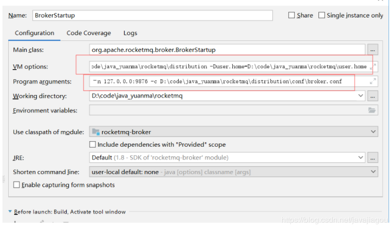

# 拉源码

github：

gitee：https://gitee.com/apache/rocketmq

# 全局install

```
mvn -Prelease-all -DskipTests clean install -U
```

# 启动namesrv

```
进入org.apache.rocketmq.namesrv.NamesrvStartup，执行main方法

会抛出错误, 原因是没有设置配置ROCKETMQ_HOME文件路径

Please set the ROCKETMQ_HOME variable in your environment to match the lo
cation of the RocketMQ installation  
```

解决办法

修改NamesrvStartup类createNamesrvController方法

```java
if (null == namesrvConfig.getRocketmqHome()) {
    System.out.printf("Please set the %s variable in your environment to match the location of the RocketMQ installation%n", MixAll.ROCKETMQ_HOME_ENV);
    System.exit(-2);
}

namesrvConfig.setRocketmqHome("E:\\GiteeDemo\\rocketmq\\distribution");
if (null == namesrvConfig.getRocketmqHome()) {
    System.out.printf("Please set the %s variable in your environment to match the location of the RocketMQ installation%n", MixAll.ROCKETMQ_HOME_ENV);
    System.exit(-2);
}
```


可以修改源码，增加rocketHome的配置，distribution是一个子项目的名称

也可以通过修改启动参数设置rocketHome， 在idea的run configurators中配置 VM参数为

-Drocketmq.home.dir=D:\code\java_yuanma\rocketmq\distribution

同时还需要设置user.home，指定日志文件路径

E:\GiteeDemo\xuegao-rocketmq-read\rocketmq\user.home

-Duser.home=D:\code\java_yuanma\rocketmq\user.home

还需要配置namesrv的ip和port


-n 127.0.0.1：9876


然后运行NamesrvStartup#main启动namesrv


# 启动broker

进入org.apache.rocketmq.broker.BrokerStartup，可以执行main方法，同样需要先配置rocketHome

在org.apache.rocketmq.broker.BrokerStartup#createBrokerController中修改源码，增加rocketHome的配置

```java
brokerConfig.setRocketmqHome("E:\\GiteeDemo\\rocketmq\\distribution");
if (null == brokerConfig.getRocketmqHome()) {
    System.out.printf("Please set the %s variable in your environment to match the location of the RocketMQ installation", MixAll.ROCKETMQ_HOME_ENV);
    System.exit(-2);
}
```

也可以通过修改启动参数设置rocketHome， 在idea的run configurators中配置 VM参数为

-Drocketmq.home.dir=D:\code\java_yuanma\rocketmq\distribution

同时还需要设置user.home，指定日志文件路径

-Duser.home=E:\GiteeDemo\rocketmq\user.home

还需要配置程序参数

‐n 127.0.0.0:9876 -c E:\GiteeDemo\rocketmq\distribution\conf\broker.conf



然后运行BrokerStartup#main启动broker


如果出现以下情况，ip不对，是因为多网卡的问题


这时需要修改D:\code\java_yuanma\rocketmq\distribution\conf\broker.conf 此配置文件

增加brokerIP1 = 127.0.0.1


#### 测试

启动Producer发消息，成功

如果出现No Topic Route Info 错误：

broker.conf 中增加配置

```
autoCreateTopicEnable = true
namesrvAddr = 127.0.0.1:9876
```

