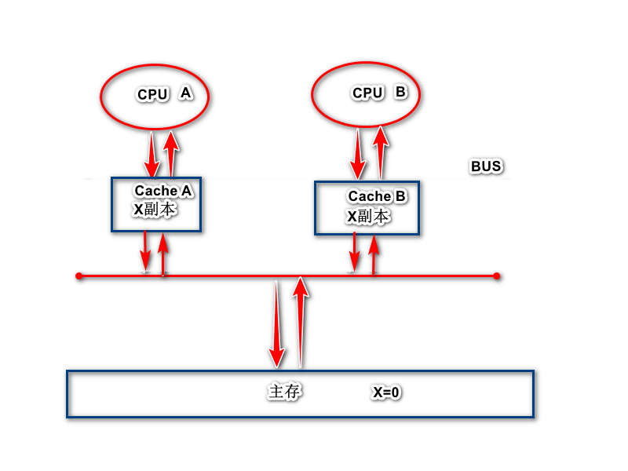
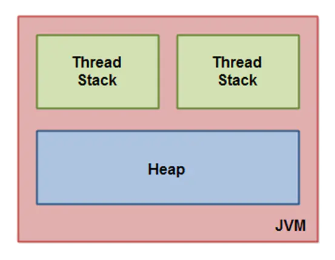
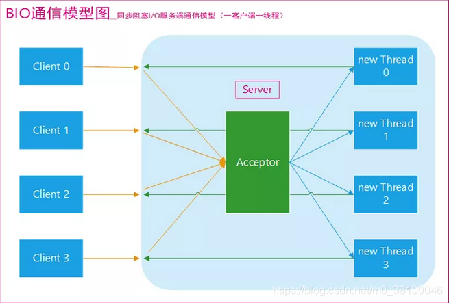
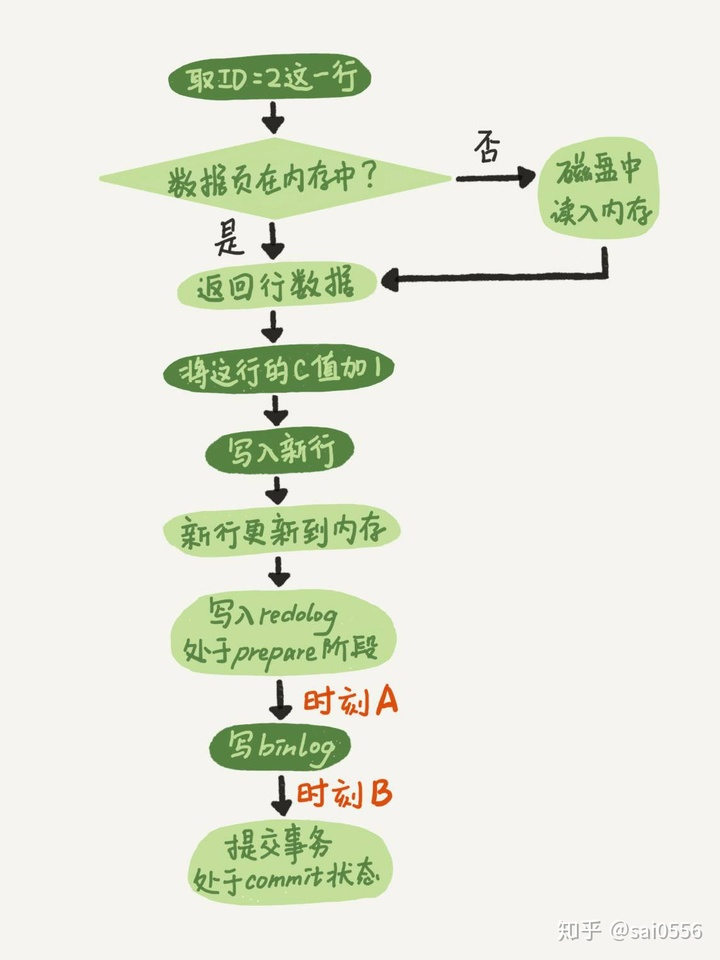

https://github.com/young1lin/notes/blob/master/Prepare%20for%20Interview/%E9%9D%A2%E8%AF%95%E9%97%AE%E9%A2%98%E7%AE%80%E5%8D%95%E6%B1%87%E6%80%BB.md

# JDK

## hashset，hashmap

### hashmap的数据结构

数组+链表，链表翻转形成红黑树

### HashSet 的底层实现说下？为什么内置 HashMap？说下它的数据结构 ?

hashset的底层就是hashmap，构造函数就是个hashmap

### 为什么 loadFactor 是 0.75？ 


### 为什么它的 size 是 2 的 n 次方？ 

数据在putVal的时候，会进行一次寻找的操作

### 讲下它的扩容机制。什么时候转红黑树，为什么要转红黑树？ 

扩容机制

数组的扩展：默认长度是16，每次都会扩展成为2的n次幂的数字

链表的扩展：如果链表的长度超过了8个，则会转成红黑树，红黑树的作用就是自平衡的二叉树，

### 为什么hashmap是线程不安全的？它的哪些方法是线程不安全的？为什么会造成死循环？ 

因为里面又很多操作，例如数组的扩容，链表转红黑树等等都是没有加锁的 在多线程的环境下，存在同时其他的元素也在进行put操作，如果hash值相同，可能出现同时在同一数组下用链表表示，造成闭环，导致在get时会出现死循环

局部性原理，当时设计HashMap的大叔采用头插法而没有采用尾插法有一点考虑是性能优化，认为最近put进去的元素，被get的概率相对较其他元素大，采用头插法能够更快得获取到最近插入的元素。

但头插法的设计有一个特点，就是扩容之后，链表上的元素顺序会反过来，这也是死循环的一个重要原因。

### 1.8 是如何解决这个问题的？ 

改成了尾插法，

### 1.8还是有死循环的问题吗？线程安全的map有什么？

有

ConcurrentHashMap

### ConcurrentHashMap和hashtable的区别

hashtable每次同步执行的时候都要锁住整个结构

ConcurrentHashMap锁的方式是稍微细粒度的， 底层采用分段的数组+链表实现 。 ConcurrentHashMap将hash表分为16个桶（默认值），诸如get,put,remove等常用操作只锁当前需要用到的桶。 

原来 只能一个线程进入，现在却能同时16个写线程进入（写线程才需要锁定，而读线程几乎不受限制，之后会提到），并发性的提升是显而易见的。  (读操作不加锁，由于HashEntry的value变量是 volatile的，也能保证读取到最新的值。) 

更令人惊讶的是ConcurrentHashMap的读取并发，因为在读取的大多数时候都没有用到锁定，所以读取操作几乎是完全的并发操作，而写操作锁定的粒度又非常细，比起之前又更加快速（这一点在桶更多时表现得更明显些）。

只有在求size等操作时才需要锁定整个表。 

### ConcurrentHashMap是强一致性的吗？它为什么是弱一致性的？ 

在遍历的时候，数组的改变不会影响遍历

### 为什么要用 volatile 修饰？说说它的功能？ 

## JUC

### MESI是什么

缓存一致性协议（MESI) ， 缓存一致性协议也叫缓存锁定，缓存一致性协议会阻止两个以上CPU同时修改缓存了相同主存数据的缓存副本 

MESI是四个单词的首字母缩写，Modified修改,Exclusive独占,Shared共享,Invalid无效 

  

1.当CPU A将主存中的x cache line读入缓存中时，此时X副本的状态为E独占。

2.当CPU B将主存中的X cache line读入缓存中时，AB同时嗅探总线，得知X cache line不止一个副本，此时X的状态变为S共享

3,当CPU A将CACHE A中的x cache line修改为1后，Cache A中的X cache line 的状态变为M修改，并发送消息给CPU B，CPU将X cache line的状态变为I无效

4.当CPU A确认所有CPU缓存中的都提交了I无效状态，将修改后的值刷新到主存中，此时主存中的X变为了1，此时Cache A中的x cache line变为E独享

5.当CPU B需要用到X，发出读取X指令，于是读取主存中的x，于是重复第二步

### 什么是可见性？ 

被加载到内存里面后，这个元素是可以被其他线程看到的

### Java内存模型JMM

  

### 什么是happens-before

JVM会对代码进行编译优化，会出现指令重排序情况，为了避免编译优化对并发编程安全性的影响，需要happens-before规则定义一些禁止编译优化的场景，保证并发编程的正确性。 

### 为什么要引入 CAS？

Compare and Swap 

每次从内存中读取数据然后将此数据和+1后的结果进行CAS操作，如果成功就返回结果，否则重试直到成功为止。 

而compareAndSet利用JNI来完成CPU指令的操作。 

```
public final boolean compareAndSet(int expect, int update) {   
    return unsafe.compareAndSwapInt(this, valueOffset, expect, update);
}
```

### 如何解决ABA问题？

使用版本号解决，A1，B2，A3

### Java AQS? 它是如何实现的？ 

AbstractQueuedSynchronizer抽象队列同步器简称AQS，它是实现同步器的基础组件，juc下面Lock的实现以及一些并发工具类就是通过AQS来实现的 

### CLH lock 原理及JAVA实现


### ReentrantLock 和 synchronized 区别是什么？

lock更加灵活，提供了更多的方法，公平锁和非公平锁，synchronized只有非公平锁

lock必须手动释放，sync不需要手动释放

### 为什么 ReetrantLock 能实现公平锁？默认构造器是公平锁吗？为什么不是？ 

默认是非公平的，因为公平锁需要有更多的性能消耗

### Copy-on-Write 了解吗？优缺点？

写入的时候，会先从当前的数组中，copy一份，写完后再放回去

读取的时候，直接从当前的数组中读取


不能够保证实时一致性的问题，只能保证最终一致性

适合读多写少

### Fork/Join 又是什么？ 

分治法，把计算任务进行各种细分为小任务，最终汇总每个小任务结果后得到大任务的计算结果

### 线程池说下参数，四种内置的拒绝策略，以及它的执行流程。

默认参数

- （1）corePoolSize：线程池中常驻核心线程数
- （2）maximumPoolSize：线程池能够容纳同时执行的最大线程数，此值必须大于等于1
- （3）keepAliveTime：多余的空闲线程存活时间。当前线程池数量超过corePoolSize时，当空闲时间到达keepAliveTime值时，多余空闲线程会被销毁直到只剩下corePoolSize个线程为止。
- （4）unit：keepAliveTime的时间单位
- （5）workQueue：任务队列，被提交但尚未执行的任务
- （6）threadFactory：表示生成线程池中的工作线程的线程工厂，用于创建线程，一般为默认线程工厂即可
- （7）handler：拒绝策略，表示当队列满了并且工作线程大于等于线程池的最大线程数（maximumPoolSize）时如何来拒绝来请求的Runnable的策略

拒绝策略

- （1）**AbortPolicy**（默认） 直接抛出RejectedExecutionException异常阻止系统正常运行。
-  （2）**CallerRunsPolicy**   “调用者运行”一种调节机制，该策略既不会丢弃任务，也不会抛出异常，而是将某些任务回退给调用者，从而降低新任务的流量。
-  （3）**DiscardOldestPolicy**  抛弃队列中等待最久的任务，然后把当前任务加入队列中尝试再次提交当前任务。  
-  （4）**DiscardPolicy**  直接丢弃任务，不予任何处理也不抛出异常。如果允许任务丢失，这是最好的一种方案。

执行流程

- 当线程池中线程数小于corePoolSize时，新提交任务将创建一个新线程执行任务，即使此时线程池中存在空闲线程。
- 当线程池中线程数达到corePoolSize时，新提交任务将被放入workQueue中，等待线程池中任务调度执行 。
- 当workQueue已满，且maximumPoolSize > corePoolSize时，新提交任务会创建新线程执行任务。
- 当workQueue已满，且提交任务数超过maximumPoolSize，任务由RejectedExecutionHandler处理。
- 当线程池中线程数超过corePoolSize，且超过这部分的空闲时间达到keepAliveTime时，回收这些线程。
- 当设置allowCoreThreadTimeOut(true)时，线程池中corePoolSize范围内的线程空闲时间达到keepAliveTime也将回收。


向线程池提交任务时，会首先判断线程池中的线程数是否大于设置的核心线程数，如果不大于，就创建一个核心线程来执行任务。

如果大于核心线程数，就会判断缓冲队列是否满了，如果没有满，则放入队列，等待线程空闲时执行任务。

如果队列已经满了，则判断是否达到了线程池设置的最大线程数，如果没有达到，就创建新线程来执行任务。

如果已经达到了最大线程数，则执行指定的拒绝策略。

这里需要注意队列的判断与最大线程数判断的顺序，不要搞反。

### I/O 密集型应用和计算密集型应用如何设置其参数？ 

IO密集型，需要更多的线程，因为很多都是等待，线程可以设置多一点，2N

计算密集型，需要少量线程，Ncpu

## Thread

### sleep 和 wait 的区别是什么？ 

sleep：不需要notify唤醒，执行的时候线程直接阻塞指定时间，时间到达后重新进入runnable状态，等待划分时间片。不会释放锁机制，会一直保留。

基本是一个线程在执行，这是因为sleep时，锁机制一直在线程甲上，所以另一个线程只能一直等待直到线程甲释放锁，谁先进入sync代码块，进入sleep不会释放改锁。（详情见代码）

wait：需要notify唤醒，唤醒后参与CPU执行权限的竞争，wait()必须放在synchronized block中，否则会报错。会释放锁机制，其他线程就可以进行执行

详情见代码

### 线程和进程说下区别？

我们的项目就相当于一个进程，这个进程启动后有很多线程在进程里面执行，例如守护线程与非守护线程

**进程是资源分配的最小单位，线程是CPU调度的最小单位**

### 线程的几种状态说下。

**New**：new出来的初始化状态

**Runnable**：调用start方法后的就绪状态

**Running**：执行状态，获取了执行权限

**Blocked**：阻塞状态，wait阻塞，sleep阻塞，join阻塞

**Dead**：死亡状态，线程执行完成

### Java 中的线程和操作系统的线程关系？

Java的多线程是直接调用linux的多线程函数实现的

## IO

### BIO、NIO、AIO 是什么？说下区别，以及如何使用？ 

- 1）BIO：同步阻塞，一个连接一个线程，客户端有连接请求时服务器端就需要启动一个线程进行处理,线程开销大。

通常由一个独立的 Acceptor 线程负责监听客户端的连接。我们一般通过在 `while(true)` 循环中服务端会调用 `accept()` 方法等待接收客户端的连接的方式监听请求，请求一旦接收到一个连接请求，就可以建立通信套接字在这个通信套接字上进行读写操作，此时不能再接收其他客户端连接请求，只能等待同当前连接的客户端的操作执行完成， 不过可以通过多线程来支持多个客户端的连接，如上图所示。

如果要让 **BIO 通信模型** 能够同时处理多个客户端请求，就必须使用多线程（主要原因是 `socket.accept()`、 `socket.read()`、 `socket.write()` 涉及的三个主要函数都是同步阻塞的），也就是说它在接收到客户端连接请求之后为每个客户端创建一个新的线程进行链路处理，处理完成之后，通过输出流返回应答给客户端，线程销毁。这就是典型的 **一请求一应答通信模型** 。我们可以设想一下如果这个连接不做任何事情的话就会造成不必要的线程开销，不过可以通过 **线程池机制** 改善，线程池还可以让线程的创建和回收成本相对较低。使用`FixedThreadPool` 可以有效的控制了线程的最大数量，保证了系统有限的资源的控制，实现了N(客户端请求数量):M(处理客户端请求的线程数量)的伪异步I/O模型（N 可以远远大于 M），下面一节"伪异步 BIO"中会详细介绍到。

BIO同步阻塞IO，一个线程同时只能执行一件事情，如果线程在执行过程中依赖于需要等待的资源，那么该线程会长期处于阻塞状态，在BIO模型下的线程 阻塞就会导致系统线程的切换。如果在需要考虑高并发的web或者tcp服务器中采用BIO模型就无法应对了，如果系统开辟成千上万的线程，那么CPU的执行时机都会浪费在线程的切换中，使得线程的执行效率大大降低。这里假设一个烧开水的场景，有一排水壶在烧开水，BIO的工作模式就是， 叫一个线程停留在一个水壶那，直到这个水壶烧开，才去处理下一个水壶。但是实际上线程在等待水壶烧开的时间段什么都没有做。



- 2）NIO：同步非阻塞，一个请求一个线程，客户端发送的连接请求会注册到多路复用器上，多路复用器轮询到该连接有I/O请求时才启动一个线程进行处理；
- 3）AIO：异步非阻塞，一个有效请求一个线程，客户端的I/O请求都是由OS先完成了再通知服务器应用去启动线程进行处理。


NIO同步非阻塞I/O，有一个Select多路复用的调度器在解决问题，Selector不断轮询注册在其上的Channel，某个Channel上面发生读写连接请求，这个Channel就处于就绪状态，被Selector轮询出来，然后通过SelectionKey可以获取就绪Channel的集合，进行后续的I/O操作。如果还拿烧开水来说，NIO的做法是叫一个线程不断的轮询每个水壶的状态，看看是否有水壶的状态发生了改变，从而进行下一步的操作。

AIO异步非阻塞I/O，NIO需要使用者线程不停的轮询IO对象，来确定是否有数据准备好可以读了，而AIO则是在数据准备好之后，才会通知数据使用者，这样使用者就不需要不停地轮询了。对应到烧开水中就是，为每个水壶上面装了一个开关，水烧开之后，水壶会自动通知我水烧开了。

## JVM

### 动态内存分配和回收策略是什么？

### 什么是空闲列表和指针碰撞？具体用什么数据结构存的？什么时候用它们？

### 空闲列表四种策略说下。

### Page Cache 知道吗，说说它的作用。Redis 和 Kafka 中间件如何通过 Page Cache 来优化？

### 哪些类型会导致内存泄漏？

### 你说你了解虚拟机，你知道虚拟机的运行时数据区吗？

程序计数器：它可以看作是当前线程所执行的字节码的行号指示器。

Java虚拟机栈：栈帧

本地方法栈：为虚拟机使用到的本地（Native）方法服务

Java堆：包括运行时常量池，堆对象的存放

方法区：JDK8里面是元空间，在虚拟机外，开辟的一块空间

### 哪些是线程共享的，哪些是线程独有的？

线程共享：方法区（JDK8的元空间），堆

线程隔离：虚拟机栈，本地方法栈，程序计数器

### 你了解 JVM 调优吗？调优过吗？为什么要这么设置？

年轻代设置大一点

### 垃圾回收算法有几种？

标记清除算法，标记整理算法，复制算法，分代收集算法

### 为什么要分代收集？

对传统的、基本的GC实现来说，由于它们在GC的整个工作过程中都要“stop-the-world”，如果能想办法缩短GC一次工作的时间长度就是件重要的事情。如果说收集整个GC堆耗时太长，那不如只收集其中的一部分？

因为很多对象都是瞬间死亡的，让新创建的对象都在young gen创建，频繁的收集young gen，大部分垃圾都可以在young gen里面被收集掉

由于young gen的大小配置通常只占整个GC堆的较小部分，而且较高的对象死亡率（或者说较低的对象存活率）让它非常适合使用copying算法来收集，这样就不但能降低单次GC的时间长度，还可以提高GC的工作效率。

### Young 区说说它的分布结构，为什么 Eden 区 80%？

Eden : From Survivor : To Survivor 空间大小设成 8 : 1 : 1 ，对象总是在 Eden 区出生， From Survivor 保存当前的幸存对象， To Survivor 为空。

一次 gc 发生后： 1）Eden 区活着的对象 ＋ From Survivor 存储的对象被复制到 To Survivor ； 2) 清空 Eden 和 From Survivor ； 3) 颠倒 From Survivor 和 To Survivor 的逻辑关系： From 变 To ， To 变 From 。可以看出，只有在 Eden 空间快满的时候才会触发 Minor GC 。而 Eden 空间占新生代的绝大部分，所以 Minor GC 的频率得以降低。当然，使用两个 Survivor 这种方式我们也付出了一定的代价，如 10% 的空间浪费、复制对象的开销等。

### 为什么大对象直接进入老年代？

年轻代频繁GC

### 控制的参数是什么？一个对象如果不是大对象，怎样才能进入老年代？控制的参数是什么？

### 什么时候会发生 OOM？你遇到过吗？怎么解决的？

配置JVM的参数，打印内存溢出时候的信息

### 为什么低版本的 JDK 要把永久代内存调大点？默认大小是多少你知道吗？

### 什么是 Major GC，什么是 Minor GC？

Major GC/Full GC：老年代GC

Minor GC：年轻代GC

### 什么情况下会频繁 GC？

内存已经不够了

### 你查看过 GC 日志吗？

只看过jastack，那种常见命令的

### 什么时候回收对象？引用计数和可达性分析是什么？

引用计数算法：给每一个对象设置一个引用计数，当引用计数为0的时候，就可以被回收，无法解决循环引用的问题

可达性分析算法：以GC Root为起点，从这些节点向下搜索，搜索所走过的路径成为引用链，当一个对象到GC Roots没有任何引用链（即该 GC Root不可达）时，则证明此对象是无用的，可以被回收。

### 什么是 GCRoot？什么类型的对象可以作为 GCRoot？

- 虚拟机栈（栈帧中的局部变量区，也叫做局部变量表）中引用的对象
- 方法区中的类静态属性引用的对象、常量引用的对象。
- 本地方法栈中JNI (Native 方法）引用的对象。

### Java 的四种引用说下，分别用在什么场景？

强，软，弱，虚


强引用：栈帧里面指向堆里面的一个对象

软引用：GC做饭后发现释放不出空间存放新的对象，则会把这些软引用的对象回收掉。软引用可以用来实现内存敏感的高速缓存。

// 强引用

String strongReference = **new** String("abc");

// 软引用

String str = **new** String("abc");

weak

弱引用：当GC运行时一定会被回收的

soft

当一个对象o被创建时, 它被放在Heap里. 当GC运行的时候, 如果发现没有任何引用指向o, o就会被回收以腾出内存空间. 或者换句话说, 一个对象被回收, 必须满足两个条件: 1)没有任何引用指向它 2)GC被运行.


虚引用：

pha

### 你知道 JDK 源码哪里有用到 弱引用 WeakReference 吗？


### 什么是 STW？


### 什么是 Safepoint？


### 什么是类加载？类加载的过程说下，什么时候优化，以及不同的阶段的主要优化是什么？

类加载：jvm将class文读取到内存中，经过对class文件的校验、转换解析、初始化最终在jvm的heap和方法区分配内存形成可以被jvm直接使用的类型的过程

生命周期：7个阶段依次为：Loading（加载）Verification （验证）Preparation （准备）Resolution（连接） Initialization （初始化）Using（使用） Unloading（卸载）


Loading（加载）：

首先  类加载器通过类的全路径限定名读取类的二进制字节流，

然后  将二进制字节流代表的类结构转化到运行时数据区的 方法区中，

最后  在jvm堆中生成代表这个类的java.lang.Class实例(不是这个类的实例)


验证verification：

Loading和 验证是交叉进行的，验证二进制字节流代表的字节码文件是否合格，主要从一下几方面判断：

文件格式：参看class文件格式详解，经过文件格式验证之后的字节流才能进入方法区分配内存来存储。

元数据验证：是否符合java语言规范

字节码验证：数据流和控制流的分析，这一步最复杂

符号引用验证：符号引用转化为直接引用时（解析阶段），检测对类自身以外的信息进行存在性、可访问性验证

如果确认代码安全无误，可用 -Xverify:none关闭大部分类的验证，加快类加载时间


准备preparation：

在方法区中给类的类变量(static修饰)分配内存

然后初始化其值，如果类变量是常量，则直接赋值为该常量值否则为java类型的默认的零值。


解析resolution：

指将常量池内的符号引用替换为直接引用的过程。

 

初始化initialization：

这个阶段才真正开始执行java代码，静态代码块和设置变量的初始值为程序员设定的值

主动引用

有且只有下面5种情况才会立即初始化类，称为主动引用：

- new 对象时
- 读取或设置类的静态字段（除了 被final，已在编译期把结果放入常量池的 静态字段）或调用类的静态方法时；
- 用java.lang.reflect包的方法对类进行反射调用没初始化过的类时
- 初始化一个类时发现其父类没初始化，则要先初始化其父类
- 含main方法的那个类，jvm启动时，需要指定一个执行主类，jvm先初始化这个类

### 为什么在编译的时候解语法糖？

- *前端编译器(编译器前端)*：指的是把`.java`源文件编译成`.class`字节码文件，而我们平时大部分人所挂在嘴边或被知道也就是指的前端编译器
- *运行时编译器(JIT：Just in Time Compile)*：指的是把`.class`字节码转换成`机器码`的过程，编译器的绝大部分优化是在这个时候做的，原因是JVM是一个平台，在运行时做优化可以针对所有在JVM上运行的编程语言(如果这个时候你还认为JAVA语言理所应当可以运行在JVM上的话，你可能没有理解JVM是一个平台的意义)

所以在前端编译器会把这些语法编译成JVM运行时能读懂的class字节码，这个过程叫：**`解语法糖`**

### 什么是双亲委派模型？可以破坏吗？

各个加载器都是先委托自己的父加载器加载类，若确实没加载到再自己来加载

于是java默认的类查找加载顺序是自顶向下的，树状结构

双亲委托的意图是保证java类型体系中最基础的行为一致，优先加载JDK中的类

### 各个 ClassLoader 加载哪部分类的？你自定义过 ClassLoader 吗？

- jvm启动类加载器bootstrap loader，用c++实现为jvm的一部分(仅指sun的hotspot)，负责 JAVA_HOME/lib下面的类库中的类的加载，这个加载器，java程序无法引用到。加载System.getProperty(``"sun.boot.class.path"``)所指定的路径或jar。
- 扩展类加载器Extension Loader，由sun.misc.Launcher$ExtClassLoader类实现，可在java中使用，负责JAVA_HOME/lib/ext 目录和java.ext.dir目录中类库的类的加载。加载System.getProperty(``"java.ext.dirs"``)所指定的路径或jar。在使用Java运行程序时，也可以指定其搜索路径，例如：java -Djava.ext.dirs=d:\projects\testproj\classes HelloWorld
- 应用系统类加载器Application System Loader，由sun.misc.Louncher$AppClassLoader实现，负责加载用户类路径中类库中的类，如果没有使用自定义的加载器，这个就是默认的 加载器！加载System.getProperty(``"java.class.path"``)所指定的路径或jar。在使用Java运行程序时，也可以加上-cp来覆盖原有的Classpath设置，例如： java -cp ./lavasoft/classes HelloWorld
- 用户自定义加载器

```java
package test;
 
import java.net.MalformedURLException;
import java.net.URL;
import java.net.URLClassLoader;
 
public class MyClassLoader {
        public static void main(String[] args) throws MalformedURLException, ClassNotFoundException, IllegalAccessException, InstantiationException {
                URL url = new URL("file:/E:\\projects\\testScanner\\out\\production\\testScanner");
                ClassLoader myloader = new URLClassLoader(new URL[]{url});
                Class c = myloader.loadClass("test.Test3");
                System.out.println("----------");
                Test3 t3 = (Test3) c.newInstance();
        }
}
  
public class Test3 {
        static {
                System.out.println("Test3的静态初始化块执行了！");
        }
}

运行后：
----------
Test3的静态初始化块执行了！
 
Process finished with exit code 0
  
可以看出自定义了ClassLoader myloader = new URLClassLoader(new URL[]{url});
已经成功将类Test3加载到内存了，并通过默认构造方法构造了对象Test3 t3 = (Test3) c.newInstance();
  
有关ClassLoader还有很重要一点：
同一个ClassLoader加载的类文件，只有一个Class实例。
但是，如果同一个类文件被不同的ClassLoader载入，则会有两份不同的ClassLoader实例（前提是着两个类加载器不能用相同的父类加载器）。
```

### 你说你用过 Jstack 诊断 CPU 使用率飙升的情况，说下具体步骤？


### Arthas 用过吗？


### Class 文件格式说下，什么是魔数，Class 文件的魔数是什么？


### JMX 了解吗？

JMX 全称为 Java Management Extensions，翻译过来就是 Java 管理扩展，用来管理和监测 Java 程序。

自己写个MBean，可以远程的获取

### 生产上有碰到过虚拟机的问题吗？怎么解决的？ 。

CPU100%堆栈，OOM启动参数，栈溢出堆栈

## 基础语法

### 静态代理和动态代理

静态代理：在代码里面手动的控制对象的代理模式，代理类需要自己编写代码写成

JDK动态代理：

### 为什么JDK动态代理只可以代理接口？

因为JDK动态代理是生成了接口的实现类


# Spring

https://www.martinfowler.com/articles/injection.html

### 什么是 Spring 事务的 SavePoint？ 

```mysql
begin;
insert into t(a) values(1);
SAVEPOINT s;
insert into t(a) values(2);
RELEASE SAVEPOINT s;
commit;
```

回滚了一次savepoint，所以第二条数据不会插入。

### Spring Bean Scope作用域 说下。

singleton：单例，随着容器的销毁而销毁

prototype：多例

request：每一次http请求中都会有一个

session：每一个session中有一个

global session：

### Spring 的注入方式有几种，为什么推荐用构造器注入？

set方法注入：

构造器注入：

工厂方法注入：

### @Resource 和 @Autowired 区别

（1）处理这2个注解的BeanPostProcessor不一样

CommonAnnotationBeanPostProcessor是处理@ReSource注解的

AutoWiredAnnotationBeanPostProcessor是处理@AutoWired注解的

（2）@Autowired只按照byType 注入；@Resource默认按byName自动注入，也提供按照byType 注入；

（3）属性：@Autowired按类型装配依赖对象，默认情况下它要求依赖对象必须存在，如果允许null值，可以设置它required属性为false。如果我们想使用按名称装配，可以结合@Qualifier注解一起使用。@Resource有两个中重要的属性：name和type。name属性指定byName，如果没有指定name属性，当注解标注在字段上，即默认取字段的名称作为bean名称寻找依赖对象，当注解标注在属性的setter方法上，即默认取属性名作为bean名称寻找依赖对象。需要注意的是，@Resource如果没有指定name属性，并且按照默认的名称仍然找不到依赖对象时， @Resource注解会回退到按类型装配。但一旦指定了name属性，就只能按名称装配了。

@Resource装配顺序

　　1. 如果同时指定了name和type，则从Spring上下文中找到唯一匹配的bean进行装配，找不到则抛出异常

　　2. 如果指定了name，则从上下文中查找名称（id）匹配的bean进行装配，找不到则抛出异常

　　3. 如果指定了type，则从上下文中找到类型匹配的唯一bean进行装配，找不到或者找到多个，都会抛出异常

　　4. 如果既没有指定name，又没有指定type，则自动按照byName方式进行装配；如果没有匹配，则回退为一个原始类型进行匹配，如果匹配则自动装配；

推荐使用@Resource注解在字段上，这样就不用写setter方法了.并且这个注解是属于J2EE的，减少了与Spring的耦合,这样代码看起就比较优雅 。


### 什么是 IoC 和 AOP？

IOC：Inversion of Control，控制反转，由spring帮你管理你的对象

DI：Dependence Injection，依赖注入，动态地将某种依赖关系注入到对象之中

AOP：面向切面编程


### Spring 解决了什么？

### @Bean 和 @Component区别说下。

如果想将第三方的类变成组件，你又没有没有源代码，也就没办法使用`@Component`进行自动配置，这种时候使用`@Bean`就比较合适了。

### Spring Bean 的生命周期说下。


### Spring AOP 原理，各种 Advice 和 Advisor 说下。

### AOP 的两种代理方式是什么？

JDK的动态代理，cglib动态代理

1、如果目标对象实现了接口，默认情况下会采用JDK的动态代理实现AOP
2、如果目标对象实现了接口，可以强制使用CGLIB实现AOP
3、如果目标对象没有实现了接口，必须采用CGLIB库，spring会自动在JDK动态代理和CGLIB之间转换

### AOP 一般作用说下。

多个应用之间的模块化

### 三级缓存解决循环依赖的过程说下。

```java
@Nullable
    protected Object getSingleton(String beanName, boolean allowEarlyReference) {
        Object singletonObject = this.singletonObjects.get(beanName);　　//首先通过beanName从一级缓存获取bean
        if (singletonObject == null && isSingletonCurrentlyInCreation(beanName)) {　　//如果一级缓存中没有，并且beanName映射的bean正在创建中
            synchronized (this.singletonObjects) {
                singletonObject = this.earlySingletonObjects.get(beanName);　　//从二级缓存中获取
                if (singletonObject == null && allowEarlyReference) {　　//二级缓存也没有
                    ObjectFactory<?> singletonFactory = this.singletonFactories.get(beanName);　　//从三级缓存获取
                    if (singletonFactory != null) {
                        singletonObject = singletonFactory.getObject();　　//获取到bean
                        this.earlySingletonObjects.put(beanName, singletonObject);　　//将获取的bean提升至二级缓存
                        this.singletonFactories.remove(beanName);　　//从三级缓存删除
                    }
                }
            }
        }
        return singletonObject;
    }
```

### Spring 的事务传播行为说下。


### Spring 事务隔离级别说下。

TransactionDefinition接口中定义了五个表示隔离级别的常量：

- TransactionDefinition.ISOLATION_DEFAULT：使用后端数据库默认的隔离界别，MySQL默认采用的REPEATABLE_READ隔离级别，Oracle默认采用的READ_COMMITTED隔离级别。
- TransactionDefinition.ISOLATION_READ_UNCOMMITTED：最低的隔离级别，允许读取，允许读取尚未提交的的数据变更，可能会导致脏读、幻读或不可重复读。
- TransactionDefinition.ISOLATION_READ_COMMITTED：允许读取并发事务已经提交的数据，可以阻止脏读，但是幻读或不可重复读仍有可能发生。
- TransactionDefinition.ISOLATION_REPEATABLE_READ：对同一字段的多次读取结果都是一致的，除非数据是被本身事务自己所修改，可以阻止脏读和不可重复读，但幻读仍有可能发生。
- TransactionDefinition.ISOLATION_SERIALIZABLE：最高的隔离级别，完全服从ACID的隔离级别。所有的事务依次逐个执行，这样事务之间就完全不可能产生干扰，也就说，该级别可以阻止脏读、不可重复读以及幻读。但是这将严重影响程序的性能。通常情况下也不会用到该级别。

### Spring 事务实现原理。

AOP

### Spring 用到了哪些设计模式，能分别讲讲它是如何实现的吗，**具体是哪些类**？

### BeanFactory 和 ApplicationContext 说下区别。

BeanFactory

BeanFactory是spring的原始接口，针对原始结构的实现类功能比较单一，BeanFactory接口实现的容器，特点是在每次获取对象时才会创建对象。

ApplicationContext

继承了BeanFactory接口，拥有BeanFactory的全部功能，并且扩展了很多高级特性，每次容器启动时就会创建所有的对象。

**创建ApplicationContext的方法：** 

1. 丛类路径下加载配置文件:ClassPathXmlApplicationContext ("applicationContext.xml");
2. 从硬盘绝对路径下加载配置文件: FileSystemXmlApplicationContext(“d:/xxx/yyy/xxx”);


### 说下BeanFactory 和 FactoryBean 区别？

BeanFactory是个Factory，也就是IOC容器或对象工厂

但对FactoryBean而言，这个Bean不是简单的Bean，而是一个能生产或者修饰对象生成的工厂Bean,它的实现与设计模式中的工厂模式和修饰器模式类似。

### BeanPostProcessor 和 BeanFactoryPostProcessor 区别是什么？

**BeanPostProcessor**：bean级别的处理，针对某个具体的bean进行处理

**BeanFactoryPostProcessor**：BeanFactory级别的处理，是针对整个Bean的工厂进行处理

### Spring 事件知道吗？

同步事件和异步事件

同步事件:在一个线程里,按顺序执行业务,做完一件事再去做下一件事

异步事件:在一个线程里,做一个事的同事,可以另起一个新的线程执行另一件事,这样两件事可以同时执行

同步事件可以解决上面第一个问题,我们把发邮件的方法独立出来,放到事件里执行,这样注册的这个方法就可以只做2操作,完成之后发布一个事件去执行3,可以很好的解决业务耦合的问题.

　 异步事件可以完美解决以上两个问题,注册方法执行2操作,执行之后发布一个异步事件,另起一个线程执行3操作,注册方法所在的线程可直接返回给用户,这样不仅实现了业务解耦还提高了效率,用户点击注册,1秒后就能看到响应.


https://www.cnblogs.com/fingerboy/p/9229164.html

### Spring 如何自定义 xml 解析？


**各种 Smart 开头的 Bean 的前置处理器，什么时候被调用，你知道吗**？

SmartLifecycle 在容器所有bean加载和初始化完毕执行

### Spring Cache 是如何实现的？

### Spring Data JPA 呢？

### 注解扫描如何实现的，**你能手写个吗**？

### 写过 Spring 的插件吗？如何实现的？代码开源了吗？

### Spring MVC 执行流程说下。

在系统启动的时候，会将所有接口的映射关系，存放到处理器映射器中

请求进来的时候，dispatchservlet根据请求信息，堆处理器映射器的进行请求，返回一个处理的handler

dispatchservlet请求处理器适配器调用对应的handler进行处理

结果交由视图解析器解析，然后进行渲染

### @RestController 和 @Controller 区别说下。

### 怎么取得 URL 中的 { } 里面的变量？

### Spring MVC 和 Struts2 比有什么优点？

### Spring MVC 怎么样设定重定向和转发的？

### 说下 Spring MVC 的常用注解。

### 如何解决 POST 请求中文乱码问题，GET 的又如何处理呢？

### Interceptor 和 Filter 区别？

### Spring MVC 的异常处理 ？

### 怎样在方法里面得到 Request，或者 Session？

### Spring MVC 中函数的返回值是什么？

### 怎么样把 ModelMap 里面的数据放入 Session 里面？

### Spring MVC 的控制器是不是单例模式,如果是,有什么问题,怎么解决？

### Spring MVC 的 RequestMapping 的方法是线程安全的吗？为什么？

### 介绍下 WebApplicationContext。

### 跨域问题如何解决？

### 如何解决全局异常？

### validation 有了解吗？用过吗？

### Json处理如何实现的？

### 哦，你刚才说了父子容器，能讲讲什么是父子容器吗？

spring是父容器,springmvc是子容器。

### **Spring MVC 国际化有了解过吗？怎么实现的**

# SpringBoot

## Spring Boot 是如何实现自动装配的？

ETA-INF/spring.factories里面的自动配置类

## 运行 Spring Boot 有几种方式？

1，IDE 运行Application这个类的main方法

2，在springboot的应用的根目录下运行mvn spring-boot:run

3，使用mvn install 生成jar后运行

## Spring Boot Starter 工作原理。

## Spring Boot 核心注解说下。


## @Enable 类型注解是如何实现的？

## @Conditional 类型注解呢？自定义过吗？

## 说下异步调用@Async。

## 什么是 YAML？

## Spring Boot Profiles 如何实现的？ 


## bootstrap.properties 和 application.properties 说下区别。

 ***bootstrap.yml\***先于***application.properties***被加载。

## Spring Boot 事件和 Spring 事件有什么关系？

## Spring Boot Actuator 了解过吗？说一下。

## Spring Batcher 用过吗，说下。

## Spring Boot 是如何实现内嵌 Servlet 容器的，**在哪行代码启动的**？

## Spring Boot 完美实现了模块化编程，你认同吗？ 


# SpringCloud

Spring Cloud Netflix 听说你了解。

画一下 Spring Cloud Netflix 架构图。

说说 Eureka 默认多少秒发送心跳？增量还是全量？

CP 还是 AP？

如何防止脑裂的？

二级缓存知道吗？

Eureaka 的自我保护模式说下。

ServiceInstance 和 DiscoryClient 知道吗？是干嘛的？

分布式事务除了两段提交，还有什么实现方式？

哦，你说 Saga，Saga 你说下是什么？

Ribbon 是什么说一下，它解决了什么问题？

Feign 又是什么？它和 Ribbon 什么关系？

Dubbo 和 Feign 区别？

Dubbo 的 SPI 知道吗？

Zuul 是什么？

它和 Nginx 有什么区别？

除了 Zuul 还有什么网关可选？

Hystrix 是什么？它是如何实现的？

### 熔断、降级和限流他们的区别说一下。

熔断：整个服务直接无法使用

降级：只可以一部分人可以访问，或者是一部分功能可以访问

限流：通过对并发访问进行限速。


Hystrix 信号量机制，隔离策略细粒度控制如何做的？

**看过源码吗？你优化过吗**？

微服务十一点说一下分别是什么？

分布式配置中心有哪些？

你们用的 Apollo 还是 Spring Config 还是其他的？为什么？

服务监控有了解吗？

什么是幂等？如何实现接口幂等？

如何实现分布式 Session？

有更好的方法吗？

哦，你说了 JWT，能详细说下吗？

不同系统的间授权的 OAuth2 了解吗？ 

# Mybatis

## MyBatis 了解吗？一级缓存，二级缓存？

## '#' 和 $ 说下。

## 如何实现的动态 SQL？

### ORM 是什么？和 Hibernate 区别？

**ORM是一种思想,JPA是一个规范,hibernate的ORM的实现者**

## MyBatis 工作原理？

## MyBatis 都有哪些 Executor 执行器？它们之间的区别是什么？

## MyBatis 中如何指定使用哪一种 Executor 执行器？

## 模糊查询 like 语句该怎么写？

## MyBatis 是否支持延迟加载？

## 如果支持，它的实现原理是什么？

## MyBatis 如何执行批量操作？

## SqlSessionFactoryBean 是什么？

## 如何实现和 Spring 的整合的？

## Mapper 方法可以重载吗？为什么不可以？

## MyBatis 是如何将 SQL 执行结果封装为目标对象并返回的？都有哪些映射形式？

## 哦，你说简单封装了 JDBC，说下 JDBC 几个重要的类。

## 为什么要预编译？有什么好处吗？ 

# Nginx

 Nginx 了解吗，说下其优缺点？怎么实现 Nginx 集群？什么是反向代理？和正向代理区别是什么？Tomcat 和 Nginx 区别？限流怎么做的，有哪三种？令牌桶和漏斗算法是什么，区别是什么？如何在其之上使用 Lua 脚本？有几种负载均衡策略？你们生产上用的哪个？为什么？为什么 Nginx 性能这么高？有没有更高的？F5 又是什么？Nginx 是怎么处理请求的？Nginx 目录有哪些？nginx.conf 配置过吗？有哪些属性模块？静态资源放哪？虚拟主机配置？location 说下。location 语法说下。 

# Tomcat

 Tomcat 你也了解？什么是 Tomcat 的 Connector？Service、Connector、Container 介绍下它们。详细说下它们是如何处理请求的，能画下它们的架构图吗？如何部署的？一定要放到 webapps 目录下吗？在哪配置？为什么不用 Jetty？区别是什么？Servlet 是线程安全的吗？为什么？怎样让它线程安全？Servlet 初始化过程？init 方法什么时候调用？Servlet 什么时候第一次初始化？JSP 知道吗？有几个内置对象？你说 JSP 是特殊的 Servlet，你看过源码吗？JSP 如何热部署的？EL 表达式知道吗？如何实现的？（大四某打车集团非滴滴校招的时候被问到的） 


# Netty

如何解决粘包问题？

ChannelPipeline 又是什么？

ByteBuf 知道吗？

读写指针又是什么？

为什么要用它，解决了 NIO 类库的 ByteBuffer 什么问题？

它和 mina 的区别是什么？

它的 Zero-Copy？

了解过 FastThreadLocal 吗？

它为什么比 ThreadLocal 快？

有看过其中源码吗？

Netty 解决了 NIO 类库的什么问题？

空轮询又是什么？

RPC 又是什么？

序列化和反序列化又是什么？

几个核心抽象说下。是干什么的？

讲讲 Netty 的线程模型。 


# Mysql

## ACID 说下是什么，如何实现的？

原子性：事务是不可以分割的

隔离性：事务之间不可以相互影响

一致性：数据只会从一个一致性的状态变成另一个一致性的状态

持久性：数据是持久不变的，不会因为其他原因而改变


Redo/Undo机制，将所有对数据的更新操作都写到日志中。

Redo log用来记录某数据块被修改后的值，可以用来恢复未写入 data file 的已成功事务更新的数据；

Undo log是用来记录数据更新前的值，保证数据更新失败能够回滚。

假如数据库在执行的过程中，不小心崩了，可以通过该日志的方式，回滚之前已经执行成功的操作，实现事务的一致性。

可以的，假如某个时刻数据库崩溃，在崩溃之前有事务A和事务B在执行，事务A已经提交，而事务B还未提交。

当数据库重启进行 crash-recovery 时，就会通过Redo log将已经提交事务的更改写到数据文件，而还没有提交的就通过Undo log进行roll back。

## 你说你优化过 SQL，怎么优化的说下。

## like '%xx%'，like '%xx'，like 'xx%' 哪种情况会用到索引，为什么？

看情况，在小数据量的时候，他们都会走索引

在有些情况的时候，他们都不会走索引

## 说下 MySQL 执行流程。

连接器——查询缓存——分析器——优化器——执行器

连接器：用户登录数据库

查询缓存：Mysql会先校验这个sql是否执行过，以Key-Value的形式缓存在内存中

分析器：

优化器：

执行器：

## WAL(Write-Ahead Logging) 知道吗？

WAL 是预写式日志, 关键点在于先写日志再写磁盘。

## redo log 和 undo log 是什么，它们作用说下。

### undolog

假设有A、B两个数据,值分别为1,2。

A.事务开始

B.记录A=1到undo log.

C.修改A=3.

D.记录B=2到undo log.

E.修改B=4.

F.将undo log写到磁盘。

G.将数据写到磁盘。

H.事务提交

先执行undolog，执行完成，然后写到磁盘，之前就是一直都在内存中，


如何保证持久性：

事务提交前，会把修改数据到磁盘前，也就是只要事务提交了，数据肯定持久化了


如何保证原子性：

每次对数据库修改，都会把修改前的数据存在undo log，那么需要回滚时，可以读取undo log进行回滚，修改数据

若系统在G，H之间崩溃，

此时事务未提交，需要回滚，可以根据undo log来恢复数据

若系统在G之前崩溃，此时数据没有写入到磁盘，仍然保持在事务之前的状态

### redolog

减少io次数

事务提交前，异步的开始写入磁盘的任务


假设有A、B两个数据，值分别为1,2

A.事务开始.

B.记录A=1到undo log buffer.

C.修改A=3.

D.记录A=3到redo log buffer.

E.记录B=2到undo log buffer.

F.修改B=4.

G.记录B=4到redo log buffer.

H.将undo log写入磁盘（其实是将undo log写入redo log）

I.将redo log写入磁盘

J.事务提交


undo log记录旧的数据，redo log记录新的数据


如何保证原子性?

如果在事务提交前故障,通过undo log日志恢复数据。如果undo log都还没写入，那么数据就尚未持久化，无需回滚


如何保证持久化?

大家会发现，这里并没有出现数据的持久化。因为数据已经写入redo log,而redo log持久化到了硬盘，因此只要到了步骤1以后，事务是可以提交的。


内存中的数据库数据何时持久化到磁盘?

因为redo log已经持久化，因此数据库数据写入磁盘与否影响不大，不过为了避免出现脏数据(内存中与磁盘不-致)，事务提交后也会将内存数据刷入磁盘(也可以按照固设定的频率刷新内存数据到磁盘中)。

## redolog buffer

先写redolog buffer，然后提交的时候，再写redolog

## 你说你还开启了 binlog，能说说是什么吗？

事务执行过程中，先把日志写到binlog cache，事务提交的时候，再把binlog cache写到binlog文件中。

一个事务的binlog是不能被拆开的，因此不论这个事务多大，也要确保一次性写入。这就涉及到了binlog cache的保存问题。

系统给binlog cache分配了一片内存，每个线程一个，参数 binlog_cache_size用于控制单个线程内binlog cache所占内存的大小。如果超过了这个参数规定的大小，就要暂存到磁盘。

事务提交的时候，执行器把binlog cache里的完整事务写入到binlog中，并清空binlog cache。



如果在图中时刻A的地方，也就是写入redo log 处于prepare阶段之后、写binlog之前，发生了崩溃（crash），由于此时binlog还没写，redo log也还没提交，所以崩溃恢复的时候，这个事务会回滚。这时候，binlog还没写，所以也不会传到备库。到这里，大家都可以理解。

大家出现问题的地方，主要集中在时刻B，也就是binlog写完，redo log还没commit前发生crash，那崩溃恢复的时候MySQL会怎么处理？

我们先来看一下崩溃恢复时的判断规则。

1. 如果redo log里面的事务是完整的，也就是已经有了commit标识，则直接提交；
2. 如果redo log里面的事务只有完整的prepare，则判断对应的事务binlog是否存在并完整：
   a. 如果是，则提交事务；
   b. 否则，回滚事务。

这里，时刻B发生crash对应的就是2(a)的情况，崩溃恢复过程中事务会被提交。

由此得出，我们这个两阶段提交机制配合redo log与binlog，就可以保证MySQL崩溃了也不会丢数据（当然了，如果服务器崩了，那就不聊了）。

## MySQL怎么知道binlog是完整的?

一个事务的binlog是有完整格式的：

- statement格式的binlog，最后会有COMMIT；
- row格式的binlog，最后会有一个XID event。

另外，在MySQL 5.6.2版本以后，还引入了binlog-checksum参数，用来验证binlog内容的正确性。对于binlog日志由于磁盘原因，可能会在日志中间出错的情况，MySQL可以通过校验checksum的结果来发现。所以，MySQL还是有办法验证事务binlog的完整性的。

## redo log 和 binlog是怎么关联起来的?

它们有一个共同的数据字段，叫XID。崩溃恢复的时候，会按顺序扫描redo log：

- 如果碰到既有prepare、又有commit的redo log，就直接提交；
- 如果碰到只有parepare、而没有commit的redo log，就拿着XID去binlog找对应的事务。

## binlog 有几种格式？

redo，undo


## 你选的是哪个？为什么？


## 恢复数据

redo log数据是写入内存buffer中，当buffer满或者事务提交时， 将buffer数据写入磁盘。

redo log中记录的数据，有可能包含尚未提交事务,如果此时数据库崩溃，那么如何完成数

据恢复?


数据恢复有两种策略:

恢复时，只重做已经提交了的事务


恢复时，重做所有事务包括未提交的事务和回滚了的事务。然后通过Undo Log回滚那些

未提交的事务

Inodb引擎采用的是第二种方案，因此undo log要在redo log前持久化


## bufferpool

MySQL以数据页为单位，从磁盘中读取数据。数据页被读取到内存中，所谓的内存其实就是Buffer Pool。

Buffer Pool中维护的数据结构是缓存页，而且每个缓存页都有它对应的描述信息。

Buffer Pool中存在三个双向链表。分别是FreeList、LRUList以及FlushList。这三个双向链表中维护着缓存页的描述信息。


读取出一个数据页

当你通过select读取出一个数据页之后，是需要将这个数据页加载进Buffer Pool中的缓存页中的。

那问题来了，MySQL怎么知道该将你读取出来的数据页存放在那个缓存页中呢？

InnoDB会将你读取出来的数据页加载进Buffer Pool中的缓存页中，然后缓存页的描述信息也会被维护进LRU链表中。链表做了冷热数据分离优化，5/8的区域是热数据区域，3/8的区域算是冷数据区域。（本质上它们都是双向链表），而你新读取的数据页会被放在冷数据区的靠前的位置上。

如果你将该数据页读取出来加载进缓存页中后，间隔没到1s，就使用该缓存页。那么InnoDB是不会将这个描述信息移动到5/8的热数据区域的。

但是当超过1s后，你又去读这个数据页。那这个数据页的描述信息就会被放到热数据区域。


假设你一次性读取出来了好多数据页

FreeList中找到空闲的缓存页信息，然后将其从FreeList中移除。根据找到的空闲缓存页的描述信息，将从磁盘中读取出来的数据页加载进去。相应的该缓存页的描述信息也会被维护进LRU链表的冷数据区域。根本没有机会将热数据区的描述信息1挤下去。当内存不够用了需要将部分缓存页刷新到磁盘中时，那就从冷数据区域开始刷新好了，反正他们本来就不经常被使用。

同样的，当你超过1s后又访问了冷数据区的缓存页，比如访问了缓存页66和数据页67，该缓存页对应的描述信息是会被提升到热数据区，


## 你说你改过 buffer_pool_size 等参数，为什么要改它？

SET GLOBAL innodb_buffer_pool_size=402653184;

buffer pool越大，MySQL的性能就越强悍。

你可以为MySQL实例配置多个Buffer Pool，每个Buffer Pool各自负责管理一部分缓存页，并且有自己独立的LRU、Free、Flush链表。

推荐将Buffer Pool的总大小设置为服务器内存的 50%～60%左右

InnoDB 在服务器关闭时为每个缓冲池保存一部分最近高频使用的页面，并在服务器启动时恢复这些页面。

## 它里面的数据结构说下是什么？

三个LRU的数据结构

Flush List：将数据页刷新回磁盘，也称这些被修改过的数据页称之为脏页。一旦你对内存中的缓冲页作出了修改，那该缓冲页对应的描述信息块就会添加进 Flush List。这样当Buffer Pool中的数据页不够用时，我们就可以优先将 Flush List中的脏数据页刷新进磁盘中。

事物A中读取到了事物B中未提交的数据，我们管这些数据叫做脏数据。

脏页刷回磁盘的时机：1，当Buffer Pool不够用时，根据LRU机制，MySQL会将Old SubList部分的缓存页移出LRU链表。如果被移除出去的缓存页的描述信息在Flush List中，MySQL就得将其刷新回磁盘。2，当MySQL数据库关闭时，会将所有的脏数据页刷新回磁盘。这个功能由参数：`innodb_fast_shutdown=0`控制，默认让InnoDB在关闭前将脏页刷回磁盘，以及清理掉undo log。3，有一个后台线程Master Thread会按照每秒或者每十秒的速度，异步的将Buffer Pool中一定比例的页面刷新回磁盘中。4，当脏数据页太多时，也会触发将脏数据页刷新回磁盘。该机制可由参数`innodb_nax_dirty_pages_pct`控制，比如将其设置为75，表示，当Buffer Pool中的脏数据页达到整体缓存的75%时，触发刷新的动作。现实情况是该参数默认值为0。以此来禁用Buffer Pool早期的刷新行为。5，当redo log不可用时，也会强制脏页列表中的脏页刷新回磁盘。这个机制同样由一个后台线程完成。

刷新临接数据页：意思是当MySQL将某脏页刷新回磁盘时，是否也以相同的态度将该脏页邻接的脏页一并刷新回磁盘。

可以通过参数`innodb_flush_neighbors`控制该过程。

- 设置为0时表示，禁用刷新邻接的功能。
- 设置为1时表示，以相同的态度刷新其邻接的脏页。
- 设置为2时表示，以相同的程度刷新脏页。

那如何选择将其设置为哪种状态呢？

你可以根据MySQL实例所在机器的存储类型来决定。如果为HDD存储建议将其开启，因为HDD的磁盘刷新速率较低，开启该参数后可以有效的减少IO操作。相反如果使用SSD存储，其本身就有高磁盘IO的特性，建议禁用该参数。

## join_buffer 你说你也改了，为什么？

## 什么是驱动表和被驱动表？如何优化？

## 你说你建了索引，什么是蔟集索引，什么是非蔟集索引？

## 什么是回表？

## 什么时候会索引失效？

## 你的二级索引什么用得多？

## 为什么优先使用普通索引，而不是唯一索引？

## MySQL 会死锁吗？

## 什么是间隙锁？

## 它会导致什么问题？

## MVCC 说下是什么？

多版本并发控制，简单来说就是通过维护数据历史版本，从而解决并发访问情况下的读一致性问题。

在`InnoDB`中，每行记录实际上都包含了两个隐藏字段：事务id(`trx_id`)和回滚指针(`roll_pointer`)。

1. `trx_id`：事务id。每次修改某行记录时，都会把该事务的事务id赋值给`trx_id`隐藏列。
2. `roll_pointer`：回滚指针。每次修改某行记录时，都会把`undo`日志地址赋值给`roll_pointer`隐藏列。


## 4 种事务说下是什么？

## 哪种或者哪几种事务隔离级别能避免幻读？能避免脏读？


## canal 用过吗？说说它的原理。

## MySQL 主从模式如何开启？

## 你是如何优化 SQL 的？

## 上亿级别的数据你是如何优化分页的？

## 为什么不建议在 MySQL 中使用分区机制？

## 几个主要的线程说下它们是什么？做什么的？

## MySQL 读写了解吗？如何实现的？

## 能做到强一致性吗？为什么？

## 为什么删了数据还是磁盘空间不变？

## 自增主键用完了会怎么样？

永远只会返回最大值

1，使用无符号的bigint

2，数据量太大的话，建议分库分表

## 自增主键什么时候是不连续的？

## 这样做的好处是什么？

## 为什么推荐用自增主键？

## B+ Tree 又是什么？如何迁移数据库？

## 为什么不建议使用外键？

## 在高版本的 MySQL 中count(1) 和 count(*) 区别是什么？

## order by 是如何工作的？

## 分页机制又是什么？

## ACL 和 RBAC 是什么？

## PBAC 和 ABAC 知道吗说下？

## grant 之后一定要刷新吗？

## 视图用过吗？它的作用说下。

## 视图和表的区别说下。

## 存储过程写过吗？

## 存储函数和存储过程的区别说下。

## 为什么要分库分表？

## 分库分表如何做到动态缩容/扩容？

## NoSQL 用过吗？

## OceanBase 了解吗？

## HBase 了解吗？

## HBase 有哪些坑，你碰到过吗？

## 什么是 RegionServer？

## 什么时候用 NoSQL，它能取代 RDBMS 吗？

## 你说你用过 Elasticsearch，能说下它的请求执行过程吗？

## 它的总体架构说下，画一下。它的插件你用过吗？

## 你们的分词策略是什么？

## 倒排索引说下是什么。 

# Redis

 Redis 它的 5 种基础类型和 6 个数据结构说下。HyperLogLog、BitMap、GEO、Stream 有接触过吗？什么时候用这些特殊数据结构？跳表又是什么，画一下？为什么使用跳表？为什么不用红黑树？全局 Hash 表又是什么？如何扩容的？什么是渐进式 rehash？Redis 怎么做到的？IO 多路复用是什么？多路是什么？复用了什么？AOF 和 RDB 又是什么？为什么 Redis 没有实现 WAL 机制？AOF 持久化策略有哪三种？你们是怎么选的？AOF 什么时候重写？为什么重写？主从复制用到了哪种日志？主从复制过程说下。主从复制什么时候增量，什么时候全量？第一次连接时，网络中断了怎么办？Redis 主从是什么？主从从又是什么？为什么主从从可以减少主库压力？从库可以设置可写吗？从库可写会带来什么问题？主从什么时候会导致数据丢失？Redis 十万并发能支撑住吗？如何支撑十万以上并发？为什么操作大对象支持不了十万并发？Redis Cluster 是什么？ 你说到了 CRC16，你知道一致性哈希算法吗，能说下是什么吗？你说虚拟节点，说下如何实现？Codis 了解吗？你们的 Redis 集群方案是什么？Redis 是如何保证高可用的？哨兵机制了解吗？什么是主观下线什么是客观下线？选主的四个筛选条件优先级的条件依次递减分别是什么？打分又是什么？如何打分？缓存击穿、缓存雪崩、缓存穿透说下？如何解决？布隆过滤器又是什么？**能手写个布隆过滤器吗**？数据倾斜知道吗，如何解决？分布式锁了解过吗？讲讲分布式锁实现原理？Redisson 源码看过吗？它是如何实现的分布式锁？Lua 脚本保证原子性吗？分布式锁需要注意哪四个问题？Redis 事务说下。缓存污染知道是什么吗？如何淘汰数据的？分别是哪八种策略？Redis 对 lru 做了什么改变吗？lfu 又是什么？Redis 做了什么优化？Redis 多线程是什么多线程？默认开启吗？你们生产中用了吗？Redis 6 还有什么新特性？自定义过 Redis 数据类型吗？自定义过 Redis 命令吗？如何解决数据库和缓存数据不一致问题？**Pika 知道吗？Tendis 和它的区别**？

### 如何实现一个 Key 千万并发？（这个有个群的群友的 Zoom 面试题） 

https://www.baidu.com/s?ie=UTF-8&wd=%E5%A6%82%E4%BD%95%E5%AE%9E%E7%8E%B0%E4%B8%80%E4%B8%AA%20Key%20%E5%8D%83%E4%B8%87%E5%B9%B6%E5%8F%91%EF%BC%9F

# MQ


# 网络基础

TCP 和 HTTP 是什么？它们之间的关系说下。OSI 七层是哪七层？分别是干什么的？TCP 和 UDP 区别是什么？什么时候会导致 TCP 抖动？TCP 是如何保证稳定的？我就要用 UDP，如何使它和 TCP 一样能保证数据到达？

# 操作系统基础

你知道 numa 架构吗？哪些中间件可以通过这个来怎么优化？为什么绑核能优化？什么是 Zero-Copy？你用的中间件中有哪些用到了这个特性？内核态和用户态是什么？硬件你了解过吗？什么是 x86？什么是 ARM？你说精简指令集？它精简了什么？ARM 架构的 CPU 是什么样的？画一下。M1 芯片为什么这么快，有了解吗？5G 有了解吗？有点题外话了，最后问你个问题，你说你是软件通信工程，通信学的什么？选修了什么？通信是学硬件吗？光纤为什么这么快？8 根线和 4 根线区别？傅立叶变换说下是什么？数字信号模拟信号？你大学在班级定位？前几？ 

# 实际编程

给二叉树后序和中序遍历，写前序遍历。手写个快排。翻转一下链表。O(1) 空间复杂度找出链表有环。DFS 找出二叉树搜索树第 k 大节点（这些都真的碰过了）。

实现一个多线程类，并用该线程类实例化3个线程A,B,C；A线程打印字符A,B线程打印字符B，C线程打印字符C；启动这3个线程，要求启动线程的顺序为C线程->B线程->A线程，并且最后输出内容为：A B C。禁止使用 sleep 函数。


